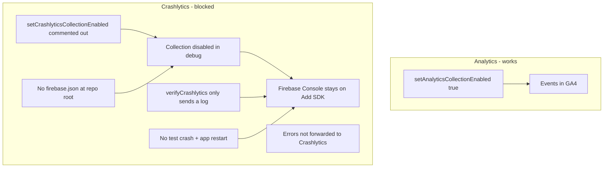

# Fix Firebase Crashlytics (iOS + Android debug)

## Problem

Crashlytics SDK is installed in the mobile app, but **Firebase Console still shows the onboarding "Add SDK" screen** (no crashes, no handshake). Testing is on **iOS Simulator and Android Emulator** via debug Metro builds (`npx react-native run-ios` / `run-android`).

That onboarding screen means Firebase has **never received a single report** from the app — not just that crashes are missing, but the SDK has not successfully "called home."

## Root causes



| Issue | Why it blocks Console | Evidence |
|-------|----------------------|----------|
| **Debug collection disabled** | RN Firebase disables Crashlytics in debug by default; Analytics explicitly overrides this | [`firebase-crashlytics.provider.ts`](../../libs/common/analytics/firebase-crashlytics.provider.ts) line 67 commented vs [`firebase-mobile.provider.ts`](../../libs/common/analytics/firebase-mobile.provider.ts) line 28 enabled |
| **No `firebase.json`** | iOS build script injects `FirebaseCrashlyticsCollectionEnabled = NO`; Android also reads this at build time | No `firebase.json` in repo; RNFB script in [`project.pbxproj`](../../apps/mobile/ios/Mobile.xcodeproj/project.pbxproj) |
| **Verification is insufficient** | Logs alone do not complete Firebase onboarding — Console needs at least one crash report | [`verifyCrashlytics()`](../../apps/mobile/src/lib/crashlytics.ts) only calls `.log()` |
| **No forced test crash + restart** | Fatal reports upload on **next app launch**, not immediately | Firebase first-setup docs require `crash()` then relaunch |
| **Errors not wired** | React/JS errors never reach Crashlytics | [`ErrorBoundary.tsx`](../../apps/mobile/src/app/components/ErrorBoundary.tsx) has comment only; [`App.tsx`](../../apps/mobile/src/app/App.tsx) doesn't wrap main tree |
| **Init errors swallowed** | Native/module failures invisible in Metro | [`main.tsx`](../../apps/mobile/src/main.tsx) `.catch(() => {})` |

### Platform notes

- **Android** (`com.mobile`): [`google-services.json`](../../apps/mobile/android/app/google-services.json) package name matches [`build.gradle`](../../apps/mobile/android/app/build.gradle). Gradle Crashlytics plugin is applied. Native config is correct; JS collection is the blocker.
- **iOS** (`org.reactjs.native.example.Mobile`): [`GoogleService-Info.plist`](../../apps/mobile/ios/GoogleService-Info.plist) bundle ID matches Xcode. Crashlytics run script and pods are present. Same JS + `firebase.json` blocker applies.
- **Firebase Console app selector**: Screenshot shows **Android `com.mobile`**. iOS reports appear under the iOS app entry — switch the dropdown when verifying each platform.

## Implementation plan

### 1. Add `firebase.json` at monorepo root

Create [`firebase.json`](../../firebase.json) (RNFB searches upward from `apps/mobile` and finds repo root):

```json
{
  "react-native": {
    "crashlytics_debug_enabled": true,
    "crashlytics_disable_auto_disabler": true,
    "crashlytics_auto_collection_enabled": true,
    "crashlytics_is_error_generation_on_js_crash_enabled": true,
    "crashlytics_javascript_exception_handler_chaining_enabled": true
  }
}
```

**Rebuild required on both platforms** after this change — Metro hot reload is not enough:
- iOS: `cd apps/mobile/ios && pod install && cd .. && npx react-native run-ios`
- Android: `npx react-native run-android` (clean rebuild if config not picked up)

### 2. Enable collection in Crashlytics provider (runtime safety net)

Update [`libs/common/analytics/firebase-crashlytics.provider.ts`](../../libs/common/analytics/firebase-crashlytics.provider.ts) `initialize()`:

- Call `await this.crashlyticsInstance.setCrashlyticsCollectionEnabled(true)` (mirror Analytics)
- Log init result and `isCrashlyticsCollectionEnabled` to Metro

### 3. Wire error reporting

- **ErrorBoundary** ([`ErrorBoundary.tsx`](../../apps/mobile/src/app/components/ErrorBoundary.tsx)): call `recordError(error, 'ReactErrorBoundary')` in `componentDidCatch`
- **App root** ([`App.tsx`](../../apps/mobile/src/app/App.tsx)): wrap full tree (including `AppContent`) in `ErrorBoundary`
- **trackError bridge** ([`analytics.ts`](../../apps/mobile/src/lib/analytics.ts)): also `recordError` to Crashlytics for non-fatals
- **Login** ([`LoginScreen.tsx`](../../apps/mobile/src/app/components/LoginScreen.tsx)): `crashlytics.setUserId` on successful login

### 4. Fix verification + first-time Firebase handshake

Update [`crashlytics.ts`](../../apps/mobile/src/lib/crashlytics.ts) and [`main.tsx`](../../apps/mobile/src/main.tsx):

- `verifyCrashlytics()`: log collection state + send test **non-fatal** via `recordError(new Error('Crashlytics verification test'), 'VerificationTest')`
- Surface init failures with `console.warn` (not silent catch)
- Add **dev-only first-run handshake** gated on `__DEV__`:
  - After init, if a one-time AsyncStorage flag is unset, call `crashlytics.crash()` OR expose a dev settings "Send test crash" button
  - Document: user must **relaunch the app** after the forced crash for Firebase to receive the fatal and dismiss "Add SDK"

> The "Add SDK" screen will not clear until at least one report (fatal or non-fatal with collection enabled) is uploaded. A log message alone is never enough.

### 5. Documentation

Add [`docs/CRASHLYTICS_SETUP.md`](../../docs/CRASHLYTICS_SETUP.md) covering:

- Mobile-only (not web/web-admin)
- Debug emulator/simulator testing steps for **both** platforms
- `firebase.json` + native rebuild requirement
- First-time flow: enable collection → force crash → **restart app** → wait 5–15 min → check correct app in Console dropdown
- Android: `adb logcat | grep -i crashlytics` to confirm collection enabled
- iOS: check Xcode build log for RNFB Crashlytics config lines

## Manual test plan

### Android Emulator (debug)

1. Rebuild: `npx react-native run-android`
2. Metro/logcat: confirm `isCrashlyticsCollectionEnabled: true` and Crashlytics init logs
3. Trigger verification non-fatal OR dev test crash
4. If test crash: **kill and relaunch** the app
5. Firebase Console → select **Android `com.mobile`** → wait ~10 min → onboarding should clear

### iOS Simulator (debug)

1. Rebuild: `cd apps/mobile/ios && pod install && cd .. && npx react-native run-ios`
2. Metro logs: confirm collection enabled
3. Same crash / non-fatal verification flow
4. Firebase Console → select **iOS app** (`org.reactjs.native.example.Mobile`) → wait ~10 min

### Success criteria

- Firebase Console moves past "Add SDK" to the Crashlytics dashboard
- Verification non-fatal appears under Non-fatals
- React errors caught by ErrorBoundary appear in Crashlytics

## Out of scope

- Web/web-admin error reporting (different SDK)
- Changing bundle IDs / package names in Firebase (current config files already match native projects)
