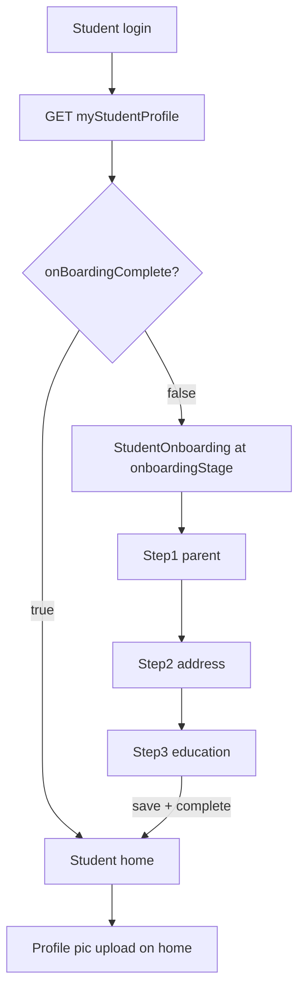
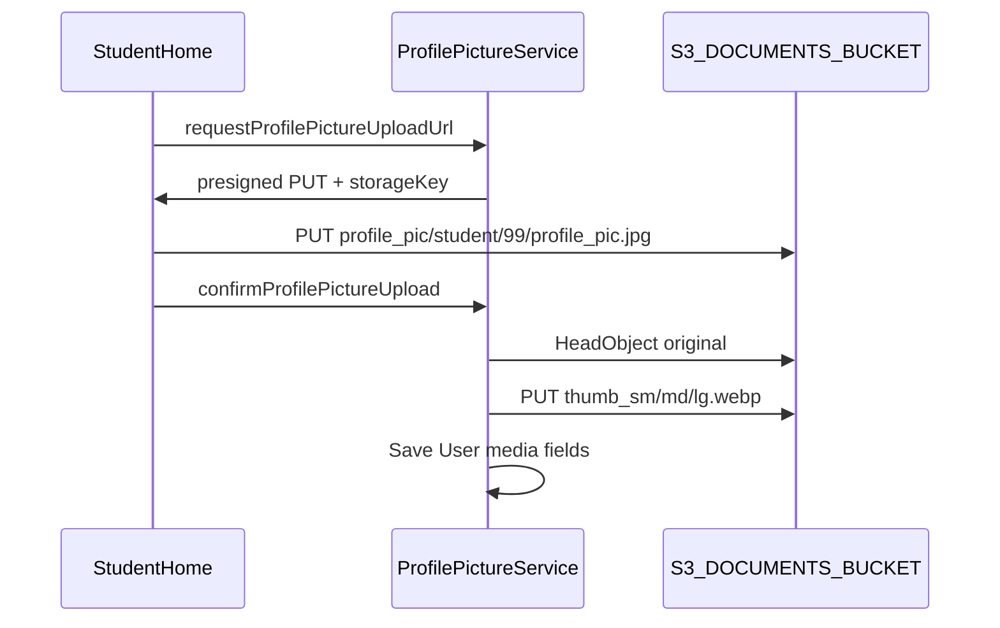

# Student Onboarding (Web First)

## Current state

- Students login and land on generic [`home`](apps/web/src/app/app.tsx) — no post-login routing.
- Tutor onboarding is the reference pattern: view-state routing in `app.tsx`, server-tracked `certificationStage`, `myTutorProfile` query, step orchestrator in [`TutorOnboarding.tsx`](apps/web/src/app/components/tutor-onboarding/TutorOnboarding.tsx).
- `User.profilePicture` exists in DB ([`user.entity.ts`](apps/api/src/app/modules/auth/entities/user.entity.ts)) but is not exposed/updated via GraphQL.
- No `Student` entity, no student-specific address, no parent/education fields.

## Proposed step flow — 3 steps (no profile photo)

Profile picture is **not** part of onboarding. It will be captured on the student home screen after onboarding completes (same user-level field, reusable for tutor later).

| Step | ID | Captures | Rationale |
|------|-----|----------|-----------|
| 1 | `parent` | Parent/guardian (Father or Mother toggle + name) | Quick personal field before location |
| 2 | `address` | Full address with Google Places (same UX as tutor) | Reuse proven [`TutorAddressEntry`](apps/web/src/app/components/tutor-onboarding/tutor-address-entry/TutorAddressEntry.tsx) pattern |
| 3 | `education` | "I am a…" + conditional class/board | Completes onboarding on submit |

**Education step behavior:**

- **School student** → required Class dropdown + Board (CBSE / ICSE / IB / Other); if Other, show free-text `boardOther`
- **College student / Currently not studying / Completed study** → no extra fields; clear any stored class/board

**Class display — Roman numerals:**

- Store `schoolClass` as numeric `1–12` in DB/API
- Display in UI as Roman numerals: **I, II, III, IV, V, VI, VII, VIII, IX, X, XI, XII**
- Add shared helpers in [`libs/shared-utils`](libs/shared-utils) (e.g. `SCHOOL_CLASS_OPTIONS`, `formatSchoolClassRoman(11) → 'XI'`) used by web and mobile

No admin approval or celebration gate (unlike tutor). Step 3 submit sets `onBoardingComplete: true` → redirect to student home.



Shared step config: new [`libs/shared-utils/src/student-onboarding-types.ts`](libs/shared-utils/src/student-onboarding-types.ts) (parallel to [`onboarding-types.ts`](libs/shared-utils/src/onboarding-types.ts)).

---

## Backend — new Student module

Create `apps/api/src/app/modules/student/` following tutor module conventions.

### Student entity (`student.entity.ts`)

One-to-one with `User`:

| Field | Type | Notes |
|-------|------|-------|
| `userId` | FK | unique |
| `onboardingStage` | enum | `parent` → `address` → `education` |
| `onBoardingComplete` | boolean | default `false` |
| `parentRelation` | enum | `FATHER` \| `MOTHER` |
| `parentName` | string | required at step 1 |
| `studentType` | enum | `SCHOOL` \| `COLLEGE` \| `NOT_STUDYING` \| `COMPLETED` |
| `schoolClass` | smallint nullable | 1–12; required when `SCHOOL` |
| `board` | enum nullable | `CBSE` \| `ICSE` \| `IB` \| `OTHER` |
| `boardOther` | string nullable | required when `board === OTHER` |

Add `User.student` OneToOne relation (mirror `User.tutor`).

### Address — extend for students

Add nullable `student_id` FK on [`AddressEntity`](apps/api/src/app/modules/address/entities/address.entity.ts) (alongside existing `tutor_id`). Add `createAddressForStudent()` in [`address.service.ts`](apps/api/src/app/modules/address/services/address.service.ts) and `createStudentAddress` mutation in address resolver (parallel to `createTutorAddress`).

### Profile picture — deferred to student home (not onboarding)

User-level profile picture upload is **out of onboarding scope**. Built on the **student home screen**; same API reused for tutor profile later.

See [S3 storage layout](#s3--profile-picture-storage) below for key paths and thumbnail rules.

**API mutations**

1. `requestProfilePictureUploadUrl` → presigned S3 PUT URL + `storageKey`
2. `confirmProfilePictureUpload` → HeadObject validate, generate thumbnails server-side, persist media fields on `User`

**User entity media fields** (mirror [`DocumentEntity`](apps/api/src/app/modules/document/entities/document.entity.ts) thumbnail pattern):

| Field | Purpose |
|-------|------|
| `profilePictureStorageKey` | S3 key for original upload |
| `profilePicture` | Display URL — typically `thumbnailSmall` (backward-compat column name) |
| `profilePictureThumbnailMedium` / `profilePictureThumbnailLarge` | Larger variants |
| `profilePictureOriginalUrl` | Full-size public URL |
| `profilePictureAverageColor`, `profilePictureWidth`, `profilePictureHeight` | Optional UI placeholders (same as docs) |

Expose in GraphQL user fragments ([`user.fragments.ts`](libs/shared-graphql/src/fragments/user.fragments.ts)).

### GraphQL surface

**Query**

- `myStudentProfile` — JWT + role `STUDENT`; calls `ensureStudentExists(userId)` (same lazy-create pattern as [`ensureTutorExists`](apps/api/src/app/modules/tutor/services/tutor.service.ts))

**Mutations (one per step, advance `onboardingStage`)**

- `saveStudentParentStep(input: { parentRelation, parentName })` — advances to `address`
- `createStudentAddress(input: CreateAddressInput)` — advances to `education`
- `saveStudentEducation(input: { studentType, schoolClass?, board?, boardOther? })` — validates conditionals, sets `onBoardingComplete: true`

Validation rules in service layer:
- Step 1: parent name non-empty
- Step 3: if `SCHOOL` → class 1–12 + board required; if `OTHER` → `boardOther` required; else null out class/board fields

### Lifecycle hooks

- [`auth.service.ts`](apps/api/src/app/modules/auth/services/auth.service.ts) register: call `ensureStudentExists` when `role === STUDENT` (mirror tutor block at lines 161–171)
- Register `Student` entity in [`database.config.ts`](apps/api/src/app/database/database.config.ts)
- TypeORM migration for `student` table + `address.student_id` + new enums

---

## S3 — profile picture storage

All profile pictures live under a dedicated **`profile_pic/`** prefix in the **existing** documents bucket (`S3_DOCUMENTS_BUCKET` — same as tutor onboarding docs). No new bucket required.

### Object key layout

Role segment is lowercase (`tutor` | `student`). **User ID** (not tutor/student entity ID) is used in the path.

**Tutor example (userId = 42):**

```
profile_pic/tutor/42/profile_pic.jpg          ← original (jpg or png)
profile_pic/tutor/42/profile_pic_thumb_sm.webp
profile_pic/tutor/42/profile_pic_thumb_md.webp
profile_pic/tutor/42/profile_pic_thumb_lg.webp
```

**Student example (userId = 99):**

```
profile_pic/student/99/profile_pic.jpg
profile_pic/student/99/profile_pic_thumb_sm.webp
profile_pic/student/99/profile_pic_thumb_md.webp
profile_pic/student/99/profile_pic_thumb_lg.webp
```

Fixed basename `profile_pic` (no UUID) — one photo per user; **replace upload deletes** previous original + all three thumbnails before writing new objects.

Thumbnail generation reuses the same sharp pipeline as tutor documents ([`document-image-media.ts`](apps/api/src/app/modules/document/document-image-media.ts)): WebP at 300 / 600 / 1024 px max edge, `_thumb_{sm|md|lg}.webp` suffix beside the original key.

### S3 / AWS tasks (infrastructure)

These are **operational checks** — S3 has no real folders; prefixes are created automatically on first upload.

| Task | Action | Notes |
|------|--------|-------|
| **Bucket** | Reuse `S3_DOCUMENTS_BUCKET` | Already used for `tutors/{tutorId}/onboarding/...` |
| **IAM (API role)** | Ensure `s3:PutObject`, `GetObject`, `HeadObject`, `DeleteObject` on `profile_pic/*` | Likely already covered if policy grants bucket-wide access; verify in dev/staging/prod |
| **CORS** | Allow browser `PUT` from web/mobile origins on bucket | Required for presigned client upload (same as tutor doc upload); add/verify `AllowedOrigin` matches `FRONTEND_URL` + mobile if applicable |
| **CDN / public reads** | If `DOCUMENT_PUBLIC_BASE_URL` is set (CloudFront or similar) | Ensure distribution serves `profile_pic/*` objects (usually whole-bucket origin — no change needed) |
| **Cache** | Thumbnails use `Cache-Control: public, max-age=31536000` | On replace, keys are overwritten in-place; optional `?v={updatedDate}` query param in UI if CDN caches aggressively |
| **Pre-create folders** | **Not needed** | Prefix appears on first `PutObject` |
| **Lifecycle rules** | Optional later | e.g. expire orphaned objects if confirm fails — not in v1 |
| **`.env`** | No new vars | Existing `S3_DOCUMENTS_BUCKET`, `AWS_REGION`, optional `DOCUMENT_PUBLIC_BASE_URL` |

### Application S3 tasks (API code)

| Task | Detail |
|------|--------|
| Key builder | `buildProfilePictureStorageKey(role, userId, ext)` → `profile_pic/{role}/{userId}/profile_pic.{ext}` |
| Presigned PUT | `PutObjectCommand` with `ContentType` + `ContentLength`; 15 min expiry (match docs) |
| Key validation on confirm | Reject keys not matching expected prefix for caller's role + userId |
| MIME / size limits | JPEG + PNG only; max ~5 MB (stricter than 10 MB docs) |
| Confirm flow | HeadObject → generate 3 WebP thumbs via shared helper (extract from `document-image-media.ts`) → PutObject thumbs → update User |
| Replace cleanup | Before new confirm, DeleteObject original + `{base}_thumb_sm/md/lg.webp` if prior keys exist |
| Public URLs | Build via `DOCUMENT_PUBLIC_BASE_URL` + encoded key path (same as [`buildOriginalDocumentUrl`](apps/api/src/app/modules/document/document-image-media.ts)) |



---

## Shared GraphQL client

Add to [`libs/shared-graphql`](libs/shared-graphql):

- `queries/student.queries.ts` — `GET_MY_STUDENT_PROFILE`
- `mutations/student.mutations.ts` — step mutations
- `mutations/user.mutations.ts` — profile picture upload mutations (used by student home, not onboarding)
- Export from library index

Add to [`libs/shared-utils`](libs/shared-utils):

- `student-onboarding-types.ts` — step IDs and config
- `school-class.ts` — `SCHOOL_CLASS_OPTIONS` (value 1–12, label Roman), `formatSchoolClassRoman()`

---

## Web UI (Phase 1 — this task)

### Routing ([`app.tsx`](apps/web/src/app/app.tsx))

- Add views: `student-onboarding` | `student-home`
- In `handleLoginSuccess`: if `role === 'STUDENT'` → lazy-query `GET_MY_STUDENT_PROFILE` → route like tutor:
  - `!onBoardingComplete` → `student-onboarding` (resume at `onboardingStage`)
  - else → `student-home`

### Onboarding components — `apps/web/src/app/components/student-onboarding/`

| File | Purpose |
|------|---------|
| `StudentOnboarding.tsx` | Orchestrator (copy structure from `TutorOnboarding`) |
| `StudentOnboardingStepper.tsx` | 3-step stepper |
| `StudentParentStep.tsx` | Father/Mother radio + parent name |
| `StudentAddressStep.tsx` | Adapt tutor address form (Google Places hook, same fields); call `createStudentAddress` |
| `StudentEducationStep.tsx` | 4-option radio + conditional Class dropdown (Roman labels) + Board select |

**Styling:** match tutor onboarding — same stepper layout, button styles, input classes from [`TutorAddressEntry`](apps/web/src/app/components/tutor-onboarding/tutor-address-entry/TutorAddressEntry.tsx).

### Student home — `apps/web/src/app/components/student-home/`

New screen shown after onboarding completes. Initial scope:

- Welcome/header with student name
- **Profile picture upload** — circular avatar, file picker, presigned S3 upload, initials fallback before photo set
- Placeholder layout for future student features (find tutors, bookings, etc.)

Profile pic is optional on home (prompt to add, not blocking).

---

## Mobile (Phase 2 — follow-up, not in initial scope)

Mirror web under `apps/mobile/src/app/components/student-onboarding/` and `student-home/`. Update [`App.tsx`](apps/mobile/src/app/App.tsx) routing. Reuse shared types, Roman class helpers, and GraphQL.

---

## Key files to create/modify

**Create**

- `apps/api/src/app/modules/student/**` (entity, enums, service, resolver, module, DTOs)
- `libs/shared-utils/src/student-onboarding-types.ts`
- `libs/shared-utils/src/school-class.ts`
- `libs/shared-graphql/src/queries/student.queries.ts`
- `libs/shared-graphql/src/mutations/student.mutations.ts`
- `libs/shared-graphql/src/mutations/user.mutations.ts` (profile pic — for student home)
- `apps/web/src/app/components/student-onboarding/**`
- `apps/web/src/app/components/student-home/**`
- Migration file

**Modify**

- [`apps/api/src/app/modules/address/entities/address.entity.ts`](apps/api/src/app/modules/address/entities/address.entity.ts)
- [`apps/api/src/app/modules/auth/entities/user.entity.ts`](apps/api/src/app/modules/auth/entities/user.entity.ts)
- [`apps/api/src/app/modules/auth/services/auth.service.ts`](apps/api/src/app/modules/auth/services/auth.service.ts)
- [`apps/web/src/app/app.tsx`](apps/web/src/app/app.tsx)
- [`libs/shared-graphql/src/fragments/user.fragments.ts`](libs/shared-graphql/src/fragments/user.fragments.ts)

---

## Test plan

- **API unit tests:** `StudentService` validation (school requires class+board, OTHER requires boardOther, non-school clears class/board), stage advancement, `ensureStudentExists` idempotency
- **Shared utils:** Roman numeral mapping for classes 1–12
- **Manual web:** signup as student → login → verify 3-step onboarding (no photo step), resume after refresh mid-flow, completed student lands on student home
- **Profile pic (home only):** upload JPEG/PNG on student home; verify S3 keys under `profile_pic/student/{userId}/`, three WebP thumbnails created, User fields updated; replace upload removes old objects
- **S3 infra:** presigned PUT from browser succeeds (CORS); IAM can read/write `profile_pic/*`
