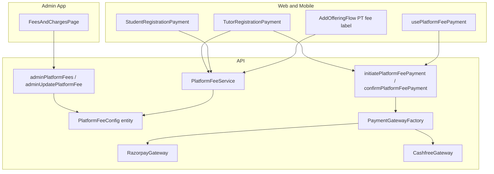

# Admin-managed Fees & Charges with payment gateway

## Problem

Platform fees are scattered across hardcoded constants and env flags:

- Tutor registration: `REGISTRATION_FEE_AMOUNT = 999`, `REGISTRATION_FEE_WAIVED = true` in [`libs/shared-utils/src/onboarding-types.ts`](libs/shared-utils/src/onboarding-types.ts); tutor entity default `regFeeAmountToBePaid: 999`
- PT fee: `PT_ATTEMPT_LIST_PRICE_INR = 99` + `PT_FEE_COLLECTION_ENABLED` in [`apps/api/src/app/config/pt-fee.config.ts`](apps/api/src/app/config/pt-fee.config.ts)
- Payment is stubbed (`NoOpPtPaymentService`); tutor step only calls `completeRegistrationPaymentStep` (stage advance, no payment)
- Student onboarding has 3 steps and sets `onBoardingComplete = true` after education — no payment step

## Target architecture



**Effective amount rule** (single source of truth in `PlatformFeeService`):

```
discountAmountInr =
  discountType === FIXED_INR  → discountValue
  discountType === PERCENT    → round(amountInr * discountValue / 100)
  otherwise                   → 0

effectiveAmountInr = waived ? 0 : max(0, amountInr - discountAmountInr)
```

- Show `promoMessage` when `waived === true` **or** `discountType !== NONE`
- If `effectiveAmountInr === 0`: skip gateway checkout, mark fee as waived/paid at ₹0, advance onboarding (gateways do not support ₹0 orders)
- If `effectiveAmountInr > 0`: create gateway order → checkout → verify → mark paid → advance

---

## 1. Backend: `PlatformFeeConfig` entity

**New module:** `apps/api/src/app/modules/platform-fee/`

| Field | Type | Notes |
|-------|------|-------|
| `code` | enum, unique | `TUTOR_REGISTRATION`, `PROFICIENCY_TEST`, `STUDENT_REGISTRATION` |
| `displayName` | string | Admin label, e.g. "Tutor registration fee" |
| `amountInr` | smallint | List/base price |
| `discountType` | enum | `NONE`, `FIXED_INR`, `PERCENT` |
| `discountValue` | smallint, default 0 | Flat INR when `FIXED_INR`; 0–100 when `PERCENT` |
| `waived` | boolean, default false | Full waiver flag |
| `promoMessage` | text, nullable | Shown to users when waived or discounted |

Extends `QBaseEntity`; register in [`database.config.ts`](apps/api/src/app/database/database.config.ts).

**Seed migration** (initial values matching current behavior):

| code | amountInr | discountType | discountValue | waived | promoMessage (example) |
|------|-----------|--------------|---------------|--------|------------------------|
| `TUTOR_REGISTRATION` | 999 | `NONE` | 0 | `true` | Current waiver copy from `onboarding-types.ts` |
| `PROFICIENCY_TEST` | 99 | `NONE` | 0 | `true` | "₹99 — Free for now" style message |
| `STUDENT_REGISTRATION` | 499 (suggested) | `NONE` | 0 | `true` | Similar limited-time waiver copy |

**Service:** `PlatformFeeService`

- `findByCode(code)` — cached read (short TTL or in-memory cache; config changes infrequently)
- `getDiscountAmountInr(config)` / `getEffectiveAmount(config)` / `buildPublicFeeInfo(config)` — returns list price, discount type/value, computed discount amount, effective amount, waived, promoMessage, displayLabel

**Admin validation:**

- `PERCENT`: `discountValue` must be 0–100
- `FIXED_INR`: `discountValue` must be 0–amountInr
- `NONE`: `discountValue` must be 0

**Deprecate/remove usage of:**

- `REGISTRATION_FEE_*` compile-time constants (keep step IDs in shared-utils; drop hardcoded amounts/waiver flags)
- `PT_ATTEMPT_LIST_PRICE_INR` and `PT_FEE_COLLECTION_ENABLED` — PT collection enabled when `effectiveAmount > 0`

Update [`tutor-offering-pt-fee.service.ts`](apps/api/src/app/modules/tutor/services/tutor-offering-pt-fee.service.ts) to read list/effective amounts from `PlatformFeeService` instead of `pt-fee.config.ts`.

---

## 2. Backend: Admin GraphQL

Extend [`admin.resolver.ts`](apps/api/src/app/modules/admin/admin.resolver.ts) / [`admin.service.ts`](apps/api/src/app/modules/admin/admin.service.ts):

- **Query** `adminPlatformFees: [PlatformFeeConfig]` — list all seeded rows
- **Mutation** `adminUpdatePlatformFee(input)` — update `amountInr`, `discountType`, `discountValue`, `waived`, `promoMessage` (code is read-only)

Add DTOs under `apps/api/src/app/modules/admin/dto/` and ops in [`libs/shared-graphql/src/queries/admin.queries.ts`](libs/shared-graphql/src/queries/admin.queries.ts) + [`admin.mutations.ts`](libs/shared-graphql/src/mutations/admin.mutations.ts).

**Public query** (authenticated tutor/student):

- `platformFee(code: PlatformFeeCode!): PlatformFeePublicInfo` — safe subset including computed `discountAmountInr` and `effectiveAmountInr`

---

## 3. Backend: Gateway-agnostic payment module

Payment provider is **not finalized** (Razorpay or Cashfree). Build a provider-agnostic layer so switching gateways is an env/config change, not a rewrite.

**New module:** `apps/api/src/app/modules/payment/`

### Core interface

```typescript
interface PaymentGateway {
  readonly provider: 'razorpay' | 'cashfree';
  createOrder(input: CreatePaymentOrderInput): Promise<PaymentOrderSession>;
  verifyPayment(input: VerifyPaymentInput): Promise<boolean>;
}
```

`PaymentOrderSession` returns gateway-neutral fields plus provider-specific checkout payload:

- `provider`, `orderId`, `amountInr`, `currency: 'INR'`
- `checkoutPayload` — JSON blob consumed by client SDK (Razorpay key/order/signature fields vs Cashfree session/payment_session_id)

### Provider implementations

| Provider | API package | Env vars |
|----------|-------------|----------|
| Razorpay | `razorpay` npm | `RAZORPAY_KEY_ID`, `RAZORPAY_KEY_SECRET` |
| Cashfree | `cashfree-pg` (or official SDK) | `CASHFREE_APP_ID`, `CASHFREE_SECRET_KEY`, `CASHFREE_ENV` (`sandbox` / `production`) |

**Selection:** `PAYMENT_GATEWAY=razorpay|cashfree` (default `razorpay` for dev docs; either works once credentials are set). `PaymentGatewayFactory` resolves the active provider at runtime. Include `NoOpPaymentGateway` when gateway env is unset (local dev only).

Replace existing [`PtPaymentGateway`](apps/api/src/app/modules/tutor/services/pt-payment.service.ts) with the shared interface (or adapter wrapping it).

### Payment ledger

**New table** `platform_fee_payment`:

| Field | Purpose |
|-------|---------|
| `fee_code` | Which platform fee |
| `user_id` | Payer |
| `context_type` / `context_id` | e.g. `tutor` / tutorId, `student` / studentId, `tutor_offering` / id |
| `list_price_inr`, `discount_type`, `discount_value`, `discount_amount_inr`, `amount_paid_inr` | Snapshot at payment time |
| `gateway_provider` | `razorpay` \| `cashfree` |
| `gateway_order_id`, `gateway_payment_id` | Provider refs |
| `status` | `waived` \| `pending` \| `paid` \| `failed` |
| `paid_at` | timestamp |

### Mutations

Gateway-neutral names (no provider in mutation signature):

- `initiatePlatformFeePayment(feeCode: PlatformFeeCode!)` — validates onboarding stage, computes effective amount; if 0 auto-records waived payment and returns `{ skipped: true }`; else creates order via active gateway + pending ledger row; returns `PaymentOrderSession`
- `confirmPlatformFeePayment(feeCode, provider, orderId, paymentId, signature)` — verify via active gateway, mark paid, advance stage

**Tutor registration** — update [`completeRegistrationPaymentStep`](apps/api/src/app/modules/tutor/resolvers/tutor.resolver.ts):

- Require paid/waived payment record (or call confirm flow first)
- Set `regFeePaid`, `regFeeAmount`, `regFeeAmountToBePaid`, `regFeeDate` from config snapshot
- Advance to `docs`

**Student registration** — new flow:

- Add `registrationPayment` to [`StudentOnboardingStageEnum`](apps/api/src/app/modules/student/enums/student.enums.ts) + DB enum migration
- Add fee columns on [`student.entity.ts`](apps/api/src/app/modules/student/entities/student.entity.ts) mirroring tutor: `regFeePaid`, `regFeeAmount`, `regFeeAmountToBePaid`, `regFeeDate`
- Change [`saveEducationStep`](apps/api/src/app/modules/student/services/student.service.ts): set `onboardingStage = registrationPayment` instead of `onBoardingComplete = true`
- New `completeStudentRegistrationPaymentStep` mutation (same payment + advance pattern; sets `onBoardingComplete = true`)

**PT fee** — implement `initiatePtFeePayment` / `confirmPtFeePayment` using shared payment module and platform fee config amounts.

---

## 4. Admin UI: "Fees & Charges"

Follow existing admin pattern ([`AdminNavDrawer.tsx`](apps/web-admin/src/app/components/AdminNavDrawer.tsx), [`app.tsx`](apps/web-admin/src/app/app.tsx)):

1. Add nav item `{ to: '/fees-and-charges', label: 'Fees & Charges' }`
2. New page [`apps/web-admin/src/app/pages/FeesAndChargesPage.tsx`](apps/web-admin/src/app/pages/FeesAndChargesPage.tsx)

**UI:** table of 3 fixed rows (code + display name read-only). Per row editable fields:

- Amount (INR)
- Discount type — dropdown: None / Fixed amount (INR) / Percent of list price
- Discount value — number input (label changes with type: "₹ off" vs "% off")
- Waived (checkbox)
- Promo / waiver message (textarea)
- Save button (calls `adminUpdatePlatformFee`)

Show computed **Discount amount** and **Effective amount** read-only for admin clarity.

---

## 5. Tutor onboarding: config-driven registration step

Files to update:

- [`TutorRegistrationPayment.tsx`](apps/web/src/app/components/tutor-onboarding/tutor-registration-payment/TutorRegistrationPayment.tsx) (web + mobile)
- [`OnboardingStepper.tsx`](apps/web/src/app/components/tutor-onboarding/OnboardingStepper.tsx) (web + mobile) — step title from API (`Registration Fee (Free)` vs `Registration Fee`)
- [`onboarding-types.ts`](libs/shared-utils/src/onboarding-types.ts) — remove hardcoded `REGISTRATION_FEE_*`; step metadata becomes dynamic via query

**Flow:**

1. `useQuery(GET_PLATFORM_FEE, { variables: { code: TUTOR_REGISTRATION } })`
2. Display list price, discount (type + computed amount), promo message
3. If effective = 0 → Continue calls initiate (auto-waive) then complete step
4. If effective > 0 → Pay button opens provider checkout → confirm mutation → refetch profile

---

## 6. Student onboarding: new final payment step

Update [`student-onboarding-types.ts`](libs/shared-utils/src/student-onboarding-types.ts):

```typescript
// Add step after education
{ id: 'registrationPayment', title: '...', description: '...' }
```

Wire in web + mobile:

- [`StudentOnboarding.tsx`](apps/web/src/app/components/student-onboarding/StudentOnboarding.tsx) + mobile counterpart
- New `StudentRegistrationPayment.tsx` (mirror tutor payment component)
- [`StudentOnboardingStepper.tsx`](apps/web/src/app/components/student-onboarding/StudentOnboardingStepper.tsx)
- [`StudentEducationStep.tsx`](apps/web/src/app/components/student-onboarding/StudentEducationStep.tsx) — stop calling `onComplete`; server-driven advance like address step
- Update [`ADMIN_STUDENT_LIST_TABS`](libs/shared-utils/src/student-onboarding-types.ts) and [`admin.service.ts`](apps/api/src/app/modules/admin/admin.service.ts) student stage filters

Routing: [`apps/web/src/app/app.tsx`](apps/web/src/app/app.tsx) — `onComplete` only after payment step.

---

## 7. PT fee UI alignment

Replace hardcoded `₹99` in:

- [`AddOfferingFlow.tsx`](apps/web/src/app/components/tutor-profile/AddOfferingFlow.tsx) (web + mobile)

Use `platformFee(PROFICIENCY_TEST)` or existing `ptFeeDisplayLabel` from API (already built in [`tutor-offering-pt-fee.service.ts`](apps/api/src/app/modules/tutor/services/tutor-offering-pt-fee.service.ts) — update backend to source from config).

When collection is enabled (`effectiveAmount > 0`), add Pay-before-PT flow using shared payment mutations.

---

## 8. Shared payment UI helper (gateway-aware)

New lib (recommended: `libs/payment-ui/`):

- `usePlatformFeePayment({ feeCode, onSuccess })` — encapsulates initiate → checkout → confirm
- `openPaymentCheckout(session: PaymentOrderSession)` — branches on `session.provider`:
  - **Razorpay:** web `checkout.js`; mobile `react-native-razorpay`
  - **Cashfree:** web Cashfree JS SDK; mobile Cashfree RN SDK / WebView
- Clients never hardcode a provider; they read `provider` + `checkoutPayload` from the initiate mutation response

Keeps tutor/student/PT flows consistent and gateway-swappable.

---

## 9. Testing

- **API unit tests:** `PlatformFeeService` effective amount for all discount types (none, fixed, percent, waived, 100% percent); admin update validation; tutor/student payment step guards; PT fee creation from config; both gateway services mocked behind factory
- **Update existing specs:** [`student.service.spec.ts`](apps/api/src/app/modules/student/services/student.service.spec.ts), PT fee service tests
- **Manual test plan:** admin edits fee with percent discount → tutor onboarding shows computed price → waived auto-continues → non-waived checkout in sandbox (test with whichever gateway is configured) → student final step → add-offering PT fee label

---

## Out of scope / follow-ups

- Admin ability to **add new fee types** beyond the 3 seeded codes (entity supports it; UI can be a follow-up)
- Payment webhooks (v1 uses client-side confirm + signature verify; webhooks can be added per provider for reliability)
- Admin display of payment history (read-only ledger exists but no admin page yet)
- Running both gateways simultaneously (v1: one active provider via env)

## Key files summary

| Area | Primary files |
|------|----------------|
| Entity + service | `apps/api/src/app/modules/platform-fee/*` |
| Payment gateway | `apps/api/src/app/modules/payment/*` (factory + Razorpay + Cashfree adapters) |
| Admin API/UI | `admin.resolver.ts`, `FeesAndChargesPage.tsx` |
| Tutor step | `TutorRegistrationPayment.tsx`, `tutor.resolver.ts` |
| Student step | `student.service.ts`, `StudentRegistrationPayment.tsx`, enum migration |
| PT fee | `tutor-offering-pt-fee.service.ts`, `pt-payment.service.ts` |
| Remove hardcoding | `onboarding-types.ts`, `pt-fee.config.ts` |

## Implementation todos

1. **platform-fee-entity** — Create `PlatformFeeConfig` entity with `discountType`/`discountValue`, migration with 3 seeded rows, `PlatformFeeService` with effective-amount logic
2. **admin-fees-api-ui** — Add `adminPlatformFees` query + `adminUpdatePlatformFee` mutation; build Fees & Charges admin page and nav entry (discount type dropdown)
3. **payment-gateway-module** — Gateway-agnostic payment module, `platform_fee_payment` ledger, Razorpay + Cashfree adapters, factory, initiate/confirm mutations with ₹0 auto-waive path
4. **tutor-registration-wire** — Wire tutor registration step + `completeRegistrationPaymentStep` to config and payment flow (web + mobile)
5. **student-payment-step** — Add student `registrationPayment` stage, entity fee columns, education→payment advance, new payment step UI (web + mobile)
6. **pt-fee-config-wire** — Source PT fee from `PlatformFeeConfig`; replace `pt-fee.config.ts`; implement PT payment flow and fix AddOfferingFlow labels
7. **shared-payment-ui** — Extract `usePlatformFeePayment` + provider-aware checkout helper for web and mobile
8. **tests-and-env** — Add API unit tests, update student/tutor specs, document `PAYMENT_GATEWAY`, `RAZORPAY_*`, and `CASHFREE_*` in `.env.example`
