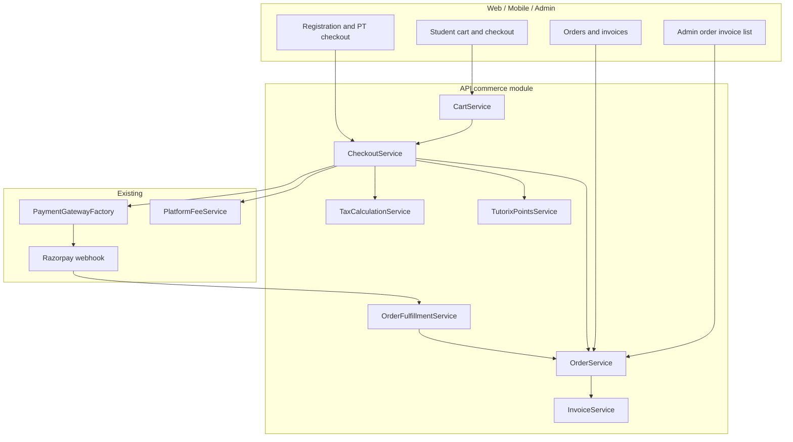

# Unified commerce orders, invoicing, Tutorix points, and class cart

## Problem

Payments today are **fee-specific**, not order-based:

- Each flow (tutor registration, student registration, PT fee) creates a standalone gateway order via [`PlatformFeePaymentService`](../../apps/api/src/app/modules/payment/services/platform-fee-payment.service.ts) and records a row in [`platform_fee_payment`](../../apps/api/src/app/modules/payment/entities/platform-fee-payment.entity.ts).
- There is **no unified order**, **no order items**, **no invoice**, **no reward points**, and **no cart**.
- Class booking tables exist ([`tutor_class_session`](../../apps/api/src/app/modules/tutor-class-session/entities/tutor-class-session.entity.ts), enrollments) but have **no payment or checkout** path.
- Future transaction types (packages, subscriptions, marketplace payouts) would each require another one-off payment path unless we introduce a commerce layer now.

**Product requirements:**

1. Every payment is against a specific **order** with one or more **order items**.
2. A **proper invoice** is issued for every successfully paid order.
3. **Tutorix points** — users earn/hold points; X points = ₹1 (admin-configurable); partial redemption at checkout (mostly student payments).
4. **Student cart** — add classes from multiple tutors, checkout once.
5. Order items carry description, quantity, rate, discount, and GST (CGST / SGST / IGST).
6. Implement in **4 phases** without breaking current registration/PT flows.
7. **Waived / ₹0 net fees** — always create a completed order with list-price line items and full discount; skip gateway but still issue an invoice (Phase 2) showing list price, waiver, and net ₹0.

---

## Current baseline (already shipped)

| Capability | Location |
|------------|----------|
| Admin fee config (amount, discount, waiver) | `platform-fee` module |
| Gateway abstraction (Razorpay / Cashfree) | `payment-gateways.ts`, `PaymentGatewayFactory` |
| Fee payment ledger | `platform_fee_payment` |
| Webhook fulfillment | `razorpay-webhook.controller.ts` |
| Client checkout helper | `libs/shared-utils/src/payment-checkout.ts` |
| Onboarding payment UIs | tutor/student registration, PT (web + mobile) |

Phase 1 **builds on** this; it does not replace gateways or fee config.

---

## Target architecture



**Checkout amount rule:**

```
line_subtotal     = unit_rate_inr × quantity
line_discount     = from PlatformFeeConfig / promo / cart rules
line_taxable      = line_subtotal - line_discount
line_gst          = TaxCalculationService (CGST+SGST or IGST)
order_subtotal    = Σ line_subtotal
order_discount    = Σ line_discount
order_tax         = Σ line_gst
points_value_inr  = min(redeemed_points / points_per_inr, max_allowed, order_total)
amount_due_inr    = order_subtotal - order_discount + order_tax - points_value_inr

if amount_due_inr <= 0 → skip gateway, mark order paid with payment_method=waived (or points), still create order + line items at list price
else → create gateway order for amount_due_inr
```

On order completion (`paid`): run fulfillment, then generate invoice (Phase 2) — **including net ₹0 waived orders**. Line items use list price + discount, not zero-rate rows.

---

## Data model

### New module: `apps/api/src/app/modules/commerce/`

#### `order`

| Field | Type | Notes |
|-------|------|-------|
| `order_number` | varchar, unique | Human-readable; used as Razorpay receipt base |
| `user_id` | int | Payer |
| `payer_role` | enum | `student` \| `tutor` |
| `status` | enum | `draft`, `pending_payment`, `paid`, `failed`, `cancelled`, `refunded` |
| `subtotal_inr` | int | Sum of line subtotals |
| `discount_inr` | int | Total discount |
| `tax_inr` | int | Total GST |
| `points_redeemed` | int | Points used |
| `points_value_inr` | int | INR equivalent at checkout |
| `amount_due_inr` | int | Charged to gateway |
| `amount_paid_inr` | int | Actually collected (gateway + points value) |
| Billing snapshot | columns | name, email, phone, state_code (GST) |
| `paid_at` | timestamp | |
| `payment_method` | enum | `waived`, `gateway`, `points`, `mixed` |
| `source` | enum | `onboarding`, `cart`, `admin` |

#### `order_item`

| Field | Type | Notes |
|-------|------|-------|
| `order_id` | FK | |
| `item_type` | enum | `TUTOR_REGISTRATION`, `STUDENT_REGISTRATION`, `PROFICIENCY_TEST`, `CLASS_BOOKING` |
| `description` | text | e.g. "Tutor registration fee", "Class with {tutor} — {offering}" |
| `quantity` | smallint | Default 1 for fees; N for classes |
| `unit_rate_inr` | int | |
| `line_subtotal_inr` | int | |
| `discount_inr` | int | |
| `cgst_inr`, `sgst_inr`, `igst_inr` | int | Snapshotted at checkout |
| `gst_rate_percent` | decimal | |
| `reference_type` | enum | `tutor`, `student`, `tutor_offering`, `class_session`, `calendar_slot` |
| `reference_id` | int | Context for fulfillment |
| `fulfillment_status` | enum | `pending`, `fulfilled`, `failed` |

#### `payment_attempt`

| Field | Type | Notes |
|-------|------|-------|
| `order_id` | FK | |
| `provider` | enum | razorpay, cashfree |
| `gateway_order_id` | varchar | |
| `gateway_payment_id` | varchar | nullable until success |
| `amount_inr` | int | |
| `status` | enum | `pending`, `paid`, `failed` |

#### `invoice` + `invoice_line`

Immutable snapshot after `order.status = paid`. Copy all order + line fields; add `invoice_number`, `issued_at`, `pdf_storage_key`.

#### `tutorix_points_account` + `tutorix_points_ledger`

| Ledger field | Notes |
|--------------|-------|
| `account_id` | One per user |
| `entry_type` | `credit` \| `debit` |
| `points` | Always positive; sign implied by type |
| `balance_after` | Running balance |
| `source` | `signup_bonus`, `referral`, `order_redemption`, `admin_adjustment`, … |
| `order_id` | Nullable; set on redemption |
| `inr_equivalent` | Snapshot at redemption time |

Admin config entity (or extend platform config): `points_per_inr`, `max_redemption_percent`, `eligible_item_types[]`.

#### `cart` + `cart_item` (Phase 4)

| cart_item field | Notes |
|-----------------|-------|
| `student_id` | Owner |
| `tutor_offering_id` | |
| `tutor_calendar_id` or `session_id` | Bookable slot |
| `quantity` | Number of classes |
| `unit_rate_inr` | From rate card at add-to-cart time |
| `expires_at` | Optional TTL on held slots |

---

## Fulfillment (replace ad-hoc hooks)

New `OrderFulfillmentService` — idempotent, called from confirm mutation and webhook:

| `item_type` | Action |
|-------------|--------|
| `TUTOR_REGISTRATION` | Same as today: `regFeePaid`, stage → docs |
| `STUDENT_REGISTRATION` | Same as today: `regFeePaid`, `onBoardingComplete` |
| `PROFICIENCY_TEST` | Mark offering PT fee paid |
| `CLASS_BOOKING` | Create/confirm `tutor_class_session_enrollment`(s); respect batch capacity |

Extract logic currently in `PlatformFeePaymentService.buildContext` into fulfillment handlers.

**Bridge during migration:** keep `platform_fee_payment` with optional `order_id` FK for audit; stop writing new rows once Phase 1 is stable, or dual-write briefly.

---

## GraphQL API (sketch)

### Phase 1 — checkout

```graphql
mutation initiateCheckout($input: InitiateCheckoutInput!) {
  initiateCheckout(input: $input) {
    order { id orderNumber status amountDueInr items { ... } }
    session { skipped provider orderId amountInr checkoutPayload }
  }
}

mutation confirmCheckout($input: ConfirmCheckoutInput!) {
  confirmCheckout(input: $input) {
    order { id status paidAt }
  }
}

query myOrder($id: Int!) { myOrder(id: $id) { ... } }
```

`InitiateCheckoutInput` variants:

- `{ type: PLATFORM_FEE, feeCode, contextId? }` — replaces `initiatePlatformFeePayment` / `initiatePtFeePayment`
- `{ type: CART, cartId, pointsToRedeem? }` — Phase 4

Deprecate fee-specific mutations after clients migrate; keep as thin wrappers initially.

### Phase 2 — invoices

```graphql
query myInvoices { myInvoices { invoiceNumber issuedAt pdfUrl orderNumber } }
query invoicePdf($invoiceNumber: String!) { ... }
```

Admin: `adminOrders`, `adminOrderDetail`, `adminInvoices`.

### Phase 3 — points

```graphql
query myTutorixPoints { balance pointsPerInr maxRedemptionPercent }
mutation adminAdjustTutorixPoints(...)
```

Checkout input adds `pointsToRedeem: Int`.

### Phase 4 — cart

```graphql
query myCart { items { ... } totals { ... } }
mutation addToCart / updateCartItem / removeFromCart
mutation initiateCheckout(input: { type: CART, ... })
```

---

## GST and invoicing notes

**Deferred until GST registration (~₹20L revenue threshold):**

Tutorix is not GST-registered yet. Order/invoice schema retains `tax_inr`, `cgst_inr`, `sgst_inr`, `igst_inr`, and `gst_rate_percent` columns (all stored as **0** for now). **`TaxCalculationService` is not implemented** until registration.

Invoice PDF omits GST/tax breakup while unregistered — controlled by `SHOW_GST_ON_INVOICE` in [`invoice-pdf.util.ts`](../../apps/api/src/app/modules/commerce/utils/invoice-pdf.util.ts). Flip to `true` post-registration to restore GST column and tax totals on PDFs.

**Resolve before enabling GST on invoices:**

1. **Supplier on invoice** for platform fees (Tutorix GSTIN) vs class booking (tutor vs marketplace model).
2. **HSN/SAC codes** per item type.
3. **Intra-state vs inter-state** — derive from buyer `state_code` vs Tutorix registered state; tutors may need state on profile for class lines.

`TaxCalculationService` (future): `(supplierState, buyerState, taxableInr, gstRatePercent)` → `{ cgst, sgst, igst }`.

Invoice PDF (current): line items, subtotal/discount/net, payment mode (gateway / points / mixed / waived), Tutorix branding. Store in existing S3 document pipeline.

---

## Phase 1 — Order foundation + migrate existing fees

**Goal:** All current payments create an `order` with one `order_item`; gateway + webhook unchanged in behavior.

### Backend

1. Migrations + entities: `order`, `order_item`, `payment_attempt`.
2. `CheckoutService.initiateCheckout` / `confirmCheckout`.
3. `OrderPricingService` — build line from `PlatformFeeService.getEffectiveAmountInr` + display name.
4. Refactor `PlatformFeePaymentService` to delegate to `CheckoutService` (or replace).
5. Update webhook to resolve `payment_attempt` → `order` → fulfill.
6. Add `order_id` to `platform_fee_payment` (optional dual-write).
7. Receipt: `buildRazorpayReceipt(orderNumber)` in `payment-receipt.util.ts`.

### Frontend

1. Shared hook `useCheckout` wrapping initiate/confirm (replaces fee-specific initiate in registration + PT).
2. Web + mobile: tutor reg, student reg, PT — pass checkout input instead of fee mutations.
3. Success UI shows `orderNumber`.

### Tests

- Unit: pricing, ₹0 waived skip gateway, duplicate checkout idempotency.
- E2E: tutor reg paid, student reg waived, PT paid, webhook replay.

**Exit criteria:** No regression in onboarding; every payment (including waived ₹0) has a `paid` order with list-price line items; waived flows return `order` in API response (session skipped only means no gateway); no `payment_attempt` when amount_due_inr is 0.

---

## Phase 2 — Invoicing (GST deferred)

**Goal:** Paid orders generate immutable invoices with PDF.

### Backend

1. `invoice`, `invoice_line` entities + sequential `invoice_number` (FY-aware).
2. `InvoiceService.generateForOrder(orderId)` — called once on transition to `paid`.
3. PDF render + S3 upload.
4. ~~GST on platform fee lines~~ **deferred** until GST registration; schema fields remain 0; PDF omits tax via `SHOW_GST_ON_INVOICE`.
5. Admin UI: Orders & Invoices list/detail.

### Frontend

1. Download invoice link on payment success.
2. Student/tutor profile: "My orders" list (optional in this phase).

**Exit criteria:** Every completed order (including net ₹0 waived) produces a downloadable invoice with list price, discount/waiver, net ₹0 total, and payment mode (Waived / Gateway / Points). Admin can filter by payment_method=waived.

---

## Phase 3 — Tutorix points + checkout redemption

**Goal:** Points balance, earn rules (minimal), redeem at checkout.

### Backend

1. Points account + ledger migrations.
2. Admin config: `points_per_inr`, redemption caps, eligible item types.
3. Checkout: validate balance, lock points, apply to `amount_due_inr`.
4. Invoice lines for points redemption.
5. Admin: manual credit/debit, ledger view.

### Frontend

1. Checkout UI: balance, redeem input, updated total.
2. Points history screen (student first).

**Exit criteria:** Student registration checkout can be partially paid with points; invoice shows gateway + points split.

---

## Phase 4 — Student cart + class booking checkout

**Goal:** Multi-tutor cart, single order, enrollments on pay.

### Backend

1. `cart`, `cart_item` CRUD.
2. Pricing from tutor rate cards; validate slot availability.
3. Slot reservation on `pending_payment` (TTL job to release).
4. `CLASS_BOOKING` order items with quantity > 1.
5. Fulfillment: session/enrollment creation per line.
6. GST rules for class lines (per Phase 2 legal decision).

### Frontend

1. Add to cart from tutor profile / calendar.
2. Cart page grouped by tutor.
3. Checkout → payment → confirmation with class summary.

**Exit criteria:** Student buys 2 classes from tutor A + 4 from tutor B in one payment; one invoice; enrollments created.

---

## Migration and compatibility

| Step | Action |
|------|--------|
| 1 | Introduce order tables alongside `platform_fee_payment` |
| 2 | Dual-write or link `order_id` on fee payments |
| 3 | Migrate clients to `initiateCheckout` |
| 4 | Deprecate `initiatePlatformFeePayment` / `initiatePtFeePayment` |
| 5 | Stop dual-write; keep `platform_fee_payment` read-only for history or drop in later migration |

**Idempotency:** Unique constraint on `(user_id, item_type, reference_type, reference_id)` for non-cart orders where duplicate payment must be rejected.

---

## File touch list (by phase)

| Area | Paths |
|------|-------|
| New module | `apps/api/src/app/modules/commerce/**` |
| Payment refactor | `platform-fee-payment.service.ts`, `payment.resolver.ts`, webhook controller |
| GraphQL | `libs/shared-graphql/src/mutations/checkout.mutations.ts`, queries |
| Shared checkout | `libs/shared-utils/src/payment-checkout.ts`, new `checkout.ts` |
| Clients | `*RegistrationPayment.tsx`, `TutorPT.tsx`, future cart components |
| Admin | `apps/web-admin/src/app/pages/OrdersPage.tsx`, `InvoicesPage.tsx` |
| Migrations | `apps/api/src/migrations/1777*` series |

---

## Testing strategy

- **Unit:** tax calc, points redemption math, order total, fulfillment handlers (mocked deps).
- **Integration:** checkout → confirm → invoice → fulfillment chain.
- **Regression:** existing `platform-fee-payment.service` behavior covered until removed.
- **Manual:** Razorpay test mode for multi-item cart; webhook retry.

---

## Risks and mitigations

| Risk | Mitigation |
|------|------------|
| Big-bang rewrite breaks onboarding | Phase 1 keeps old mutations as wrappers |
| Double fulfillment (confirm + webhook) | Idempotent fulfillment keyed by `order_item.id` |
| Slot overselling | Reserve on pending_payment + TTL |
| GST incorrect on class booking | Defer class tax to Phase 4; resolve legal model in Phase 2 |
| Points race conditions | DB transaction + row lock on points account |

---

## Out of scope (later)

- Refunds, credit notes, chargebacks
- Tutor payout / settlement
- Subscription billing
- Promo codes (beyond existing PlatformFeeConfig discounts)
- Cashfree parity testing (if Razorpay-only in v1)

---

## Suggested Jira structure

- **Epic:** Unified commerce and orders
  - **Phase 1:** Order schema, CheckoutService, migrate reg/PT, client hook
  - **Phase 2:** Invoice PDF, GST lines, admin orders
  - **Phase 3:** Tutorix points ledger + redemption
  - **Phase 4:** Cart, class booking checkout, enrollment fulfillment
