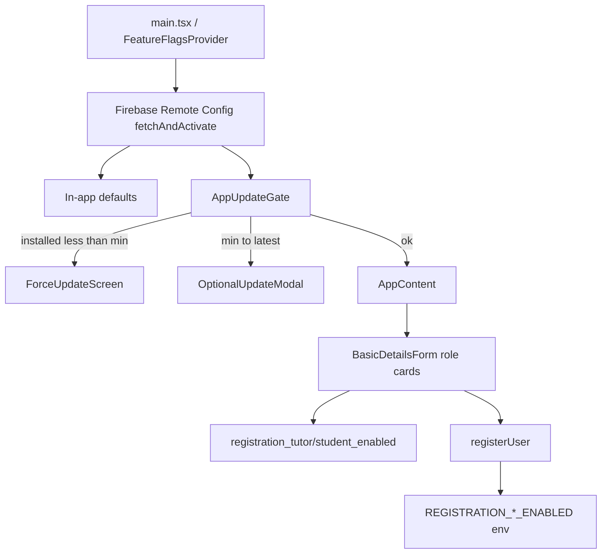

  ---
title: Mobile Feature Flags (Remote Config)
status: in-progress
jira: TUTORIX-64
created: 2026-08-06
labels:
  - cursor-plan
  - implementation-plan
  - mobile
---

# Mobile Feature Flags via Firebase Remote Config

> **Update (2026-08-07):** Tutor/student registration enable/disable is **no longer** controlled by Remote Config or `.env`. Source of truth is DB + admin panel — see [2026-08-07-admin-registration-settings.md](./2026-08-07-admin-registration-settings.md). This plan’s Remote Config scope remains **force/optional app updates only**.

## Goal

Add Firebase Remote Config on mobile to support:

1. **Force update** when the installed app is below a minimum supported version
2. **Optional update** when a newer version is available but not required
3. ~~Enable/disable tutor and student registration~~ → moved to admin/DB (see linked plan)

## Architecture



## Remote Config keys

| Key | Type | Default | Notes |
|-----|------|---------|-------|
| `min_supported_version` | string | `1.0.0` | Force update if installed &lt; this |
| `latest_version` | string | `1.0.0` | Soft prompt if min ≤ installed &lt; latest |
| `ios_store_url` | string | placeholder | App Store URL |
| `android_store_url` | string | placeholder | Play Store URL |
| `force_update_message` | string | copy | Blocking screen body |
| `optional_update_message` | string | copy | Soft modal body |
| `registration_tutor_enabled` | boolean | `true` | Tutor role card |
| `registration_student_enabled` | boolean | `true` | Student role card |
| `registration_disabled_message` | string | copy | When a role (or both) is off |

Version comparison uses simple semver (`major.minor.patch`). Installed version comes from `APP_VERSION` in mobile config (bumped with each store release alongside native `versionName` / marketing version).

## Mobile implementation

1. Add `@react-native-firebase/remote-config` (root + `apps/mobile`).
2. `apps/mobile/src/lib/remote-config.ts` — initialize, defaults, `fetchAndActivate`, typed getters.
3. `apps/mobile/src/lib/semver.ts` — `compareSemver` / `isVersionLessThan`.
4. `apps/mobile/src/app/feature-flags/` — context provider + hooks (`useUpdatePolicy`, `useRegistrationFlags`).
5. `AppUpdateGate` — force full-screen (Update only) or optional modal (Update / Later; dismiss persisted per `latest_version` in AsyncStorage). Re-evaluate on `AppState` active.
6. Wire provider + gate around the app tree in `App.tsx`; init remote config from provider (and optionally kick off early in `main.tsx`).
7. `BasicDetailsForm` — disable/grey role cards from flags; auto-select when only one role enabled; block submit when both disabled; show `registration_disabled_message`.

## API enforcement

- Env vars (default enabled):
  - `REGISTRATION_TUTOR_ENABLED=true|false`
  - `REGISTRATION_STUDENT_ENABLED=true|false`
- At start of `AuthService.registerUser`, reject new signups (and role assignment from `UNKNOWN`) for a disabled role with `BadRequestException`.
- Document in `.env.example`.

Ops note: when closing registration, set **both** Firebase Remote Config flags and the matching API env vars.

## Ops workflow

- Soft release: raise `latest_version` to the new store version.
- Hard cutoff: raise `min_supported_version`.
- Pause tutors only: `registration_tutor_enabled=false` (+ API env).
- Pause all registration: both registration booleans false (+ API env).

## Firebase Console setup (ops)

In Firebase Console → Remote Config, create the keys listed above with the same defaults. Publish after setting store URLs for your apps.

After adding `@react-native-firebase/remote-config`, rebuild native apps:

```bash
cd apps/mobile/ios && pod install && cd ..
npx react-native run-ios
# or
npx react-native run-android
```

Metro hot reload alone is not enough for the new native module.

- Web signup parity (same pattern can follow later)
- A/B experiments / percentage rollouts
- Syncing Remote Config values into the API automatically

## Test plan

- [ ] Defaults allow normal use when Firebase fetch fails
- [ ] Installed &lt; min → force screen; Update opens store URL
- [ ] min ≤ installed &lt; latest → optional modal; Later dismisses until `latest_version` changes
- [ ] Tutor flag false → tutor card disabled; student still selectable
- [ ] Both flags false → cannot submit; message shown
- [ ] API rejects `registerUser` with disabled role when env is `false`
- [ ] Incomplete signup resume still works for an already-assigned role
