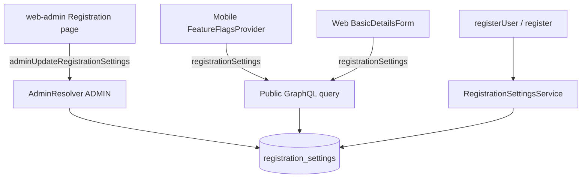

# Admin-Controlled Registration Flags

Supersedes the **registration** portion of [2026-08-06-mobile-feature-flags-remote-config.md](./2026-08-06-mobile-feature-flags-remote-config.md) (TUTORIX-64). **Force/optional app updates stay on Firebase Remote Config.**

Scope: **mobile + web** signup UIs both read the same public GraphQL flags; API enforces from DB (not `.env`).

## Architecture

## Implementation summary

- Entity `RegistrationSettingsEntity` / table `registration_settings` (singleton id=1)
- Public query `registrationSettings` (no auth)
- Admin query/mutation `adminRegistrationSettings` / `adminUpdateRegistrationSettings`
- Web-admin page `/registration-settings`
- Mobile + web signup consume GraphQL flags
- AuthService enforces via `RegistrationSettingsService`

## Test plan

- Migration seeds both roles enabled
- Public query returns settings without JWT
- Admin can toggle tutor off → mobile + web show tutor card disabled; `registerUser` with TUTOR fails
- Student-only / both-off / both-on cases
- Incomplete signup resume with already-assigned role still works
- Update gate still uses Remote Config only
