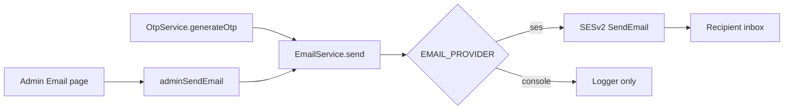

# AWS SES email (OTP + admin test send)

## Context

Signup already generates and verifies 6-digit OTPs (`EMAIL_VERIFICATION` / `MOBILE_VERIFICATION`) and stores a SHA-256 hash in PostgreSQL. Delivery is console-only, and `generateOtp` returns the plaintext code in GraphQL.

There is no mailer today. AWS is already used for S3 and Secrets Manager via the default credential chain (`AWS_REGION`, optional keys, EC2 IAM role). Frontends (web + mobile) do not read the OTP from the API — users type the code they received.

This step builds a generic email service so later work (password reset, receipts, tutor approval) can reuse it. First consumers: email OTP and an admin send-email page for SES testing.

AWS Console SES setup is done: `info@tutorix.tech` in `us-east-1`.

## Architecture

Provider selection:

- `EMAIL_PROVIDER=ses` (or `SES_FROM_EMAIL` set) → AWS SESv2
- `EMAIL_PROVIDER=console` or unset in development → log subject/to/body, do not call AWS
- Production (`NODE_ENV=production`) with email OTP: require SES; fail the mutation if send fails

Mobile OTP is unchanged (still console + returned code until SMS is added).

## Implementation

1. EmailModule with SESv2 + console providers, OTP template, `@aws-sdk/client-sesv2`
2. Env: `EMAIL_PROVIDER`, `SES_FROM_EMAIL=info@tutorix.tech`, `SES_FROM_NAME`, `SES_REGION=us-east-1`
3. Wire EMAIL_VERIFICATION OTP via EmailService; make GraphQL `otp` nullable
4. Admin Email page + `adminSendEmail` / `adminEmailStatus` (JWT + ADMIN)
5. Tests and `docs/EMAIL_SES.md`

## Out of scope

- Password-reset email
- SMS / WhatsApp OTP
- User picker / bulk send / templates from admin
- Rate limiting beyond the existing 60s resend timer in the signup UI
- SES template store / bounce/complaint handling
- Removing the `otp` GraphQL field entirely
