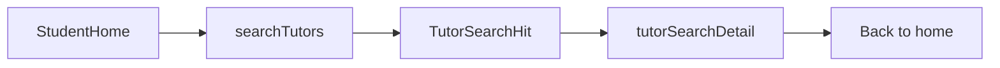

# Student tutor search

Replace the student-home “coming soon” block with tutor discovery. One API, then web and mobile. No booking, inquiry mutation, ratings, or map.

## Product rules

Eligible tutors only: `onBoardingComplete`, matching **leaf** `TutorOffering` with `pt_passed`, complete rate card (`isRateCardComplete`).

Filters map to existing data:

- **Subject** — catalog leaf `offeringId` (study area → board → class → subject for School Education; other study areas use their existing cascade in [`libs/shared-utils/src/study-areas.constants.ts`](libs/shared-utils/src/study-areas.constants.ts))
- **Budget** — `maxRateInr` vs the **1–4 class effective rate** for the compared mode (`calculateEffectiveRate` in [`libs/shared-utils/src/rate-card.ts`](libs/shared-utils/src/rate-card.ts))
- **Online / offline** — rate card `onlineEnabled` / `offlineEnabled`
- **1:1 / group** — batch size `=== 1` vs `> 1` on the compared mode
- **Distance** — haversine from the student’s primary address to the tutor `HOME`/`TEACHING` address. Apply only when offline is in play

Delivery mode behavior:

- Offline only — require radius; drop tutors outside it
- Online only — ignore radius; sort by rate
- Both (default) — nearby offline **plus** all matching online tutors

Defaults on home: prefill board + class from [`Student.board`](apps/api/src/app/modules/student/entities/student.entity.ts) / `schoolClass` via a shared mapper (catalog `displayName` match, e.g. `CBSE` + `Class 8`). Subject starts empty. Mode and class format **Both**. Radius **10 km**. Budget **Any**. If the student has no usable lat/lng, treat as online-only and say so.

Search does not run until a leaf subject is chosen.

## API

Add `TutorSearchService` in the tutor module ([`apps/api/src/app/modules/tutor/`](apps/api/src/app/modules/tutor/)). Expose two student-only queries on [`tutor.resolver.ts`](apps/api/src/app/modules/tutor/resolvers/tutor.resolver.ts) with `JwtAuthGuard` + `RolesGuard` + `@Roles(UserRole.STUDENT)`:

- `searchTutors(input)` — cursor page of `TutorSearchHit`
- `tutorSearchDetail(tutorId, offeringId)` — read-only preview (name, photo, years, city, distance, matching offering label + rate card summary, other passed offerings as labels only). No bank, documents, or PT internals

Input: `offeringId`, `deliveryMode` (`ONLINE` | `OFFLINE` | `ANY`), `classFormat` (`INDIVIDUAL` | `GROUP` | `ANY`), `maxRateInr`, `radiusKm`, `sortBy` (`BEST_MATCH` | `DISTANCE` | `RATE`), cursor, limit.

`TutorSearchHit`: tutor id, display name, photo URL, years, `offeringLabel` (`formatTutorOfferingFullLabel`), rate for the shown mode, mode flags, group size, `distanceKm` (null for online-only hits), city, `freeDemoOffered`, `hasAvailabilityThisWeek`, `slotsThisWeek`.

**Current-week calendar preference (not a hard filter).** Tutors who have kept this week’s grid filled rank above otherwise equal tutors. Use [`tutor_calendar.startsAt`](apps/api/src/app/modules/tutor-calendar/entities/tutor-calendar.entity.ts) (`deleted = false`), not `availabilityConfiguredAt` (that only marks first save).

- Window: **current IST week only** — reuse helpers in [`libs/shared-utils/src/tutor-calendar.ts`](libs/shared-utils/src/tutor-calendar.ts) (`TUTOR_CALENDAR_TIMEZONE`, `istTodayStartUtc`, `addIstDaysUtc`). Week starts Sunday 00:00 IST (same `IST_DAY_ABBR` order as the tutor grid). Count slots with `startsAt >= max(weekStart, now)` and `startsAt < weekEnd`.
- “Updated” = at least **1** future slot in that window. Keep the threshold as a named constant (`MIN_SLOTS_THIS_WEEK = 1`) so it can be raised later.
- Do **not** look 8 weeks ahead (`MAX_WEEKS_AHEAD` stays tutor-save only). The student ranking horizon is this week.
- Missing calendar still appears in results; they just rank lower.
- Best-match sort: **has this-week availability**, then in-budget, then free demo, then closer (offline) or cheaper (online), then more slots this week, then experience.
- Cards: “Available this week” chip when `hasAvailabilityThisWeek`. Preview can repeat the count.

Student origin: load current student + primary address inside the service (do not trust client lat/lng).

Service tests with fixtures: nearby offline in budget, online-only, over-budget, incomplete rate card / failed PT / not onboarded (excluded), offline outside radius, **tutor with current-week slots ranks above an identical tutor with an empty calendar**, past-only slots in this week do not count.

## Shared clients

- Queries in [`libs/shared-graphql/src/queries/`](libs/shared-graphql/src/queries/)
- `mapStudentEducationToOfferingPath(board, schoolClass, offerings)` in [`libs/shared-utils`](libs/shared-utils/src)
- Fire existing `AnalyticsEvent.TUTOR_SEARCH` / `TUTOR_VIEWED` from web + mobile analytics helpers

Reuse `GET_OFFERINGS` for the cascade. Do not reuse tutor-onboarding `OfferingCascadePicker` as-is — build a student-facing path picker (tiles for study area, then short cascade).

## Web

Replace the dashed placeholder in [`StudentHomePage.tsx`](apps/web/src/app/components/student-home/StudentHomePage.tsx):

- Intent bar: subject (hero) + chips for board/class, mode, 1:1/group, budget, distance
- Chips open popovers; subject opens the path picker
- Result summary + card grid (photo, name, years, offering line, rate, km or Online, free-demo chip, **Available this week** when the tutor has current-week slots, **View profile**)
- Empty: if offline-only is empty, offer one tap to include online

Add view `student-tutor-preview` in [`web-navigation.ts`](apps/web/src/app/web-navigation.ts) and [`app.tsx`](apps/web/src/app/app.tsx). Header: Back → student home, wallet chip stays. Preview page uses `tutorSearchDetail`. Extend `walletReturnFromView` so preview returns to home.

## Mobile

Same composition on [`StudentHomeScreen.tsx`](apps/mobile/src/app/components/student-home/StudentHomeScreen.tsx): intent chips open a bottom sheet. Cards are full width.

Add `studentTutorPreview` to [`student-navigation.ts`](apps/mobile/src/app/student-navigation.ts) and [`App.tsx`](apps/mobile/src/app/App.tsx). `StudentNavHeader` with Back to home. Same wallet-return rule as web.

## Out of scope

Class booking, wallet `CLASS_BOOKING`, “Request demo” mutation, ratings, map pins, schedule overlap, web-admin.

## Verify

- API unit tests for filter/sort/eligibility, including current-week calendar ranking
- Web + mobile navigation specs for the new preview view
- Browser: student login on `localhost:4200` — prefill, search, card, preview, back, wallet round-trip
- Mobile: same flow on student home
