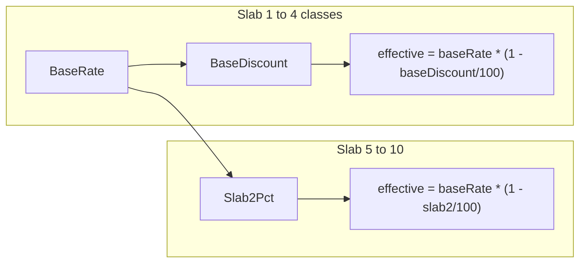

# Add Base Discount to Rate Card

## Current behavior

The rate card stores a **base rate** plus optional **bulk discounts** for slabs 2 (5–10 classes) and 3 (11+ classes). Slab 1 (1–4 classes) always shows the undiscounted base rate in [`RateCardModal.tsx`](libs/tutor-detail-ui/src/RateCardModal.tsx):

```81:85:libs/tutor-detail-ui/src/RateCardModal.tsx
              <div className="flex flex-wrap items-center justify-between gap-2 text-sm">
                <span className="font-medium text-purple-950">{RATE_CARD_SLABS[0].label}</span>
                <span className="text-purple-800/70">
                  {hasBaseRate ? `${formatInr(baseRateNum)}/class` : 'Base rate (no discount)'}
                </span>
```

Effective rates use `calculateEffectiveRate(baseRate, discountPct)` in [`rate-card.ts`](libs/shared-utils/src/rate-card.ts) — each slab discount is a % off the **same** base rate.

## Target behavior

- Add **base discount** per mode (`offline` / `online`): % off base rate for the 1–4 class slab.
- **Default: 0** (no discount; backward-compatible for existing rows).
- **Validation:** enforce monotonic tiers — `baseDiscount ≤ slab2 ≤ slab3` (when values are set).
- Slab 2/3 continue to discount off the **listed base rate** (unchanged formula).
- Summary text shows the **effective** rate when base discount &gt; 0.



## 1. Database migration

Add columns to `tutor_offering_rate_card` in a new migration (e.g. `1775200000000-AddBaseDiscountToTutorOfferingRateCard.ts`):

```sql
ALTER TABLE "tutor_offering_rate_card"
  ADD COLUMN "offline_base_discount_pct" smallint NOT NULL DEFAULT 0,
  ADD COLUMN "online_base_discount_pct" smallint NOT NULL DEFAULT 0;
```

Update entity [`tutor-offering-rate-card.entity.ts`](apps/api/src/app/modules/tutor-rate-card/entities/tutor-offering-rate-card.entity.ts):

- `offlineBaseDiscountPct: number` (default 0)
- `onlineBaseDiscountPct: number` (default 0)

## 2. API / GraphQL layer

Extend these DTOs with `@Field(() => Int)` (nullable on input, default 0 on output):

| File | New fields |
|------|------------|
| [`tutor-offering-rate-card.dto.ts`](apps/api/src/app/modules/tutor-rate-card/dto/tutor-offering-rate-card.dto.ts) | `offlineBaseDiscountPct`, `onlineBaseDiscountPct` |
| [`save-tutor-offering-rate-card.input.ts`](apps/api/src/app/modules/tutor-rate-card/dto/save-tutor-offering-rate-card.input.ts) | same |

Update [`tutor-rate-card.service.ts`](apps/api/src/app/modules/tutor-rate-card/services/tutor-rate-card.service.ts):

- Pass `baseDiscountPct` into `validateRateCardForm` offline/online objects
- Persist on save (0 when mode disabled, same pattern as other pct fields)
- Map in `mapEntityToGraphql`

No resolver changes needed — existing `saveMyTutorOfferingRateCard` mutation picks up new input fields automatically.

## 3. Shared utils (core logic)

Update [`rate-card.ts`](libs/shared-utils/src/rate-card.ts):

**Types** — add `baseDiscountPct: string` to `RateCardModeValues`; add `offlineBaseDiscountPct` / `onlineBaseDiscountPct` to `RateCardFormValues` and `RateCardLike`.

**Validation** in `validateMode`:
- Parse base discount (empty → `0`)
- Range: 0–99%
- If slab2 set: `baseDiscount ≤ slab2`
- Existing slab2 ≤ slab3 rule unchanged

**Helpers:**
- `rateCardToFormInput`: map stored pct to string (`0` → `''` or `'0'` — prefer `''` with placeholder "0" to match slab2/3 UX)
- `formatRateCardSummary`: use `calculateEffectiveRate(baseRate, baseDiscountPct ?? 0)` instead of raw base rate

**Tests** in [`rate-card.spec.ts`](libs/shared-utils/src/rate-card.spec.ts):
- Base discount applied in effective rate display path
- Reject when base discount &gt; slab2
- Default 0 accepted

## 4. GraphQL client queries / mutation

Add fields to rate card selections in:

- [`tutor.queries.ts`](libs/shared-graphql/src/queries/tutor.queries.ts) — `GET_MY_TUTOR_DETAIL` rateCard block
- [`admin.queries.ts`](libs/shared-graphql/src/queries/admin.queries.ts) — admin tutor detail rateCard block
- [`tutor-rate-card.mutations.ts`](libs/shared-graphql/src/mutations/tutor-rate-card.mutations.ts) — mutation response fields

## 5. UI

**[`RateCardModal.tsx`](libs/tutor-detail-ui/src/RateCardModal.tsx)** — Slab 1 row gets the same discount input pattern as slabs 2/3:

- Label: "Base discount" (or inline in the 1–4 row)
- Input bound to `values.baseDiscountPct`
- Preview: `→ ₹X/class` via `calculateEffectiveRate(baseRateNum, baseDiscountPct)`

**[`TutorProfilePage.tsx`](apps/web/src/app/components/tutor-profile/TutorProfilePage.tsx)** — include `offlineBaseDiscountPct` / `onlineBaseDiscountPct` in mutation variables when saving.

**[`types.ts`](libs/tutor-detail-ui/src/types.ts)** — add optional fields on `offerings[].rateCard`.

No mobile changes (rate card is web-only today).

## 6. Verification

- Run `nx test shared-utils --testPathPattern=rate-card` (or equivalent)
- Manually: open tutor profile → rate card modal → set base discount on offline mode → save → confirm summary shows discounted rate and reload preserves value
