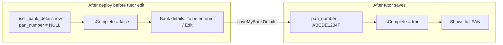

# Add mandatory PAN to bank details

## Existing row: migration strategy

You already have one row without PAN. **Do not** add a `NOT NULL` column without a backfill — Postgres would reject the migration or force a fake placeholder.

Recommended approach (matches how optional GST works today, but PAN is required in app logic):

| Layer | Rule |
|-------|------|
| **Database** | New column `pan_number` `varchar(10)` **nullable** — existing row gets `NULL`, migration succeeds with zero data loss |
| **Save API** | PAN required on every `saveMyBankDetails` (class-validator + service `normalizeInput`) |
| **Read API** | `isComplete` false when `pan_number` is null/blank — legacy row automatically becomes “incomplete” |
| **UX** | Tutor sees incomplete state and must open **Edit bank details** to add PAN (still must re-enter account number per current modal behavior) |

No SQL backfill is possible without real PAN values. If that tutor’s bank block was previously “complete”, it will correctly flip to incomplete until they update.



## PAN validation (shared)

Indian PAN format: `AAAAA9999A` (5 letters, 4 digits, 1 letter). Reuse one constant in:

- [`libs/shared-utils/src/bank-details-formatters.ts`](libs/shared-utils/src/bank-details-formatters.ts) — export `PAN_PATTERN` / `normalizePanNumber()` and extend `BankDetailsLike` + `isBankDetailsComplete()` to require `panNumber`
- [`apps/api/.../save-user-bank-details.input.ts`](apps/api/src/app/modules/user-bank-details/dto/save-user-bank-details.input.ts) — `@Field()` required (not optional), `@Matches(PAN_PATTERN)`
- [`libs/tutor-detail-ui/.../BankDetailsModal.tsx`](libs/tutor-detail-ui/src/BankDetailsModal.tsx) — required field + client-side validation (mirror IFSC/GST style)

Store uppercase trimmed (same as IFSC/GST).

## Backend changes

1. **Migration** — new file e.g. [`apps/api/src/migrations/1774300000000-AddPanNumberToUserBankDetails.ts`](apps/api/src/migrations/1774300000000-AddPanNumberToUserBankDetails.ts):

```sql
ALTER TABLE "user_bank_details"
ADD COLUMN "pan_number" character varying(10);
```

(`down`: drop column)

2. **Entity** — [`user-bank-details.entity.ts`](apps/api/src/app/modules/user-bank-details/entities/user-bank-details.entity.ts): `panNumber` column `pan_number`, length 10, nullable.

3. **GraphQL DTO** — [`user-bank-details.dto.ts`](apps/api/src/app/modules/user-bank-details/dto/user-bank-details.dto.ts): `@Field() panNumber: string` on output (full value for tutor + admin per your choice).

4. **Service** — [`user-bank-details.service.ts`](apps/api/src/app/modules/user-bank-details/services/user-bank-details.service.ts):
   - Persist `panNumber` on create/update
   - Map to GraphQL
   - Pass `panNumber` into `isBankDetailsComplete({ bankName, accountNumber, ifscCode, panNumber })`

5. **Tests** — [`user-bank-details.service.spec.ts`](apps/api/src/app/modules/user-bank-details/services/user-bank-details.service.spec.ts):
   - Create/update includes `panNumber`
   - `mapToGraphql` with null PAN → `isComplete: false`
   - With PAN → `isComplete: true`
   - Add spec in `bank-details-formatters` if you add unit tests there

6. **Tutor detail spec** — [`tutor-detail.service.spec.ts`](apps/api/src/app/modules/tutor/services/tutor-detail.service.spec.ts): mock `bankDetails` includes `panNumber` where `isComplete: true`.

No change needed to [`user-bank-details.resolver.ts`](apps/api/src/app/modules/user-bank-details/resolvers/user-bank-details.resolver.ts) (PAN is not admin-only like `accountNumber`).

## Frontend / GraphQL

1. **Queries** — add `panNumber` under `bankDetails` in:
   - [`libs/shared-graphql/src/queries/tutor.queries.ts`](libs/shared-graphql/src/queries/tutor.queries.ts)
   - [`libs/shared-graphql/src/queries/admin.queries.ts`](libs/shared-graphql/src/queries/admin.queries.ts)

2. **Mutation** — [`libs/shared-graphql/src/mutations/user-bank-details.mutations.ts`](libs/shared-graphql/src/mutations/user-bank-details.mutations.ts): request `panNumber` in response.

3. **Types + UI**
   - [`libs/tutor-detail-ui/src/types.ts`](libs/tutor-detail-ui/src/types.ts): `panNumber` on `bankDetails`
   - [`BankDetailsModal.tsx`](libs/tutor-detail-ui/src/BankDetailsModal.tsx): `panNumber` in form + `initialValues`; label required (not optional)
   - [`BankDetailsSection.tsx`](libs/tutor-detail-ui/src/BankDetailsSection.tsx): `DetailRow` for PAN when complete
   - [`TutorProfilePage.tsx`](apps/web/src/app/components/tutor-profile/TutorProfilePage.tsx): pass `panNumber` in mutation variables

Scope: web tutor profile + admin tutor detail only (no mobile bank-details flow today).

## Deploy / ops note

After migration deploy:

- The existing DB row remains; API returns `isComplete: false`.
- Coordinate with that tutor (or ops) to open profile and submit PAN via edit — no one-off SQL unless you collect PAN out-of-band.

## Out of scope (unless you ask later)

- Extracting PAN from uploaded `PAN_CARD` document into `user_bank_details` (separate feature; document screening already avoids storing PAN strings in AI output).
- DB `NOT NULL` constraint (only safe after every row has PAN).
- Unique index on `pan_number` across users.
