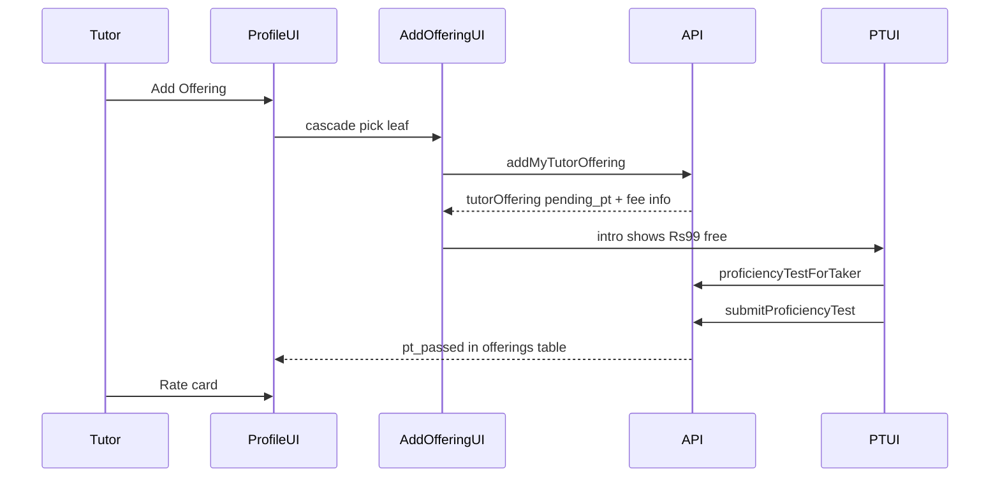

# Add offering after onboarding

## Current state

- Offering selection UI exists in [`TutorOfferings.tsx`](apps/web/src/app/components/tutor-onboarding/tutor-offerings/TutorOfferings.tsx) (web + mobile): study area → board → class → subject cascade, saves **one leaf** via `SAVE_TUTOR_OFFERINGS`.
- API [`saveTutorOfferings`](apps/api/src/app/modules/tutor/resolvers/tutor.resolver.ts) always sets `isInitialOnboarding: true` and advances `certificationStage` to `pt`.
- PT flow: [`TutorPT.tsx`](apps/web/src/app/components/tutor-onboarding/tutor-pt/TutorPT.tsx) + [`submitProficiencyTest`](apps/api/src/app/modules/tutor/services/tutor-offering.service.ts) — 2 attempts, on pass sets `pt_passed` and **incorrectly** advances stage to `registrationPayment` for all offerings.
- Profile: [`TutorDetailView` `OfferingsSection`](libs/tutor-detail-ui/src/TutorDetailView.tsx) lists all offerings from `myTutorDetail`; rate card edit is not gated on `pt_passed` today.
- `is_initial_onboarding` column already exists on [`tutor_offering`](apps/api/src/app/modules/tutor/entities/tutor-offering.entity.ts) but is unused for post-onboarding paths.
- No payment gateway integration yet (registration fee uses a [placeholder skip mutation](apps/api/src/app/modules/tutor/resolvers/tutor.resolver.ts)).

---

## 1. API: post-onboarding add offering

**New mutation** `addMyTutorOffering(offeringId: Int!)` (or dedicated input type) in [`tutor.resolver.ts`](apps/api/src/app/modules/tutor/resolvers/tutor.resolver.ts):

- Guard: tutor role, [`getMyTutorDetail`](apps/api/src/app/modules/tutor/services/tutor-detail.service.ts) rules (`onBoardingComplete` + celebration seen).
- Reject if `(tutorId, offeringId)` already exists.
- Optional guard: block if another `pending_pt` row exists for this tutor (one add flow at a time); return clear error with `tutorOfferingId` to resume.
- Call `saveForTutor` with `{ isInitialOnboarding: false, advanceToNextStep: false }` for a **single** leaf `offeringId`.
- Create PT fee record (see §2); return `AddTutorOfferingResult` with `tutorOffering` + `ptFee`.

**Extend** [`SaveTutorOfferingsInput`](apps/api/src/app/modules/tutor/dto/tutor-offering.input.ts) / resolver: accept `isInitialOnboarding` from input for onboarding only (default `true`); keep onboarding mutation behavior unchanged.

**Fix** [`submitProficiencyTest`](apps/api/src/app/modules/tutor/services/tutor-offering.service.ts): advance `certificationStage` to `registrationPayment` **only when** `tutorOffering.isInitialOnboarding === true` **and** tutor is still at `pt` stage. Post-onboarding pass only updates offering status.

**Guards for PT + rate card:**

- [`proficiencyTestForTaker`](apps/api/src/app/modules/tutor/resolvers/tutor.resolver.ts): require `pending_pt` or `pt_failed` with attempts left; when fee collection enabled, require `payment_status === paid | waived`.
- [`saveMyTutorOfferingRateCard`](apps/api/src/app/modules/tutor-rate-card/services/tutor-rate-card.service.ts): require `tutorOffering.status === pt_passed`.

---

## 2. PT fee model (Rs 99, free now, gateway-ready)

**Config** (e.g. [`apps/api/src/app/config/pt-fee.config.ts`](apps/api/src/app/config/pt-fee.config.ts)):

- `PT_ATTEMPT_LIST_PRICE_INR = 99`
- `PT_FEE_COLLECTION_ENABLED` from env (default `false`)

**New table** `tutor_offering_pt_fee` (or columns on `tutor_offering`; separate table is cleaner for payment webhooks):

| Field | Purpose |
|-------|---------|
| `tutor_offering_id` | FK, unique |
| `list_price_inr` | 99 |
| `amount_due_inr` | 0 when waived / not collecting |
| `payment_status` | `waived` \| `pending` \| `paid` |
| `gateway_order_id` | nullable, for Razorpay/etc. later |
| `paid_at` | nullable |

On `addMyTutorOffering`: insert row with `list_price_inr: 99`, `amount_due_inr: 0`, `payment_status: waived` when collection disabled; when enabled, `pending` + `amount_due_inr: 99`.

**GraphQL** type `ProficiencyTestFeeInfo`:

- `listPriceInr`, `amountDueInr`, `collectionEnabled`, `paymentStatus`, `displayLabel` (e.g. “₹99 — Free for now”)

**Payment hook (stub now):**

- `PtPaymentService` interface: `createOrder(tutorOfferingId)`, `confirmPayment(orderId)` — `NoOpPtPaymentService` throws “not enabled” when collection off; document swap-in for gateway module later.
- Mutation placeholder `initiatePtFeePayment` / `confirmPtFeePayment` (return not-implemented or no-op until gateway) so UI flow is wired.

---

## 3. Shared UI: offering picker + add-offering wizard

**Extract** cascade picker from onboarding into a reusable component (new lib e.g. `libs/tutor-offering-picker-ui` or under `libs/tutor-detail-ui`):

- Props: `mode: 'onboarding' | 'add'`, `onLeafSelected`, `excludeOfferingIds?` (already-owned leaves).
- Reuse [`STUDY_AREAS`](libs/shared-utils/src/study-areas.constants.ts) + `GET_OFFERINGS`.

**New wizard** `AddOfferingFlow` (web route e.g. `/tutor/profile/add-offering`, mobile screen):

1. **Select offering** — same cascade as onboarding.
2. **Confirm + fee** — show list price ₹99, “Free for now” badge when `amountDueInr === 0`; Continue calls `addMyTutorOffering`.
3. **PT** — reuse [`TutorPT`](apps/web/src/app/components/tutor-onboarding/tutor-pt/TutorPT.tsx) / [`PTIntroScreen`](apps/web/src/app/components/tutor-onboarding/tutor-pt/PTIntroScreen.tsx) with props:
   - `tutorOfferingId` (explicit, not only `myTutorProfile` scan)
   - `feeInfo` on intro
   - `onComplete` → navigate back to profile + refetch `GET_MY_TUTOR_DETAIL`
4. **Result** — on pass, prompt to set rate card; on fail (2 attempts), return to profile with failed status in table.

Refactor `TutorPT` to accept optional `tutorOfferingId` + `context: 'onboarding' | 'addOffering'` so onboarding path stays unchanged.

---

## 4. Profile: Add Offering entry + rate card gating

**[`OfferingsSection`](libs/tutor-detail-ui/src/TutorDetailView.tsx):**

- Header action **Add Offering** when `mode === 'tutor'` (not admin).
- Callback prop `onAddOffering?: () => void` — web/mobile navigate to wizard.
- Per your choice: keep **all statuses in the table** (Pending / Passed / Failed badges already via `ptStatusLabel`).
- **Rate card** column: enable “Rate card” / “Edit rate card” only when `offering.status === 'pt_passed'`; show “Complete PT first” or disabled state for `pending_pt` / `pt_failed`.

Wire in [`TutorProfilePage.tsx`](apps/web/src/app/components/tutor-profile/TutorProfilePage.tsx) and [`TutorDetailScreen.tsx`](apps/mobile/src/app/components/tutor-profile/TutorDetailScreen.tsx).

---

## 5. GraphQL client updates

In [`libs/shared-graphql`](libs/shared-graphql):

- Mutation `addMyTutorOffering` + fee fragment.
- Query `ptFeeInfo(tutorOfferingId)` optional if needed before test start.
- Extend `GET_MY_TUTOR_DETAIL` offerings if fee/status fields needed in table (optional).

---

## 6. Tests

- **API unit tests:** `addMyTutorOffering` guards; `submitProficiencyTest` does not change stage when `isInitialOnboarding: false`; rate card save rejected when not `pt_passed`; fee record `waived` when collection disabled.
- **Shared-utils** (optional): fee display helper `formatPtFeeLabel(feeInfo)`.

---

## Implementation order

1. Config + migration + `PtPaymentService` stub + fee entity/service  
2. `addMyTutorOffering` + fix `submitProficiencyTest` + PT/rate-card guards  
3. Extract offering picker + `AddOfferingFlow` + refactor `TutorPT`  
4. Profile button + rate card gating + web/mobile routing  
5. GraphQL + tests  
