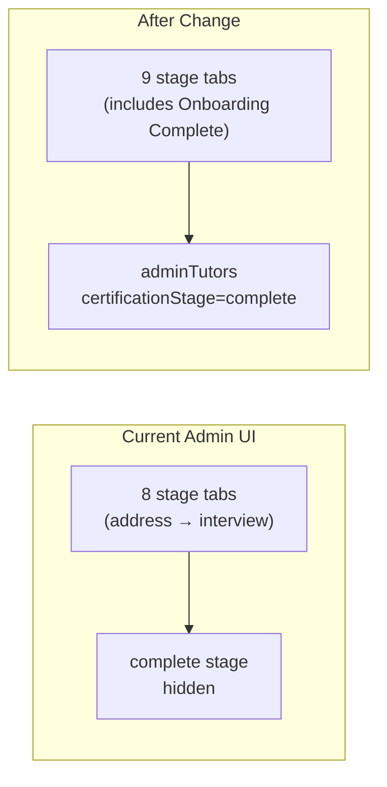

# Admin "Onboarding Complete" Tutors Tab

## Context

The admin Tutors page ([`apps/web-admin/src/app/pages/TutorsPage.tsx`](apps/web-admin/src/app/pages/TutorsPage.tsx)) renders stage tabs from `ONBOARDING_STEPS`, but **deliberately excludes** the `complete` step:

```46:46:apps/web-admin/src/app/pages/TutorsPage.tsx
const TUTOR_STAGE_TABS = ONBOARDING_STEPS.filter((step) => step.id !== 'complete');
```

When a tutor finishes onboarding, the approval batch sets both:
- `certificationStage` → `'complete'`
- `onBoardingComplete` → `true`

The existing GraphQL APIs already support this stage — no backend work is required:

| API | Behavior |
|-----|----------|
| `adminTutors(input: { certificationStage: 'complete', ... })` | Lists approved tutors ([`admin.service.ts`](apps/api/src/app/modules/admin/admin.service.ts) L156–205) |
| `adminTutorStageCounts` | Returns count for `complete` stage ([`admin.service.ts`](apps/api/src/app/modules/admin/admin.service.ts) L208–230) |



## Implementation

### 1. Include the `complete` tab

In [`TutorsPage.tsx`](apps/web-admin/src/app/pages/TutorsPage.tsx):

- Change `TUTOR_STAGE_TABS` to use all `ONBOARDING_STEPS` (remove the `.filter((step) => step.id !== 'complete')`).
- The tab label will automatically be **"Onboarding Complete"** from shared config ([`libs/shared-utils/src/onboarding-types.ts`](libs/shared-utils/src/onboarding-types.ts) L82–85).

### 2. Add tab styling for `complete`

`STAGE_TAB_STYLES` and `ACTIVE_PANEL_STYLES` already have a `complete` key but with empty strings. Fill in a success-themed style (e.g. teal/green) consistent with the other tabs:

```typescript
complete: {
  active: 'border-teal-300 bg-gradient-to-b from-teal-50 to-white ...',
  header: 'border-teal-200 bg-gradient-to-r from-teal-100/80 ...',
  badge: 'bg-teal-500 text-white',
  badgeInactive: 'bg-teal-100 text-teal-700',
  indicator: 'bg-teal-500',
}
```

Also update `ACTIVE_PANEL_STYLES.complete` to match (e.g. `'border-teal-200/80 shadow-teal-100/50'`).

### 3. Reuse existing table behavior

No changes needed to GraphQL queries ([`libs/shared-graphql/src/queries/admin.queries.ts`](libs/shared-graphql/src/queries/admin.queries.ts)) — the same `GET_ADMIN_TUTORS` and `GET_ADMIN_TUTOR_STAGE_COUNTS` queries work with `activeStage = 'complete'`.

The existing table columns (ID, Name, Email, Mobile, Days in stage) work as-is:
- Search and pagination behave the same
- Tutor name links to `/tutors/:id` detail page
- "Days in stage" reflects days since entering the `complete` stage (`certificationStageEnteredAt`)
- Docs-specific UI (review badge, row highlight) only triggers when `activeStage === 'docs'`, so it won't affect the new tab

### 4. Optional UX polish (minimal)

- Update empty-state copy when `activeStage === 'complete'`: e.g. "No tutors with completed onboarding." instead of generic "No tutors at this stage."
- Optionally rename the "Days in stage" column header to "Days since approved" when on the complete tab — low priority, can skip to keep diff minimal.

## Files to change

| File | Change |
|------|--------|
| [`apps/web-admin/src/app/pages/TutorsPage.tsx`](apps/web-admin/src/app/pages/TutorsPage.tsx) | Include `complete` tab, add styling, optional empty-state text |

No backend, GraphQL schema, or shared-utils changes required.

## Verification

1. Open admin `/tutors` — confirm a 9th tab **"Onboarding Complete"** appears after "Application Review"
2. Tab shows count badge from `adminTutorStageCounts`
3. Clicking the tab lists tutors with `certificationStage = complete`
4. Search and pagination work on the new tab
5. Clicking a tutor name opens the existing detail page
