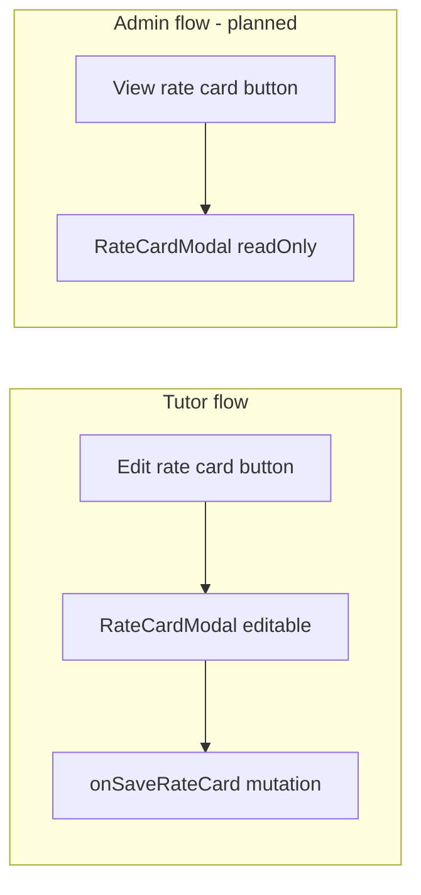

# Admin read-only rate card modal

## Current state

- Tutors open [`RateCardModal`](libs/tutor-detail-ui/src/RateCardModal.tsx) from [`TutorDetailView`](libs/tutor-detail-ui/src/TutorDetailView.tsx) via an offerings-table button; save flows through `onSaveRateCard` from [`TutorProfilePage`](apps/web/src/app/components/tutor-profile/TutorProfilePage.tsx).
- Admin [`TutorDetailPage`](apps/web-admin/src/app/pages/TutorDetailPage.tsx) uses `TutorDetailView` with `mode="admin"` but the modal is **not rendered** (`{!isAdmin && onSaveRateCard && rateCardOffering ? <RateCardModal ... />}`).
- Admin offerings show only a one-line summary via `formatRateCardSummary` in [`OfferingsSection`](libs/tutor-detail-ui/src/TutorDetailView.tsx) (lines 310–313).
- Data is already available: [`GET_ADMIN_TUTOR_DETAIL`](libs/shared-graphql/src/queries/admin.queries.ts) includes the full `rateCard` fragment (same fields as tutor query). **No API or GraphQL changes.**



## 1. Add `readOnly` to `RateCardModal`

**File:** [`libs/tutor-detail-ui/src/RateCardModal.tsx`](libs/tutor-detail-ui/src/RateCardModal.tsx)

- Add prop: `readOnly?: boolean` (default `false`).
- Make `onSubmit` optional when `readOnly` is true (TypeScript: `onSubmit?: ...` with runtime guard so submit handler is never called in read-only mode).
- When `readOnly`:
  - Pass `disabled={true}` into `ModeSection` (and free-demo checkbox) so all inputs/checkboxes are non-interactive but still display current values (including always-visible rate/discount fields when a mode is off).
  - Keep **tabs interactive** (`RateCardModeTabs` only disabled during `saving`, not in read-only).
  - **Footer:** single **Close** button (hide Cancel + Save rate card).
  - **Copy:** title `"View rate card"`; subtitle `"How this tutor charges for this offering."` (instead of tutor-facing “Set how you charge…”).
  - Skip validation / `handleSubmit` entirely.

Reuse existing `disabled` plumbing in `ModeSection` (`inputsDisabled = disabled || !values.enabled`) — passing `disabled={readOnly || saving}` covers read-only cleanly.

## 2. Wire modal + button in `TutorDetailView`

**File:** [`libs/tutor-detail-ui/src/TutorDetailView.tsx`](libs/tutor-detail-ui/src/TutorDetailView.tsx)

**Modal rendering** — replace tutor-only guard with shared state:

```tsx
{rateCardOffering ? (
  <RateCardModal
    open
    readOnly={isAdmin}
    offeringName={...}
    initialValues={rateCardOffering.rateCard}
    saving={!isAdmin ? savingRateCard : false}
    error={!isAdmin ? rateCardSaveError : null}
    onClose={() => setRateCardOffering(null)}
    onSubmit={
      !isAdmin && onSaveRateCard
        ? async (values) => { await onSaveRateCard(rateCardOffering.id, values); setRateCardOffering(null); }
        : undefined
    }
  />
) : null}
```

**`OfferingsSection` admin cell** — mirror tutor UX with a view action:

- When `isAdmin && onOpenRateCard`, show a **View rate card** button (always, so admins can see empty/unconfigured state in the modal).
- Optionally keep the short summary line (`rateCardSummary ?? 'Not configured'`) beside the button for quick scanning.

**Callbacks:**

- Tutor offerings (existing): `onOpenRateCard={onSaveRateCard ? setRateCardOffering : undefined}`
- Admin offerings (new): `onOpenRateCard={(offering) => setRateCardOffering(offering)}` on the admin `<OfferingsSection>` at ~line 657

## 3. No changes required elsewhere

- [`apps/web-admin/src/app/pages/TutorDetailPage.tsx`](apps/web-admin/src/app/pages/TutorDetailPage.tsx) — already passes `mode="admin"` and full tutor detail; no new props needed.
- [`libs/tutor-detail-ui/src/index.ts`](libs/tutor-detail-ui/src/index.ts) — export unchanged (`RateCardModal` already exported).
- Backend / mutations — admin remains view-only; no save mutation on admin path.

## Testing checklist

- Admin tutor detail → Offerings → **View rate card** opens tabbed modal with correct offline/online values and free-demo checkbox state.
- All fields and checkboxes are non-editable; tabs still switch between Offline / Online.
- Only **Close** in footer; no save errors or mutation calls.
- Tutor profile flow unchanged: edit, save, validation errors still work.
