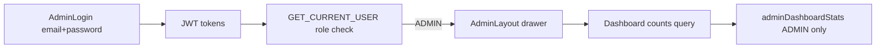

# Admin Interface — Phase 1 (Login + Dashboard counts)

## Context

- [`apps/web-admin`](apps/web-admin) already exists (Vite + React + `GraphQLProvider`) but is a placeholder (`NxWelcome`). Run with `npm run serve:admin` on **port 4201**.
- Auth backend supports **`UserRole.ADMIN`** and shared **`login`** mutation (email + password). Pattern for admin-only APIs exists: `sessionStats` in [`auth.resolver.ts`](apps/api/src/app/modules/auth/resolvers/auth.resolver.ts) uses `JwtAuthGuard` + `RolesGuard` + `@Roles(ADMIN)`.
- **No count queries** exist today. Students are only `User` rows with `role = STUDENT` (no student module/table yet). Tutors have a `tutor` table but “signed up” maps cleanly to **`user.role = TUTOR`**.



---

## Backend (API)

### New `AdminModule`

Add [`apps/api/src/app/modules/admin/`](apps/api/src/app/modules/admin/):

| File | Purpose |
|------|---------|
| `admin.module.ts` | Import `TypeOrmModule.forFeature([User])`, register resolver + service |
| `admin.service.ts` | Count queries on `user` table |
| `admin.resolver.ts` | GraphQL query guarded for ADMIN |
| `dto/admin-dashboard-stats.dto.ts` | GraphQL object type |

**Query:**

```graphql
adminDashboardStats {
  tutorSignupCount
  studentSignupCount
}
```

**Count logic** (both exclude soft-deleted users):

- `tutorSignupCount`: `user` where `role = TUTOR` and `deleted = false`
- `studentSignupCount`: `user` where `role = STUDENT` and `deleted = false`

Use TypeORM `count()` — do **not** fetch full lists (unlike existing unguarded `tutors` query).

**Guard:** `@UseGuards(JwtAuthGuard, RolesGuard)` + `@Roles(UserRole.ADMIN)` — same as `sessionStats`.

Register `AdminModule` in [`app.module.ts`](apps/api/src/app/app.module.ts).

**Unit test:** `admin.service.spec.ts` — mock repository counts for TUTOR/STUDENT.

---

## Shared GraphQL

Add to [`libs/shared-graphql`](libs/shared-graphql):

- `queries/admin.queries.ts` — `GET_ADMIN_DASHBOARD_STATS`
- Export from `queries/index.ts`

Reuse existing `LOGIN`, `GET_CURRENT_USER`, `LOGOUT` from [`auth.mutations.ts`](libs/shared-graphql/src/mutations/auth.mutations.ts) / [`auth.queries.ts`](libs/shared-graphql/src/queries/auth.queries.ts).

---

## Frontend (`web-admin` SPA)

### Tooling setup

Mirror [`apps/web`](apps/web) styling stack:

- Add Tailwind + PostCSS config to `web-admin` (copy/adapt `tailwind.config.cjs`, `postcss.config.cjs`, update [`styles.css`](apps/web-admin/src/styles.css))
- Add **`react-router-dom`** to root `package.json` for client-side routes
- Optional: mirror GraphQL `define` block from [`apps/web/vite.config.mts`](apps/web/vite.config.mts) in [`web-admin/vite.config.mts`](apps/web-admin/vite.config.mts) for env consistency (defaults already work via [`endpoint.ts`](libs/shared-graphql/src/client/web/endpoint.ts))

### App structure

```
apps/web-admin/src/app/
  App.tsx                 # BrowserRouter + auth bootstrap
  auth/
    RequireAdmin.tsx      # Redirect to /login if no token or role !== ADMIN
    useAdminAuth.ts       # login, logout, me check, clear tokens on reject
  layouts/
    AdminLayout.tsx       # Left drawer + <Outlet />
  components/
    AdminNavDrawer.tsx    # Dashboard | Tutors | Students links
  pages/
    LoginPage.tsx         # Email + password only; reject non-ADMIN after login
    DashboardPage.tsx     # Two stat cards: tutor count, student count
    TutorsPage.tsx        # Placeholder (“Tutor management coming soon”)
    StudentsPage.tsx      # Placeholder (“Student management coming soon”)
```

### Routes

| Path | Screen | Auth |
|------|--------|------|
| `/login` | Login | Public |
| `/` | Redirect → `/dashboard` | Admin |
| `/dashboard` | Count cards | Admin |
| `/tutors` | Placeholder | Admin |
| `/students` | Placeholder | Admin |

### Login flow

1. `LOGIN` with `{ loginId: email, password, platform: 'web' }`
2. Store tokens via existing [`token-storage.ts`](libs/shared-graphql/src/client/web/token-storage.ts)
3. Fetch `GET_CURRENT_USER` — if `role !== 'ADMIN'`, clear tokens and show “Admin access only”
4. Navigate to `/dashboard`

On app load: if token exists, run `me` query; restore session only for ADMIN.

### Admin shell UI

- **Left drawer** (~240px): app title, nav links with active state, logout at bottom
- **Main content**: Dashboard shows two cards:
  - “Tutors signed up” → `tutorSignupCount`
  - “Students signed up” → `studentSignupCount`
- Tutors / Students pages: minimal placeholder text for now (future CRM lists)

Match existing Tutorix palette from web (`#143055` primary, light gray background).

---

## Out of scope (Phase 1)

- Tutor/student search, detail pages, pagination
- Separate admin login mutation (reuse `login`)
- Student profile module
- Document review UI from admin
- Role management / multi-admin CRUD

---

## Manual test checklist

1. Create or use an existing `ADMIN` user (email + password in DB)
2. `npm run serve:api` + `npm run serve:admin` → open `http://localhost:4201`
3. Non-admin login → rejected with clear message
4. Admin login → dashboard with counts matching DB
5. Drawer navigation works; Tutors/Students show placeholders
6. Logout clears session; protected routes redirect to login
7. Unauthenticated `adminDashboardStats` → GraphQL forbidden error
