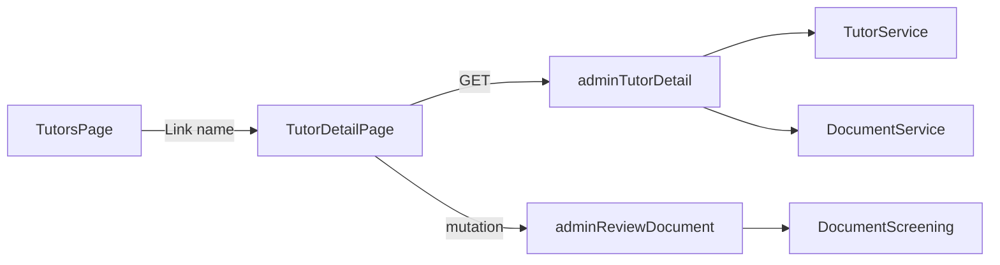

# Admin tutor detail page

## Goal

Clicking a tutor **name** on any stage tab in [`TutorsPage.tsx`](apps/web-admin/src/app/pages/TutorsPage.tsx) navigates to `/tutors/:tutorId` and shows a read-only profile with document review actions where applicable.



## Backend: admin tutor detail query

### New GraphQL API (admin-only)

Add to [`admin.resolver.ts`](apps/api/src/app/modules/admin/admin.resolver.ts):

- `adminTutorDetail(tutorId: Int!): AdminTutorDetail`

Add DTOs under `apps/api/src/app/modules/admin/dto/`:

| DTO | Contents |
|-----|----------|
| `AdminTutorDetail` | `id`, `certificationStage`, `yearsOfExperience`, fee fields (`regFeePaid`, `regFeeAmount`, `regFeeAmountToBePaid`, `regFeeDate`), `user` (name, email, mobile, `createdDate` as registration date), `addresses[]`, `qualifications[]`, `experiences[]`, `offerings[]`, `documents[]` |
| `AdminTutorOfferingDetail` | offering name/displayName, PT `status`, `attemptsUsed`, computed `attemptsRemaining` (max 2 − used), `lastScore`/`lastMaxScore`, `lastAttemptAt`, `passedAt`, `lastTimeTakenSeconds` |
| `AdminTutorDocumentDetail` | id, type, filename, mimeType, `previewUrl`, `viewUrl` (full file presigned GET), `screening` (status, summaryNotes, confidence, automatedAt) |

Implement `AdminService.getTutorDetail(tutorId)` in [`admin.service.ts`](apps/api/src/app/modules/admin/admin.service.ts) by composing existing services:

- [`TutorService.findOne`](apps/api/src/app/modules/tutor/services/tutor.service.ts) with `user` + `addresses` relations
- [`TutorQualificationService.findByTutorId`](apps/api/src/app/modules/tutor/services/tutor-qualification.service.ts)
- [`ExperienceService.findByTutorId`](apps/api/src/app/modules/experience/services/experience.service.ts)
- [`TutorOfferingService.findByTutorId`](apps/api/src/app/modules/tutor/services/tutor-offering.service.ts) with `offering` relation
- [`DocumentService.findDocumentsByTutorId`](apps/api/src/app/modules/document/services/document.service.ts) (or equivalent) with screening join

**Do not reuse** unguarded `tutor(id)` — keep admin data behind `@Roles(ADMIN)`.

### Admin document URLs

Extend [`document.service.ts`](apps/api/src/app/modules/document/services/document.service.ts):

- `resolvePreviewUrlForAdmin(doc)` — reuse existing preview helper logic (thumbnail/CDN/presigned thumb)
- `resolveViewUrlForAdmin(doc)` — presigned GET on `storageKey` (900s) so admins can open PDFs in the viewer

Current tutor-only guard in `assertUserCanAccessDocument` blocks admins; admin methods skip that guard (caller is already ADMIN-guarded).

Populate `previewUrl` / `viewUrl` in `getTutorDetail` mapping — do not rely on the tutor-only `DocumentEntityResolver.previewUrl` field resolver.

### Document review mutation

Wire existing [`AdminReviewEducationDocumentInput`](apps/api/src/app/modules/document/dto/admin-review-education-document.input.ts) as:

- `adminReviewDocument(input: AdminReviewEducationDocumentInput!): AdminTutorDocumentDetail` (admin resolver)

Add `DocumentScreeningService.reviewByAdmin(documentId, approve, note, adminUserId)`:

- Validate document exists, is onboarding type ([`onboarding-document-types.ts`](apps/api/src/app/modules/document/onboarding-document-types.ts)), screening status is `PENDING_HUMAN`
- Set `APPROVED_HUMAN` or `REJECTED_HUMAN`, `reviewedByUserId`, `reviewedAt`, `reviewerNote`
- On approve: set `document.verified = true`, `verifiedBy`, `verifiedDate`
- On reject: leave `document.verified = false`

Register `DocumentModule` (+ `ExperienceModule`, `TutorModule`) in [`admin.module.ts`](apps/api/src/app/modules/admin/admin.module.ts).

## Shared GraphQL

Add to [`libs/shared-graphql/src/queries/admin.queries.ts`](libs/shared-graphql/src/queries/admin.queries.ts):

- `GET_ADMIN_TUTOR_DETAIL` — full nested selection matching `AdminTutorDetail`

Add [`libs/shared-graphql/src/mutations/admin.mutations.ts`](libs/shared-graphql/src/mutations/admin.mutations.ts) (new file, export from index):

- `ADMIN_REVIEW_DOCUMENT`

## Frontend: routing + list link

In [`app.tsx`](apps/web-admin/src/app/app.tsx):

```tsx
<Route path="tutors/:tutorId" element={<TutorDetailPage />} />
```

In [`TutorsPage.tsx`](apps/web-admin/src/app/pages/TutorsPage.tsx): wrap tutor name in `<Link to={`/tutors/${tutor.id}`}>` (styled as link, works on every tab).

## Frontend: TutorDetailPage

New page [`apps/web-admin/src/app/pages/TutorDetailPage.tsx`](apps/web-admin/src/app/pages/TutorDetailPage.tsx):

- `useParams()` → `tutorId`
- `useQuery(GET_ADMIN_TUTOR_DETAIL)`
- Header: back link to `/tutors`, tutor name + ID
- Section cards (consistent with existing colorful admin styling):

| Section | Display |
|---------|---------|
| **Profile** | ID, full name, email, mobile, registration date (`user.createdDate`) |
| **Address** | All addresses formatted (street, city, state, postal, fullAddress) |
| **Education** | List all qualifications (type, board, degree, grades, year) |
| **Experience** | `yearsOfExperience` summary + all experience rows (title, employer, dates) |
| **Offerings** | Table per offering: name, PT status (pass/fail/pending), date taken, score (`lastScore/lastMaxScore`), attempts used, attempts remaining |
| **Fee** | Placeholder card: amount (`regFeeAmountToBePaid` or paid amount), date received (`regFeeDate` or “Not received”), paid badge |
| **Documents** | 2×2 grid of thumbnails (reuse tutor-web visual language from [`DocumentUploadCard.tsx`](apps/web/src/app/components/tutor-onboarding/tutor-docs-upload/DocumentUploadCard.tsx) — read-only, no upload) |

### Document viewer modal

New component `AdminDocumentViewerModal.tsx`:

- Opens on thumbnail click
- Shows image via `previewUrl` or PDF via `viewUrl` in `<iframe>` / ``
- If `screening.status === PENDING_HUMAN`: show AI notes + **Accept** / **Reject** buttons
- Reject: optional note textarea
- Calls `ADMIN_REVIEW_DOCUMENT` mutation, refetches detail, closes modal on success
- Show screening status badge (passed automated, approved human, rejected human, pending)

Extract small shared helpers for document status labels (mirror tutor-web `passed` / `humanPending` / `rejected` logic).

## Tests

- `AdminService.getTutorDetail` — maps nested data, computes `attemptsRemaining`, attaches admin URLs
- `DocumentScreeningService.reviewByAdmin` — approve/reject transitions, rejects invalid status
- Unit test for admin document URL methods (admin allowed, no tutor guard)

## Out of scope (this iteration)

- Stage advancement / interview actions
- Editing tutor profile from admin
- Experience-attached documents (only onboarding docs in grid)
- Fee collection workflow (display placeholder only)
- URL-synced stage tab on list page when returning from detail

## Verification

1. Restart API after GraphQL changes
2. From any tutors tab, click a name → detail page loads
3. All sections render for a tutor with full onboarding data
4. Click document thumb → viewer opens
5. For `PENDING_HUMAN` doc: Accept/Reject updates status and UI after refetch
