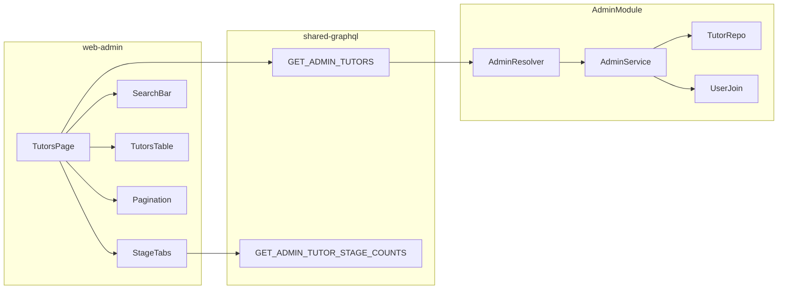

# Admin Tutors List by Onboarding Stage

## Scope

Replace the placeholder [`TutorsPage.tsx`](apps/web-admin/src/app/pages/TutorsPage.tsx) with a tabbed, searchable, paginated tutor table. Tabs match onboarding stages **Address through Interview** (8 tabs — exclude `complete`). Columns: **Tutor ID**, **Name**, **Email**, **Mobile**, **Days in stage**.

## Architecture

Stage labels and order come from existing [`ONBOARDING_STEPS`](libs/shared-utils/src/onboarding-types.ts) (already aliased in [`web-admin/vite.config.mts`](apps/web-admin/vite.config.mts)). Filter to steps where `id !== 'complete'`.

---

## 1. Database: days-in-stage tracking

**Problem:** [`Tutor.certificationStage`](apps/api/src/app/modules/tutor/entities/tutor.entity.ts) stores the current step only; no per-stage entry time exists.

**Change:**
- Add migration `1773900000000-AddCertificationStageEnteredAt.ts`:
  - Column `certification_stage_entered_at` (`timestamp`, nullable) on `tutor`
  - Backfill existing rows: `SET certification_stage_entered_at = updated_date` (best available proxy)
- Add `@Column` + `@Field` on `Tutor` entity: `certificationStageEnteredAt?: Date`
- Update [`TutorService.updateCertificationStage()`](apps/api/src/app/modules/tutor/services/tutor.service.ts): when stage **changes**, set `certificationStageEnteredAt = new Date()`; on tutor creation in `ensureTutorExists`, initialize to `now` if missing

**Computed field for API/UI:** `daysInStage = floor((now - certificationStageEnteredAt) / 86400000)` (minimum 0). Exposed as `Int` on a slim admin list DTO — not stored.

**Suggested column title:** **Days in stage** (header); cell shows e.g. `5` or `5 days` — recommend plain number with header carrying the unit.

---

## 2. Backend: admin list API

Extend [`AdminModule`](apps/api/src/app/modules/admin/admin.module.ts):
- Import `TypeOrmModule.forFeature([Tutor])` (keep `User` if still needed for dashboard counts)

**New DTOs** under `apps/api/src/app/modules/admin/dto/`:
- `AdminTutorListInput` — `certificationStage` (required enum), `page` (default 1), `pageSize` (default 20, max 20), `search?` (string)
- `AdminTutorListItem` — `id`, `firstName`, `lastName`, `email`, `mobile`, `mobileCountryCode`, `mobileNumber`, `certificationStage`, `daysInStage`
- `AdminTutorListResult` — `items`, `totalCount`, `page`, `pageSize`, `totalPages`
- `AdminTutorStageCount` — `stage`, `count` (for tab badges)

**New service methods** in [`admin.service.ts`](apps/api/src/app/modules/admin/admin.service.ts):
- `listTutors(input)` — TypeORM query builder:
  - `tutor` JOIN `user` ON `user_id`
  - `tutor.deleted = false` (include inactive tutors for admin review; do **not** filter `active: true` like public `findAll`)
  - `tutor.certificationStage = :stage`
  - Search (when `search` trimmed): case-insensitive match on `user.email`, `user.mobile`, `user.mobile_number`, or `CONCAT(first_name, ' ', last_name)` / individual name fields
  - `orderBy('tutor.certificationStageEnteredAt', 'ASC')` (longest-waiting first — good for ops)
  - `skip/take` for pagination; `getManyAndCount()`
  - Map rows to `AdminTutorListItem` with `daysInStage` computed in service
- `getTutorStageCounts(search?)` — `GROUP BY certification_stage` with same search filter applied (optional: only when search active, counts reflect search; when no search, show global per-stage counts for badges)

**New resolver queries** in [`admin.resolver.ts`](apps/api/src/app/modules/admin/admin.resolver.ts) (same guard pattern as `adminDashboardStats`):
- `adminTutors(input: AdminTutorListInput!): AdminTutorListResult!`
- `adminTutorStageCounts(search: String): [AdminTutorStageCount!]!`

Do **not** extend the unguarded public `tutors` query.

---

## 3. Shared GraphQL

Add to [`libs/shared-graphql/src/queries/admin.queries.ts`](libs/shared-graphql/src/queries/admin.queries.ts):
- `GET_ADMIN_TUTORS` with `$input: AdminTutorListInput!`
- `GET_ADMIN_TUTOR_STAGE_COUNTS` with optional `$search: String`
- Export from [`queries/index.ts`](libs/shared-graphql/src/queries/index.ts)

---

## 4. Frontend: Tutors page UI

Replace [`TutorsPage.tsx`](apps/web-admin/src/app/pages/TutorsPage.tsx) with:

**Layout (main content area, right of nav drawer — unchanged shell):**
1. **Page header** — title + short description (match dashboard styling)
2. **Search bar** — single input: "Search by name, email, or mobile"; debounced ~300ms; resets to page 1 on change
3. **Stage tabs** — horizontal scroll on small screens; one tab per step (Address → Interview); show optional count badge from `adminTutorStageCounts`; active tab drives `certificationStage` filter
4. **Table** — responsive striped table:
   - Tutor ID | Name | Email | Mobile | Days in stage
   - Name = `[firstName, lastName].filter(Boolean).join(' ')` with fallback `—`
   - Mobile = prefer `mobile` field; else format `mobileCountryCode mobileNumber`
5. **Pagination** — Previous / Next buttons; disabled at bounds; text like "Page 2 of 4 (53 tutors)"; fixed `pageSize: 20`
6. **States** — loading skeleton/text, empty state ("No tutors at this stage"), error alert

**Data fetching:**
- `useQuery(GET_ADMIN_TUTOR_STAGE_COUNTS, { variables: { search } })` for tab badges
- `useQuery(GET_ADMIN_TUTORS, { variables: { input: { certificationStage, page, pageSize: 20, search } }, fetchPolicy: 'cache-and-network' })`
- Default active tab: `address` (or first tab)

Extract small presentational pieces if it keeps the page readable (`TutorStageTabs`, `TutorsTable`, `TutorsPagination`) — keep in `apps/web-admin/src/app/pages/` or `components/tutors/`.

---

## 5. Tests

Extend [`admin.service.spec.ts`](apps/api/src/app/modules/admin/admin.service.spec.ts):
- `listTutors` filters by stage, paginates correctly, applies search
- `daysInStage` calculation from `certificationStageEnteredAt`
- `getTutorStageCounts` returns grouped counts

Add/update tutor service test (if exists) or small unit test: `updateCertificationStage` sets `certificationStageEnteredAt` only when stage changes.

---

## 6. Manual verification

1. Run migration: `npm run migration:run`
2. Restart API (`npm run serve:api`)
3. Open admin `/tutors` — confirm 8 tabs, search, pagination, and counts per stage
4. Spot-check a known tutor’s stage vs tab placement and days-in-stage value

---

## Out of scope (future)

- Tutor detail/drill-down view on row click
- `complete` stage tab or post-onboarding CRM actions
- Export CSV, column sorting, page-size selector
