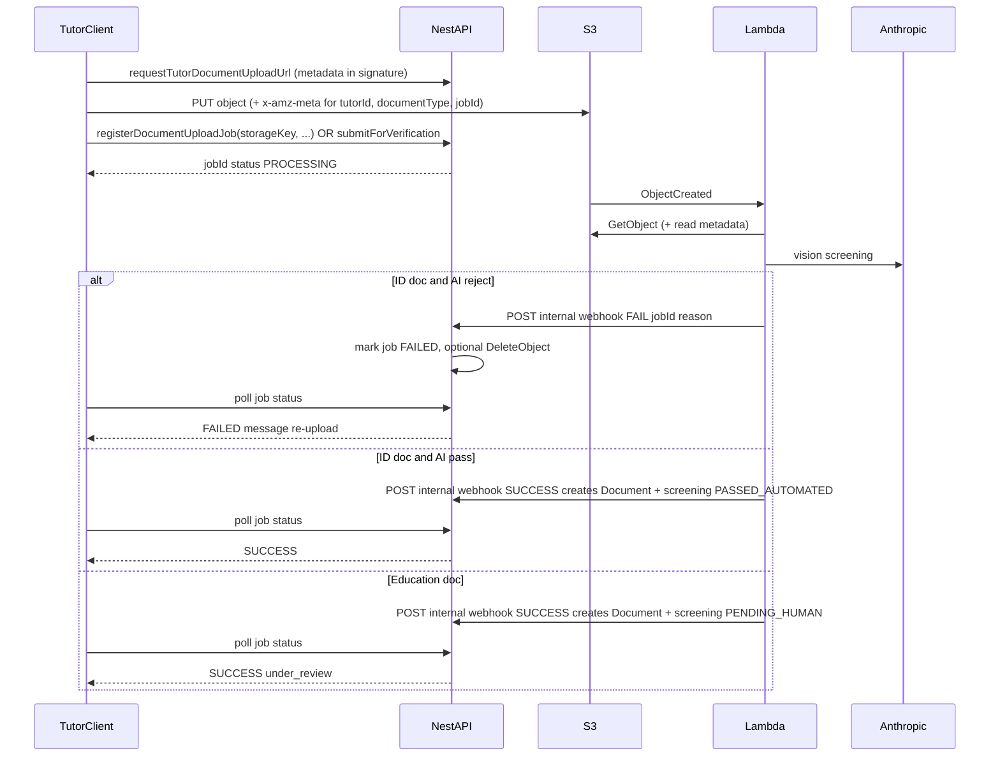

# AI verification for tutor onboarding documents

## Product rules (your proposal)

| Document types | AI outcome | Tutor experience | Progression |
|---------------|------------|------------------|-------------|
| **Aadhaar (front/back), PAN** | Not the expected ID | **Reject** after Lambda: job **`FAILED`**, no `DocumentEntity`; tutor sees message and re-uploads | Optional **S3 DeleteObject** on failure |
| **Aadhaar / PAN** | Passes | Job **`COMPLETE`**; document saved | Counts toward docs step |
| **Class XII marksheet, Highest degree** | AI step completes | **Job COMPLETE**; file stays in S3; **“under review”** for tutor | Block next stage until **admin** `APPROVED_HUMAN` on screening |
| **Education** | Clearly not a certificate | Product choice: **either** treat like soft-reject with re-upload **or** still flag for human (plan assumes **flag for human** to reduce false rejections; can tighten later) |

## Current baseline (repo)

- Upload flow today: [`requestTutorDocumentUploadUrl`](apps/api/src/app/modules/document/services/document.service.ts) → client PUT → [`confirmTutorDocumentUpload`](apps/api/src/app/modules/document/services/document.service.ts). **Target flow:** presign → PUT → **register job** → **Lambda verifies** → **internal webhook** persists **`document` + `document_screening`** → client **polls job** until success/fail.
- `DocumentEntity` already has `verified`, `verifiedBy`, `verifiedDate` (human-oriented).
- Tutor stage gate: [`getTutorForDocumentUpload`](apps/api/src/app/modules/document/services/document.service.ts) requires `certificationStage === docs` — advancement logic lives in tutor module (needs extension so “docs complete” requires ID docs OK + **no pending education review** unless admin cleared).

## Architecture (chosen: Lambda verifies, then server persists)

**Goal:** After the file is in S3, **Lambda** runs AI verification; **only if verification succeeds** (or education path allows save with human review) does the **API** create/update **`document` + `document_screening`** and expose a **successful** outcome to the client. The browser does not treat the upload as “done” until the server says so **after** Lambda.

**Why this matches “success only after Lambda”:** The API **does not** insert `DocumentEntity` on the first client call after PUT; it only inserts (or marks job complete) when Lambda calls a **trusted internal HTTP endpoint** (or equivalent) with verification results. The client **polls** `documentUploadJob` / `getDocumentVerificationStatus(jobId)` or uses a subscription until `COMPLETE` / `FAILED`.

**Presign / metadata:** Extend presigned `PutObject` so required **x-amz-meta-** fields are part of the signed headers (e.g. `job-id`, `document-type`, `user-id` or a signed **nonce** issued by `registerDocumentUploadJob`). Lambda reads metadata to correlate the object to a row in **`document_upload_verification`** (or similar) and to avoid trusting the body alone.

**Internal callback security:** Nest exposes e.g. `POST /internal/document-verification/complete` and `/fail` (or one route with body) protected by **shared secret** (HMAC of body + timestamp) or **IAM / API Gateway** fronting Lambda only—**never** callable from the browser.

**Lambda responsibilities:** `GetObject`, optional resize/PDF first page, call Anthropic, map result to pass/fail/education pending human, invoke API callback, **idempotent** (duplicate S3 events → safe retries).

**Failure cleanup (Aadhaar/PAN):** On automated reject, Lambda or API may **DeleteObject** on the key to avoid orphan PII in S3; job row stores `reason` for the UI.

**Local / non-AWS dev:** Feature flag or **inline** verification in API for dev only; or invoke Lambda locally (SAM); keep the same job + callback contract where possible.

**Vision provider (Lambda):** **`ANTHROPIC_API_KEY`** and model id in **Lambda env** (or Secrets Manager). Same prompts as in plan below.

**Execution model note:** Product latency is **upload + Lambda + AI + poll**; show a **“Verifying document…”** state in the tutor UI until the job completes.

**Input handling:**

- **Images:** JPEG/PNG as **`base64` + `media_type`** in Claude **`image` content blocks** per Messages API.
- **PDF:** Rasterize first page (or first N pages for education) server-side (e.g. `pdf-to-img` / `pdfjs` + canvas in Node, or microbatch Lambda); cap pixels/size for cost and latency.

**Reference images (Aadhaar/PAN):**

- Store **non-PII official sample/layout images** you provide in a dedicated S3 prefix (e.g. `reference-documents/aadhaar-front.jpg`) or ship as controlled assets; **do not** use real individuals’ Aadhaar/PAN in prompts.
- Prompt strategy: multimodal — “compare layout and distinctive elements (logos, headers, number formats) to these references; determine if upload is Indian Aadhaar front/back or Indian PAN; avoid copying or outputting full ID numbers.”

**Education certificates:**

- No template matching: structured prompt asking for **binary or scored** `isLikelyEducationalCredential` plus short rationale; accept **regional variance** (board/university headers, tables, stamps).
- **Always** save the file after AI; set a **review state** (see data model). Tutor sees **under review** even when AI is confident, per your rule (or only when score below threshold — product tweak).

## Data model

Use a **`document_screening` table** (separate from [`DocumentEntity`](apps/api/src/app/modules/document/entities/document.entity.ts)) so screening metadata, model version, and human-review columns do not bloat the core document row and can evolve independently.

**`document_screening` (suggested columns):**

- `id` (PK)
- `document_id` (FK → `document.id`, **unique** — one active screening record per saved document; add a separate `document_screening_history` table later if you need immutable audit of each attempt)
- `status` enum: `PASSED_AUTOMATED | PENDING_HUMAN | APPROVED_HUMAN | REJECTED_HUMAN` (and optionally `REJECTED_AUTOMATED` if you ever persist automated failures against a draft row)
- `automated_at` (timestamp when AI ran)
- `model_id` (string, e.g. Anthropic model id)
- `confidence` (numeric, nullable)
- `summary_notes` (short text; non-sensitive rationale for admins/tutor messaging)
- **Human review:** `reviewed_by_user_id` (nullable FK), `reviewed_at` (nullable), `reviewer_note` (nullable)

**`DocumentEntity`:** Keep existing `verified`, `verifiedBy`, `verifiedDate` for **human** verification of the file itself; align with admin workflow (admin action can update both `document` and `document_screening` in one transaction).

**`document_upload_verification` (job row — new):** Tracks each upload attempt from S3 PUT through Lambda until the API finalizes.

- `id` / `job_id` (UUID, what the client polls)
- `tutor_id`, `user_id` (who initiated; match JWT on register)
- `document_type`, `storage_key`, `mime_type`, `size_bytes`, `original_filename` (mirror what today’s confirm sends)
- `status`: `AWAITING_UPLOAD | PROCESSING | COMPLETE | FAILED` (or `REJECTED_AUTOMATED` for ID fail)
- `failure_reason` (nullable, tutor-safe message)
- `document_id` (nullable FK, set when COMPLETE)
- Timestamps: `created_at`, `processing_started_at`, `completed_at`
- Optional **`idempotency_key`** / S3 **etag** to dedupe Lambda retries

**Screening row lifecycle (with Lambda):**

- **Register:** Client calls API to create job + get presigned URL; client PUTs to S3 with meta **`job-id`**; client notifies **“upload finished”** (or rely on Lambda only—register must create job row first so Lambda can attach).
- **Aadhaar / PAN — pass:** Lambda **SUCCESS** webhook → API creates `DocumentEntity` + `document_screening` (`PASSED_AUTOMATED`), sets job `COMPLETE`, links `document_id`.
- **Aadhaar / PAN — fail:** Lambda **FAIL** webhook → job `FAILED`, **no** `DocumentEntity`; optional **DeleteObject**; client polls and shows re-upload.
- **Education — pass (save + human queue):** Lambda **SUCCESS** webhook → API creates `DocumentEntity` + `document_screening` (`PENDING_HUMAN`) with AI fields in screening row; job `COMPLETE`.

**Tutor progression:** Introduce a clear check used by tutor service/resolvers, e.g. `documentsStepComplete(tutorId)`:

- All required onboarding doc **slots** present (existing business rules).
- Every **Aadhaar/PAN** `document` has a joined `document_screening` with `status === PASSED_AUTOMATED` (legacy docs without a row need a one-time backfill or grandfather rule).
- Every **education** `document` has `document_screening.status === APPROVED_HUMAN` — not `PENDING_HUMAN` or `REJECTED_HUMAN`.

Until education docs are approved, tutor stays on `docs` stage (or a substage “awaiting review”) and next-step mutation returns a clear error.

## API / GraphQL

- **Replace / split today’s `confirmTutorDocumentUpload` flow:**  
  - **`registerDocumentUploadJob`** (name TBD): after `requestTutorDocumentUploadUrl`, client completes PUT, then calls this with file metadata + `storageKey`; returns **`jobId`**, status `PROCESSING`.  
  - **`documentUploadJobStatus(jobId)`** (query): returns `PROCESSING | COMPLETE | FAILED`, **`documentId`** when done, **`failureReason`**, **`requiresHumanReview`** for education.  
  - **Internal (HTTP):** `POST /internal/document-verification/complete|fail` — called only by **Lambda**, secured with **HMAC or mTLS**; performs **`DocumentEntity` + `document_screening`** writes inside a transaction and updates the job row.
- **`document { screening { ... } }`:** unchanged intent — nested `DocumentScreening` GraphQL type from `document_screening`.
- **Admin (phase 2):** `reviewTutorDocument` updates **`document_screening`** + **`document`** `verified*` fields.
- **Deprecate** direct “confirm without job” for onboarding once Lambda path is live; keep behind flag for local dev if needed.

## Frontend ([`TutorDocsUpload.tsx`](apps/web/src/app/components/tutor-onboarding/tutor-docs-upload/TutorDocsUpload.tsx) and related)

- After S3 PUT: call **register job**, then show **“Verifying document…”** while **polling** `documentUploadJobStatus` (backoff / timeout UX).
- On **`FAILED`** (ID automated reject): show API/Lambda-provided message; allow re-upload (new job + new key).
- On **`COMPLETE`** + education: toast/banner **under review** if `requiresHumanReview`.
- Disable **Next** until docs step complete (existing gating + screening states).

## Compliance / safety

- **Aadhaar**: Minimize retention of model outputs containing numbers; instruct model not to echo full Aadhaar/PAN; align internal policy with applicable Indian data rules.
- **Logging**: Log screening outcomes, not raw images.

## Docs

- Update [`docs/DOCUMENT_UPLOAD_STEPS.md`](docs/DOCUMENT_UPLOAD_STEPS.md): presign + metadata, S3→Lambda, job polling, internal callback auth, Lambda env (`ANTHROPIC_API_KEY`, `API_CALLBACK_SECRET`, API base URL). **Never** expose secrets to the web client.

## Implementation order

1. **`document_screening` + `document_upload_verification` migrations** + entities; TypeORM relations; GraphQL types; **internal webhook** module (HMAC) on Nest.
2. **Lambda** (S3 trigger): GetObject, Anthropic call, PDF/image prep, **callback** to API success/fail; Terraform/SAM/IAM; idempotency.
3. **Presigned PUT** changes: include signed **metadata** (`job-id`, etc.); **`registerDocumentUploadJob`** + **`documentUploadJobStatus`**; retire or gate old **`confirmTutorDocumentUpload`** for onboarding.
4. Tutor progression guard (unchanged rules; based on `document_screening`).
5. **Web:** polling + verifying UI.
6. **Admin** review UI + mutation (second PR).
