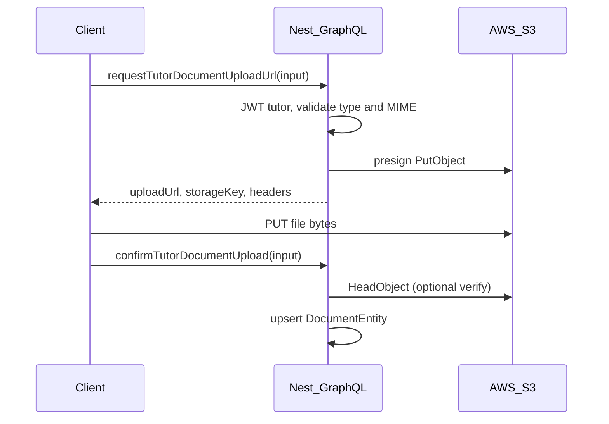

# Backend: tutor document upload (S3 + GraphQL)

## Context

- `[DocumentService](apps/api/src/app/modules/document/services/document.service.ts)` is a stub; `[DocumentModule](apps/api/src/app/modules/document/document.module.ts)` registers only the repo.
- Root `[package.json](package.json)` already has `@aws-sdk/client-secrets-manager`; **no** `@aws-sdk/client-s3` yet.
- `[docs/DOCUMENT_UPLOAD_STEPS.md](docs/DOCUMENT_UPLOAD_STEPS.md)` outlines the intended direction (S3 config → service → GraphQL); this plan aligns with **presigned client-side upload** (matches earlier product discussion), not streaming files through Nest.

## Architecture

## 1. Dependencies and configuration

- Add `**@aws-sdk/client-s3**` and `**@aws-sdk/s3-request-presigner**` to workspace root `dependencies` (same pattern as existing AWS SDK usage).
- Environment variables (document in `.env.example` or internal docs if present):
  - `**AWS_REGION**` or `AWS_DEFAULT_REGION` (already used elsewhere, e.g. `[database-credentials.loader.ts](apps/api/src/app/database/database-credentials.loader.ts)`).
  - `**S3_DOCUMENTS_BUCKET**` (bucket name from Terraform `tutorix-documents-dev` / prod equivalent).
- Credentials: **default** AWS SDK credential chain (env `AWS_ACCESS_KEY_ID` / `AWS_SECRET_ACCESS_KEY`, or IAM role in ECS). No code change if dev already uses the same keys as Terraform IAM user.

## 2. `DocumentService` (core logic)

Extend `[document.service.ts](apps/api/src/app/modules/document/services/document.service.ts)`:

- Inject `**Repository<DocumentEntity>`** and `**Repository<Tutor>`** (register `Tutor` in `[document.module.ts](apps/api/src/app/modules/document/document.module.ts)` via `TypeOrmModule.forFeature([DocumentEntity, Tutor])`) so **DocumentModule does not import TutorModule** (avoids circular dependency).

**Constants**

- **Allowed MIME types**: `application/pdf`, `image/jpeg`, `image/png`.
- **Allowed onboarding `DocumentTypeEnum` values**: `AADHAAR_CARD`, `PAN_CARD`, `CLASS_XII_MARKSHEET`, `HIGHEST_DEGREE_CERTIFICATE` (from `[document-type.enum.ts](apps/api/src/app/modules/document/enums/document-type.enum.ts)`).
- **Max file size** (e.g. 5–10 MB): enforce when issuing presign (server knows `contentLength` from input) and again on confirm.

**Methods (suggested)**

1. `**resolveTutorForUser(userId: number)`** — `findOne` on `Tutor` by `userId`; throw `ForbiddenException` / `NotFoundException` if missing or role ≠ TUTOR (role check can stay in resolver if you prefer).
2. `**generatePresignedPutUrl(params)`** — build `storageKey` entirely on the server, e.g. `tutors/{tutorId}/onboarding/{documentType}/{uuid}.{ext}` where `ext` derives from MIME; use `PutObjectCommand` + `getSignedUrl` with short expiry (e.g. 15 minutes).
3. `**confirmUpload(input)**` — validate `storageKey` matches expected prefix for this tutor + document type; optional `**HeadObjectCommand**` to verify object exists, size, and `Content-Type`; then **upsert** `DocumentEntity` (unique constraint: if one row per `(tutorId, documentType)` for onboarding, use `findOne` + save or `upsert` — **may need a small migration** if you add a unique partial index; otherwise delete previous row for same tutor+type before insert, or update in place).
4. **Optional `deleteObjectForReplace`** — if re-upload replaces, delete old S3 key after successful new confirm (or delete before presign).

`**DocumentEntity` fields to set** on confirm: `name` (human label), `documentType`, `documentForType` = `DocumentForTypeEnum.TUTOR`, `tutorId`, `filename`, `mimeType`, `size`, `storageKey`, `userId` if applicable (optional).

## 3. GraphQL: DTOs and resolver

- Add `**dto/`** under the document module (mirror existing patterns in `[apps/api/src/app/modules/proficiency/dto](apps/api/src/app/modules/proficiency/dto)`):
  - Input: `documentType`, `mimeType`, `byteSize`, optional `originalFilename` for presign.
  - Input for confirm: `storageKey`, `mimeType`, `sizeBytes`, `originalFilename` (optional).
  - Output types: `uploadUrl`, `storageKey`, `headers` (if needed for `Content-Type`), `expiresAt` (optional).
- Add `**document.resolver.ts`** (or `tutor-document.resolver.ts`) with:
  - `@UseGuards(JwtAuthGuard)` on mutations.
  - `@CurrentUser()` → resolve tutor via `DocumentService`.
  - **Business rule**: only allow when `tutor.certificationStage === TutorCertificationStageEnum.docs` (or document explicitly if you want uploads earlier — default to `**docs`** stage to match onboarding).
- Register resolver in `**DocumentModule.providers`**.

## 4. Listing documents for the client

- Add `**@Resolver(() => Tutor)**` in the same document module with `**@ResolveField('documents', () => [DocumentEntity])**` that loads documents where `tutorId` matches parent — **no** TutorModule import needed. Clients can query `myTutorProfile { documents { id documentType storageKey ... } }` when they need the list.

**Note:** GraphQL `orphanedTypes` in `[graphql.module.ts](apps/api/src/app/graphql/graphql.module.ts)` currently includes `AddressEntity`; add `**DocumentEntity`** if the schema generator fails to emit types for `DocumentEntity` when only used as return types.

## 5. Shared GraphQL clients

- Add mutations (and optionally a fragment) to `[libs/shared-graphql](libs/shared-graphql)` (same pattern as `[SUBMIT_PROFICIENCY_TEST](libs/shared-graphql/src/mutations/tutor.mutations.ts)`) so web and mobile can call the same operations.

## 6. Testing and verification

- Unit test `DocumentService` (key generation, MIME allowlist, key prefix validation) with mocked S3 client.
- Manual: `curl` presigned PUT to S3, then `confirm` mutation.

## 7. Out of scope (later)

- Virus scanning, thumbnails, admin download URLs — **not** in this slice.
- **DB migration** if you add a unique constraint on `(tutor_id, document_type)` for onboarding docs — **skip** unless you implement strict upsert semantics.

## Key files to add or touch

| Area    | Files                                                                                                                                                                 |
| ------- | --------------------------------------------------------------------------------------------------------------------------------------------------------------------- |
| Deps    | `[package.json](package.json)`                                                                                                                                        |
| Service | `[document.service.ts](apps/api/src/app/modules/document/services/document.service.ts)`, `[document.module.ts](apps/api/src/app/modules/document/document.module.ts)` |
| API     | New `dto/*.ts`, `document.resolver.ts`                                                                                                                                |
| GraphQL | `[graphql.module.ts](apps/api/src/app/graphql/graphql.module.ts)` if `orphanedTypes` needs `DocumentEntity`                                                           |
| Clients | `libs/shared-graphql/src/mutations/tutor.mutations.ts` (or new file)                                                                                                  |

