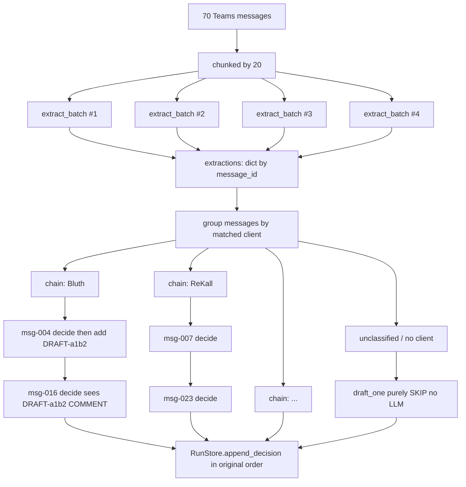

# Batch extract + client-parallel decide

## What we're changing

### Phase 1 — Extract: 70 serial calls to 4 batched calls

Replace per-message calls with a single "record_requests_batch" tool call per batch of 20. Keep the single-message `extract()` on the `LLMClient` protocol for tests and the stub; add a new `extract_batch()`.

### Phase 2 — Decide: serial for-loop to client-keyed parallel chains

Replace `for message in messages: await _draft_one(...)` with a set of async task chains — one chain per matched HubSpot client. Within a chain messages stay in channel order so iterative dedup (a client's message 14 sees message 4's `DRAFT-xxxx`) is preserved. Across chains, work runs in parallel up to `AGENT_CONCURRENCY`.

## Architecture



## File-level changes

### 1. LLM layer

- [backend/bridge_agent/llm/base.py](backend/bridge_agent/llm/base.py)
  - Add an `extract_batch(items: list[ExtractInput]) -> dict[str, Extraction]` method to the `LLMClient` `Protocol`. Keep `extract()` (single) for back-compat with tests.

- [backend/bridge_agent/llm/tools.py](backend/bridge_agent/llm/tools.py)
  - Add `EXTRACT_BATCH_TOOL`: `items: [ {message_id, sender, is_feature_request, client_name_raw, requester_hint, core_request, one_line_summary, confidence, reasoning}, ... ]`. `message_id` is required so responses map back deterministically.

- [backend/bridge_agent/llm/prompts.py](backend/bridge_agent/llm/prompts.py)
  - Add `EXTRACT_BATCH_SYSTEM` and `extract_batch_user_message(inputs)`. System prompt is the same analyst persona; user message lists all N messages. Explicitly instructs: one output item per input message_id, preserve every id.

- [backend/bridge_agent/llm/claude.py](backend/bridge_agent/llm/claude.py)
  - Implement `extract_batch` with the flat batched tool and the same retry/`Retry-After` machinery already in `_call_tool`.
  - Post-call: index the response array by `message_id`; validate each `Extraction` individually; any rows that fail Pydantic become `None` in the returned dict (same contract as today's per-message try/except in the agent).

- [backend/bridge_agent/llm/stub.py](backend/bridge_agent/llm/stub.py)
  - Implement `extract_batch` as a trivial loop over the existing `extract()`. Keeps the deterministic stub — and all 66 tests — identical.

### 2. Agent orchestrator

- [backend/bridge_agent/agent.py](backend/bridge_agent/agent.py) — replace `_extract_all` (lines 210-236):

  ```python
  async def _extract_all(self, messages: list[TeamsMessage]) -> dict[str, Extraction]:
      batch_size = self._settings.extract_batch_size
      sem = asyncio.Semaphore(self._settings.agent_concurrency)

      async def run_batch(batch: list[TeamsMessage]) -> dict[str, Extraction]:
          async with sem:
              inputs = [ExtractInput(message_id=m.id, sender=..., text=...) for m in batch]
              try:
                  return await self._llm.extract_batch(inputs)
              except LLMError as exc:
                  log.warning("agent.extract_batch.failed", ids=[m.id for m in batch], error=exc.message)
                  return {}  # per-batch failure, not per-run failure

      chunks = [messages[i:i + batch_size] for i in range(0, len(messages), batch_size)]
      results = await asyncio.gather(*(run_batch(c) for c in chunks))
      return {mid: ext for r in results for mid, ext in r.items()}
  ```

- Replace Phase 2 serial loop (lines 136-146) with a client-keyed chain builder. Use `match.id` (stable HubSpot company id) as the chain key for feature-request messages; SKIP-bound messages (no extraction, not a feature request, no client match) bypass chaining entirely. Keep a `list[asyncio.Task]` in original message order to preserve determinism when writing to the run store:

  ```python
  sem = asyncio.Semaphore(self._settings.agent_concurrency)
  client_chain: dict[str, asyncio.Task] = {}
  tasks: list[tuple[str, asyncio.Task]] = []  # (message_id, task) in original order

  for message in messages:
      key = self._chain_key(extractions.get(message.id), companies)  # None for SKIP-bound
      prev = client_chain.get(key) if key else None

      async def work(prev_task, m):
          if prev_task is not None:
              await prev_task
          async with sem:
              return await self._draft_one(run_id=run.id, message=m, ...)

      task = asyncio.create_task(work(prev, message))
      tasks.append((message.id, task))
      if key is not None:
          client_chain[key] = task

  for message_id, task in tasks:
      decision = await task
      await self._store.append_decision(run.id, decision)
  ```

  `_chain_key` uses the same normalization as `matching.match_client_to_record` so the chain key is consistent with the key `_draft_one` will derive internally.

### 3. Config

- [backend/bridge_agent/config.py](backend/bridge_agent/config.py): add `extract_batch_size: int = Field(default=20, ge=1, le=50)`.
- [`.env.example`](/.env.example) and [`.env`](/.env): add `EXTRACT_BATCH_SIZE=20` in the "Agent behaviour" section (keep them in sync).

### 4. Tests

- `backend/tests/test_llm_stub.py`: add a test that `extract_batch(inputs) == {i.message_id: extract(i) for i in inputs}` to lock the stub's loop-equivalence.
- `backend/tests/test_llm_claude.py` (new): mock `AsyncAnthropic.messages.create` to return a batched tool response; assert `extract_batch` returns the right dict keyed by message_id, and that a single failing item doesn't poison the rest.
- `backend/tests/test_agent_pipeline.py`:
  - Existing aggregate-count test (15/45/10 against `docs/expected_outcomes.md`) must still pass — this is the correctness gate.
  - Existing `test_iterative_dedup_reuses_drafts_within_run` (msg-004 CSV export CREATE, msg-016 COMMENT on the draft) must still pass — verifies chain-order preservation when both messages are from the same client.
  - Add a new test that explicitly asserts cross-client parallelism: given two messages from different clients each triggering a decide, both calls should be in flight simultaneously (verified by a mock LLM that records the max concurrency it saw).

## Known risk: cross-client duplicate clustering

Parallel cross-client chains mean two clients asking for the same capability in the same run may both CREATE instead of the second one commenting on the first's `DRAFT-xxxx`. The validated [docs/expected_outcomes.md](docs/expected_outcomes.md) ground truth is the arbiter: if the aggregate count regresses from `15 CREATE / 45 COMMENT / 10 SKIP`, we have a problem to fix. Planned mitigations (in order, applied only if needed):

1. **First: run the pipeline test against the stub and real Claude, compare counts.** If counts match, ship as-is.
2. **Fallback: cluster-key by `(matched_client_id, intent_bucket)` instead of just client id.** `intent_bucket` comes from a cheap `rapidfuzz` grouping over `extraction.one_line_summary`, so two messages (any client) with semantically similar summaries go into the same chain. Preserves most of the parallelism.
3. **Last resort: bolt a post-processing pass that finds pairs of CREATEs with near-identical titles and promotes the later one to a COMMENT on the earlier.** Works but is uglier and re-introduces a serialization barrier.

## Non-goals (explicit)

- No `DECIDE_MODE=batched` (Option A from the prior chat). That changes decision semantics and needs a full re-validation, out of scope here.
- No upgrade to the `VectorIndex`. The 7-ticket corpus doesn't need it.
- No changes to the submit path (`submit_decision`) or the frontend.

## Acceptance

- Existing 66 tests + 3 new tests all pass.
- `ruff check` clean.
- One end-to-end run against real Claude completes in under 5 minutes on a Tier-1 Sonnet key, with the decision summary matching `docs/expected_outcomes.md` within the same tolerances the existing tests enforce.
- `docker compose up` + `curl -s -X POST :8000/api/process | jq .summary` returns `{create: 15, comment: 45, skip: 10, total: 70}` when run against the stub (`USE_LLM_STUB=true`).