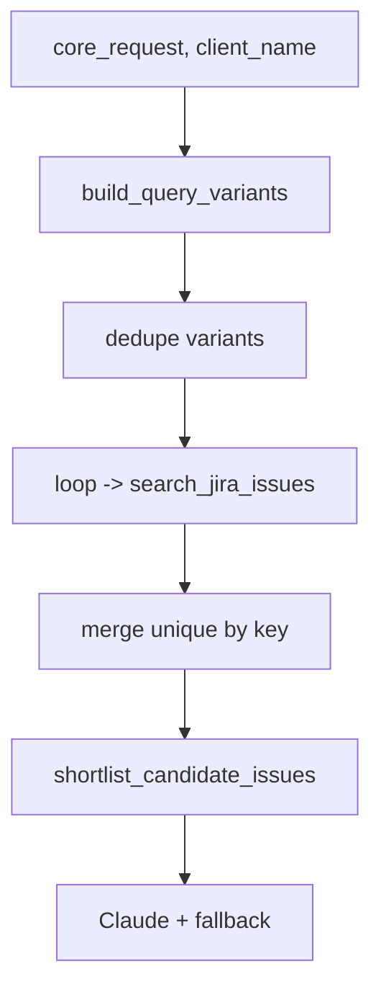

# Broaden Jira search with query variants (Option 2)

## Why

Today [`MessageProcessor._fetch_jira_candidates`](app/services/processor.py) runs **only two** Jira searches (`core_request` and `client_name`) so candidate recall is shaped by whatever Jira returns for those two strings. We will generate a small, bounded set of additional variants to catch duplicates that the two seed queries miss. Ranking and anti-merge rules stay untouched.

## Scope (this plan)

- New variants: keyword tokens, top phrase n-grams, client aliases.
- Same public API for `search_jira_issues`, same shortlist and guardrails.
- No pagination (separate plan), no schema-aware JQL, no embeddings.

## Architecture



## Changes

### 1) New helpers in [`app/services/deduplication.py`](app/services/deduplication.py)

Expose a single pure function:

```python
def build_query_variants(
    core_request: str,
    client_name: str,
    max_variants: int = 8,
) -> list[str]:
    ...
```

Variant sources, in priority order (stop when `max_variants` hit):

- Raw `core_request` (already used).
- Raw `client_name` (already used).
- Content-bearing **keyword tokens** via existing `_extract_keywords(core_request)` — keep only tokens length >= 4 to drop noise, then take top N (e.g. 3–4).
- Top **bigrams and trigrams** built from `_extract_keywords` order, e.g. `"reporting api"`, `"reporting api dashboard"` (take top 2–3, first in request wins).
- **Client aliases**: strip common suffixes like `Inc`, `Ltd`, `LLC`, `Company`, `Co`, `GmbH`, `Corp`, `Corporation`, `Pvt`, `Private`, and collapse whitespace. Only add if different from raw `client_name`.

Rules:

- Normalize, dedupe case-insensitively preserving first form.
- Drop any variant shorter than 3 chars.
- Cap total at `max_variants` (default 8) to bound Jira traffic.

Keep `build_query_variants` deterministic and unit-testable; do not touch scoring.

### 2) Use variants in [`app/services/processor.py`](app/services/processor.py) `_fetch_jira_candidates`

Replace the current two-query loop with:

```python
variants = build_query_variants(extracted.core_request, extracted.client_name)
merged: dict[str, JiraIssue] = {}
for query in variants:
    for issue in await self._mock_client.search_jira_issues(query):
        if issue.key not in merged:
            merged[issue.key] = issue
shortlist = shortlist_candidate_issues(extracted.core_request, list(merged.values()))
return shortlist or list(merged.values())[:8]
```

No change to shortlist limit or anti-merge validation.

### 3) Optional small resilience

- If any single `search_jira_issues(query)` fails, log and continue with the next variant (do not abort whole dedup on a transient 5xx).

## Trade-offs and safeguards

- Up to 8 Jira search calls per message instead of 2. Acceptable for mock and typical Jira rate limits; bounded by `max_variants`.
- Noisier candidate pool, but shortlist + anti-merge guards remain in place (top-2 margin, confidence floor).
- No behavior change when `client_name` is empty (internal skips still apply earlier in `process_single_message`).

## Tests

Add unit tests under [`tests/`](tests/):

- `build_query_variants` cases:
  - includes `core_request` and `client_name` first
  - adds keyword tokens and phrase n-grams
  - adds alias like `Acme Corp` -> `Acme`
  - case-insensitive dedupe
  - respects `max_variants`
- Processor integration test with a mocked `search_jira_issues` that returns different issues per variant and verifies merged uniqueness and that shortlist/validation still apply.

## Out of scope (future)

- Pagination of `search_jira_issues` (Option 1).
- Raising shortlist limit beyond 8 (Option 3).
- Embedding-based retrieval (Options 5/6).
