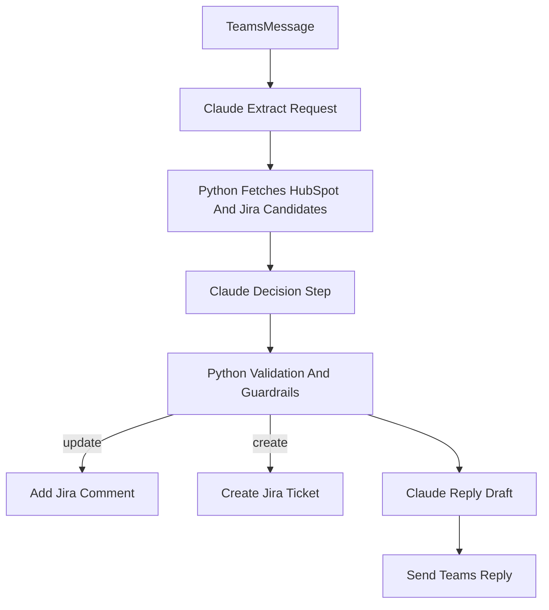

# Claude-Driven Bridge Plan

## Goal
Shift decision-making from deterministic Python heuristics to Claude-led structured decisions, while keeping Python responsible for API execution, validation, and recovery when Claude is uncertain or external calls fail.

## Current Baseline
The current flow uses Claude only for extraction in [`app/clients/anthropic_client.py`](/Users/atulmala/workflex/submission/app/clients/anthropic_client.py), while create/update choice and Jira matching are still Python-driven in [`app/services/processor.py`](/Users/atulmala/workflex/submission/app/services/processor.py) and [`app/services/deduplication.py`](/Users/atulmala/workflex/submission/app/services/deduplication.py).

Essential current decision point:
```103:161:/Users/atulmala/workflex/submission/app/services/processor.py
search_query = f"{extracted.client_name} {extracted.core_request}".strip()
existing_issues = await self._mock_client.search_jira_issues(search_query)
matched_issue = find_matching_issue(...)
...
if matched_issue:
    await self._mock_client.add_jira_comment(...)
else:
    created = await self._mock_client.create_jira_issue(...)
```

## Proposed Architecture


## Key Changes

### 1. Introduce Claude Decision Schema
Add a new structured response contract for the decision phase in [`app/models.py`](/Users/atulmala/workflex/submission/app/models.py), likely including:
- extracted request fields
- `decision`: `create_ticket` or `update_ticket`
- `matched_issue_key` and reason/confidence
- drafted Jira title
- drafted Jira summary/body/comment
- drafted Teams reply
- ARR usage fields (display format and whether ARR was found)

This should be a strict JSON schema so Python can validate before executing writes.

### 2. Split Claude Usage Into Two Stages
Extend [`app/clients/anthropic_client.py`](/Users/atulmala/workflex/submission/app/clients/anthropic_client.py):
- keep extraction stage for parsing message intent
- add a second method for semantic decision-making using fetched Jira candidates and HubSpot result as context

The second Claude prompt should receive:
- original Teams message
- extracted requester/client/request
- HubSpot company/ARR result
- candidate Jira issues (title + concise description)
- action policy: prefer updating only when the request is semantically the same, otherwise create new

### 3. Move Matching Logic Out Of Python Heuristics
Reduce [`app/services/deduplication.py`](/Users/atulmala/workflex/submission/app/services/deduplication.py) from primary matcher to fallback/guardrail role.

Recommended role after refactor:
- optional helper for coarse candidate narrowing before Claude
- fallback if Claude decision is unavailable
- sanity check that Claude-chosen issue key exists in the fetched candidate set or a verified Jira lookup

### 4. Refactor Processor To Claude-Led Orchestration
Update [`app/services/processor.py`](/Users/atulmala/workflex/submission/app/services/processor.py) flow to:
1. extract with Claude
2. fetch HubSpot ARR and Jira candidates with Python
3. ask Claude to choose best semantic match and action
4. validate decision with moderate guardrails
5. execute Jira create/comment
6. use Claude-authored Teams reply when available

Guardrails under the chosen “balanced” model:
- if Claude says `update_ticket`, require a valid issue key and non-empty comment body
- if Claude confidence is low or no clear match key is provided, fall back to `create_ticket`
- if HubSpot lookup returns no company, Claude may still proceed but must mark ARR unavailable
- if Claude output fails schema validation, use existing deterministic fallback path

### 5. Let Claude Draft Jira And Teams Text
Claude should now draft:
- Jira title
- Jira summary/body or comment text
- Teams reply text

Python should still normalize formatting constraints where needed:
- enforce Jira summary length limit
- preserve ARR display style (`42K`, `215K`) if required by UX
- guarantee required fields exist before API calls

### 6. Keep ARR Lookup Execution In Python, Let Claude Reason About It
HubSpot API calls should remain in [`app/clients/mock_api.py`](/Users/atulmala/workflex/submission/app/clients/mock_api.py) because Claude cannot call that API directly in the current app architecture.

So “Claude building ARR lookup logic” should be interpreted as:
- Claude can decide whether ARR is relevant to mention
- Claude can decide how ARR affects create/update narrative
- Python still performs the actual lookup and passes the result into Claude context

### 7. Update UI Result Semantics If Needed
[`app/templates/index.html`](/Users/atulmala/workflex/submission/app/templates/index.html) may need light adjustments only if you want the action column to reflect Claude rationale, confidence, or matched issue reasoning. This is optional and can be deferred.

## Suggested Rollout
- Phase 1: add decision schema + second Claude call + processor integration
- Phase 2: demote Python dedup to fallback/sanity-check only
- Phase 3: refine prompts for backlog-style generic tickets vs client-specific requests
- Phase 4: optionally expose Claude decision rationale/confidence in UI or logs

## Risks To Watch
- Claude may over-update generic backlog tickets unless prompts explicitly distinguish “same capability” from “same request instance”
- prompt size may grow if too many Jira candidates are included; candidate narrowing will matter
- if structured output is loose, downstream write safety degrades quickly
- moving Teams reply drafting to Claude can improve tone but also increase inconsistency unless constrained tightly