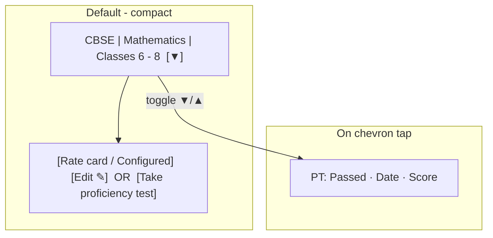

# Compact mobile offering cards

## Problem

Each offering in [`TutorDetailScreen.tsx`](apps/mobile/src/app/components/tutor-profile/TutorDetailScreen.tsx) currently renders ~5 blocks of vertical content (name, PT status line, Date/Score fields, rate-card row), which forces heavy scrolling when a tutor has multiple offerings.

```654:717:apps/mobile/src/app/components/tutor-profile/TutorDetailScreen.tsx
<View key={o.id} style={styles.offeringGridCard}>
  <Text style={styles.offeringName}>…formatted label…</Text>
  <Text style={styles.ptStatusText}>PT: …</Text>
  <View style={styles.offeringGridRow}>…Date / Score…</View>
  <View style={styles.rateCardRow}>…rate card / PT CTA…</View>
</View>
```

## Target layout (per offering)



**Row 1 — header**
- Single-line offering label via existing [`formatOfferingLabelForDisplay`](libs/shared-utils/src/tutor-offering-display.ts) (already produces `CBSE | Mathematics | Classes 6 - 8` style labels from `offeringFullLabel`).
- Truncate with `numberOfLines={1}` and `flex: 1`.
- Small chevron button on the right (`▼` collapsed / `▲` expanded), matching the picker pattern used elsewhere in mobile (`pickerChevron` in onboarding pickers).

**Row 2 — actions (always visible)**
- Keep existing business rules; only tighten presentation:
  - `pending_pt` → **Take proficiency test** button (unchanged behavior: `setPtOffering(o)`).
  - `pt_passed` + complete rate card → **Configured** badge + **Edit** pen button (opens `RateCardModal`).
  - `pt_passed` + incomplete rate card → **Rate card** button.
  - other statuses → `—` (unchanged).
- Replace the long **Edit rate card** text button with a compact **Edit** control using the existing [`PenIcon`](apps/mobile/src/app/components/tutor-profile/TutorDetailScreen.tsx) (same pattern as Experience/Qualification rows).

**Collapsible PT panel (hidden by default)**
- Move these fields behind the chevron:
  - PT status (`ptStatusLabel`)
  - Date (`formatDate(o.passedAt ?? o.lastAttemptAt)`)
  - Score (`lastScore/lastMaxScore`)
- Reuse `OfferingDetailField` in a compact row/stack inside a `ptDetailsPanel` with light top border / smaller vertical padding.
- Only one offering expanded at a time (optional but cleaner on small screens): `expandedOfferingId: number | null`.

## Files to change

| File | Change |
|------|--------|
| [`TutorDetailScreen.tsx`](apps/mobile/src/app/components/tutor-profile/TutorDetailScreen.tsx) | Refactor offerings `.map()` block, add expand state + chevron toggle, restyle card |
| (optional extract) `OfferingListItem.tsx` in same folder | Only if the inline JSX grows too large; otherwise keep in screen file to minimize scope |

**Out of scope (per your clarification):**
- [`TutorAvailabilitySection.tsx`](apps/mobile/src/app/components/tutor-profile/TutorAvailabilitySection.tsx) — no changes
- Web [`TutorDetailView.tsx`](libs/tutor-detail-ui/src/TutorDetailView.tsx) — mobile-only UI change
- Shared label utilities — already correct

## Implementation details

1. **State**
   - Add `const [expandedOfferingId, setExpandedOfferingId] = useState<number | null>(null)`.
   - Toggle: tapping chevron on offering `id` sets/expands or collapses that id.

2. **Header row component (inline)**
   - `flexDirection: 'row'`, `alignItems: 'center'`.
   - `TouchableOpacity` chevron with `accessibilityLabel` like “Show proficiency test details” / `accessibilityState={{ expanded }}`.

3. **Action row**
   - `flexDirection: 'row'`, `flexWrap: 'wrap'`, `alignItems: 'center'`, `gap: 8`.
   - Pen **Edit** only when `ptPassed` (same guard as today’s rate-card modal open).
   - Remove duplicate “Edit rate card” text button when pen icon is present.

4. **Styles** (adjust in same file’s `StyleSheet`)
   - Reduce `offeringGridCard` `gap` from `10` → `6`, `padding` from `12` → `10`.
   - New: `offeringHeaderRow`, `offeringChevron`, `offeringChevronBtn`, `ptDetailsPanel`, `offeringEditBtn` (mirror `experienceIconButton`).
   - Remove or stop using `offeringFieldsInRow` if only PT panel used it.

5. **Behavior preserved**
   - `setPtOffering`, `setRateCardOffering`, `RateCardModal`, `AddOfferingFlow`, sorting via `sortTutorOfferingsForDisplay` — all unchanged.

## Visual reference (compact card)

```
┌─────────────────────────────────────────────┐
│ CBSE | Mathematics | Classes 6 - 8      [▼] │
│ [Configured]                          [✎]   │
└─────────────────────────────────────────────┘

(after ▼ tap)
┌─────────────────────────────────────────────┐
│ CBSE | Mathematics | Classes 6 - 8      [▲] │
│ ┌ PT details ─────────────────────────────┐ │
│ │ PT: Passed   Date: 12 Jan   Score 8/10│ │
│ └─────────────────────────────────────────┘ │
│ [Configured]                          [✎]   │
└─────────────────────────────────────────────┘
```

## Test plan

- Open tutor profile on iOS simulator with multiple offerings.
- Confirm default view shows only name + action row (no PT date/score visible).
- Tap chevron: PT panel expands for that offering; tap again collapses.
- `pending_pt` offering: **Take proficiency test** still navigates to PT flow.
- `pt_passed` + configured: **Configured** badge + pen opens rate card modal.
- `pt_passed` + not configured: **Rate card** button opens modal.
- Long offering labels truncate on one line without breaking card layout.
- My Calendar section unchanged above offerings.
