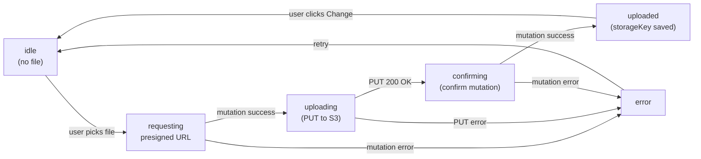

# Document Upload Frontend — Web

## Key design decision: Aadhaar front + back

The `document_type` column is a plain `smallint` with no DB-level enum or CHECK constraint (confirmed in migration `1773300000000-ExtendDocumentTypeEnumForTutorOnboarding.ts` — it's a no-op). Adding `AADHAAR_CARD_BACK = 16` requires **no DB migration**, only TypeScript + GraphQL changes.

Each Aadhaar side gets its own document slot and its own `DocumentTypeEnum` value — this is the cleanest model (one row per document, no side-channel fields).

---

## Part 1 — Backend: add AADHAAR_CARD_BACK (minimal)

**Files to change:**

- [`apps/api/src/app/modules/document/enums/document-type.enum.ts`](apps/api/src/app/modules/document/enums/document-type.enum.ts)
  - Add `AADHAAR_CARD_BACK = 16`

- [`apps/api/src/app/modules/document/services/document.service.ts`](apps/api/src/app/modules/document/services/document.service.ts)
  - Add `DocumentTypeEnum.AADHAAR_CARD_BACK` to `ONBOARDING_DOCUMENT_TYPES`
  - Add `[DocumentTypeEnum.AADHAAR_CARD_BACK]: 'Aadhaar Card (Back)'` to `DOCUMENT_DISPLAY_NAMES`

No migration needed. The existing no-op migration pattern (`1773300000000`) documents this approach.

---

## Part 2 — Frontend: TutorDocsUpload web component

### Upload flow per document slot



### 5 document slots (in order)

| # | Label | DocumentTypeEnum | Notes |
|---|-------|-----------------|-------|
| 1 | Aadhaar Card — Front | `AADHAAR_CARD` | Accepts JPG, PNG, PDF |
| 2 | Aadhaar Card — Back | `AADHAAR_CARD_BACK` | Accepts JPG, PNG, PDF |
| 3 | PAN Card | `PAN_CARD` | Accepts JPG, PNG, PDF |
| 4 | Class XII Marksheet | `CLASS_XII_MARKSHEET` | Accepts JPG, PNG, PDF |
| 5 | Highest Degree Certificate | `HIGHEST_DEGREE_CERTIFICATE` | Accepts JPG, PNG, PDF |

### Card layout (each slot)

Each document is a card with:
- Title + subtitle (e.g. "must show all 4 corners clearly")
- Upload zone: dashed border when idle, click anywhere to open file picker
- Status chip: grey "Not uploaded" / blue spinner "Uploading..." / green "Uploaded" + filename / red "Error: \<message\>" with retry
- A hidden `<input type="file" accept=".jpg,.jpeg,.png,.pdf">` triggered by clicking the zone
- When already uploaded: green check + filename + small "Change" link to re-pick

### Grid layout

Two columns on `md+`, single column on mobile:
```
[ Aadhaar Front ]  [ Aadhaar Back ]
[ PAN Card      ]  [ Class XII    ]
[ Highest Degree — full width or next row ]
```

### Continue button

Disabled with `disabled:cursor-not-allowed disabled:bg-[#5fa8ff]/40` until **all 5 slots** are in the `done` state.

### Pre-population on load

On mount, read `profileData?.myTutorProfile?.documents` (already in `GET_MY_TUTOR_PROFILE`) and mark any previously confirmed doc as `done` with its saved `storageKey` and `filename`.

---

## Files to create / modify

- **Modify** [`apps/web/src/app/components/tutor-onboarding/tutor-docs-upload/TutorDocsUpload.tsx`](apps/web/src/app/components/tutor-onboarding/tutor-docs-upload/TutorDocsUpload.tsx) — replace stub with full implementation
- **Modify** [`apps/api/src/app/modules/document/enums/document-type.enum.ts`](apps/api/src/app/modules/document/enums/document-type.enum.ts) — add `AADHAAR_CARD_BACK`
- **Modify** [`apps/api/src/app/modules/document/services/document.service.ts`](apps/api/src/app/modules/document/services/document.service.ts) — add to `ONBOARDING_DOCUMENT_TYPES` + display names

No new files, no new libraries, no schema changes, no migrations needed.
