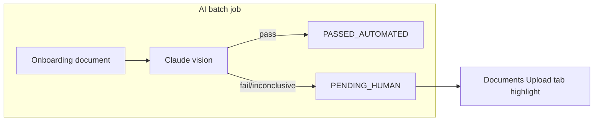

# Highlight tutors pending admin document review

## Context

The admin **Tutors** page ([`apps/web-admin/src/app/pages/TutorsPage.tsx`](apps/web-admin/src/app/pages/TutorsPage.tsx)) lists tutors by onboarding stage tab. The **Documents Upload** tab maps to `certificationStage = docs`.

When the AI verification batch runs, failures and inconclusive results are persisted as **`PENDING_HUMAN`** on `document_screening` (not `REJECTED_HUMAN`, which is reserved for human admin rejection after review). This is the correct signal for “needs admin verification.”



**Highlight rule:** A tutor is flagged when they have at least one **onboarding document** (same 4 types the batch processes: Aadhaar, PAN, Class XII marksheet, highest degree) linked via `document.tutor_id`, with a related `document_screening` row where `status = PENDING_HUMAN`.

## Backend changes

### 1. Extend list item DTO

Add to [`apps/api/src/app/modules/admin/dto/admin-tutor-list-item.dto.ts`](apps/api/src/app/modules/admin/dto/admin-tutor-list-item.dto.ts):

```typescript
@Field(() => Boolean, {
  description: 'True when any onboarding document has PENDING_HUMAN screening (awaiting admin review)',
})
pendingAdminDocumentReview: boolean;
```

### 2. Query helper in admin utils

Add to [`apps/api/src/app/modules/admin/admin-tutor.utils.ts`](apps/api/src/app/modules/admin/admin-tutor.utils.ts) a function like `findTutorIdsWithPendingDocumentReview(tutorRepo, tutorIds: number[]): Promise<Set<number>>`:

- Join `document` → `document_screening` on `document_id`
- Filter: `document.tutor_id IN (:...tutorIds)`, `document.deleted = false`, `document_screening.status = 'PENDING_HUMAN'`, onboarding document types only
- Return distinct tutor IDs

Reuse the same onboarding document type list as [`document-screening-batch.service.ts`](apps/api/src/app/modules/document/services/document-screening-batch.service.ts) (extract to a small shared constant under `document/` if needed to avoid duplication).

### 3. Wire into `AdminService.listTutors`

In [`apps/api/src/app/modules/admin/admin.service.ts`](apps/api/src/app/modules/admin/admin.service.ts):

- After fetching the page of tutors, when `input.certificationStage === docs`, call the helper with page tutor IDs
- Set `pendingAdminDocumentReview: true/false` in `toAdminTutorListItem` (pass the Set in)
- **Sort pending-review tutors first** on the docs tab: add an `EXISTS` subselect + `ORDER BY pendingReview DESC, certificationStageEnteredAt ASC` so admins see actionable rows at the top

No new GraphQL query needed — only extend the existing `adminTutors` response.

### 4. Optional tab badge (recommended)

Extend [`AdminTutorStageCount`](apps/api/src/app/modules/admin/dto/admin-tutor-stage-count.dto.ts) with optional `pendingDocumentReviewCount?: number`.

In `getTutorStageCounts`, run one additional count query for tutors at `docs` stage matching the same `PENDING_HUMAN` criteria (respecting search filter). Attach the count only to the `docs` row.

This lets the Documents Upload tab show e.g. `12` total tutors and a small amber `3 need review` badge.

### 5. Module imports

Register `DocumentEntity` and `DocumentScreeningEntity` in [`admin.module.ts`](apps/api/src/app/modules/admin/admin.module.ts) if the helper uses their repositories directly (or keep logic in utils using `tutorRepo.manager` / query builder to avoid extra injections).

### 6. Tests

Extend [`apps/api/src/app/modules/admin/admin.service.spec.ts`](apps/api/src/app/modules/admin/admin.service.spec.ts):

- Tutor with `PENDING_HUMAN` onboarding doc → `pendingAdminDocumentReview: true`
- Tutor with only `PASSED_AUTOMATED` or no screening → `false`
- Docs-tab ordering puts pending tutors first

## Shared GraphQL

Update [`libs/shared-graphql/src/queries/admin.queries.ts`](libs/shared-graphql/src/queries/admin.queries.ts):

- Add `pendingAdminDocumentReview` to `GET_ADMIN_TUTORS` items
- Add `pendingDocumentReviewCount` to `GET_ADMIN_TUTOR_STAGE_COUNTS` (if tab badge is included)

## Frontend changes

In [`apps/web-admin/src/app/pages/TutorsPage.tsx`](apps/web-admin/src/app/pages/TutorsPage.tsx):

**Row highlight (docs tab only):** When `activeStage === 'docs'` and `tutor.pendingAdminDocumentReview`:

- Row: amber left border (`border-l-4 border-l-amber-500`), subtle amber background tint
- Name cell: inline badge e.g. `Needs review` (amber pill, consistent with existing `daysInStageBadgeClass` styling)

**Tab badge:** On the Documents Upload tab button, if `pendingDocumentReviewCount > 0`, show a secondary amber badge (e.g. `3 review`) beside the stage count.

No new page or route — purely visual emphasis on existing table rows.

## Out of scope (for now)

- Admin document review actions (approve/reject) — highlight only
- Filtering to “show only needs review” — can be added later if desired
- Tutors with documents not yet processed by AI (no `document_screening` row) — excluded per your “rejected by AI batch” definition

## Verification

1. Restart API after GraphQL schema changes
2. Ensure at least one tutor at `docs` stage has a document with `document_screening.status = PENDING_HUMAN`
3. Open admin Tutors → Documents Upload tab: flagged tutor appears at top with amber highlight and badge
4. Run `admin.service.spec.ts` unit tests
