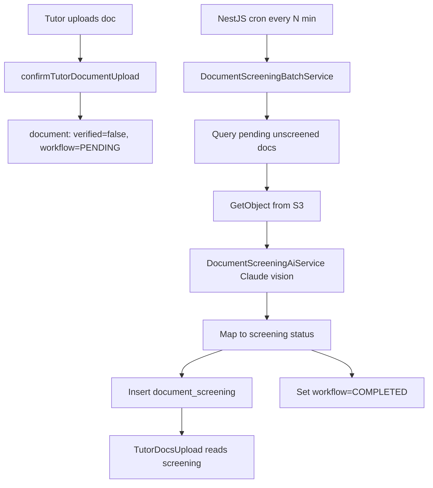

# Document AI Screening Batch Job

## Context

The upload pipeline is already in place:

- Tutors upload 4 onboarding docs via GraphQL ([`document.service.ts`](apps/api/src/app/modules/document/services/document.service.ts))
- Files land in S3 at `tutors/{tutorId}/onboarding/{TYPE_KEY}/{uuid}.{ext}`
- `document` rows are created with `verified = false` and `verificationWorkflowStatus = PENDING`
- Re-upload deletes any existing `document_screening` row
- Frontend ([`TutorDocsUpload.tsx`](apps/web/src/app/components/tutor-onboarding/tutor-docs-upload/TutorDocsUpload.tsx)) blocks Continue until all 4 slots have `screening.status` of `PASSED_AUTOMATED` or `APPROVED_HUMAN`

An earlier S3-triggered Lambda exists ([`lambdas/tutor-document-verification/handler.mjs`](lambdas/tutor-document-verification/handler.mjs)) but is **not wired** (no API callback, no S3 metadata on presigned PUT). This plan replaces that approach with a **batch job inside the Nest API**, using Anthropic from `.env` as you requested.



## Selection criteria

Each cron tick processes documents matching **all** of:

| Filter | Reason |
|--------|--------|
| `verified = false` | Per your requirement |
| `verification_workflow_status = 'PENDING'` | Only docs awaiting batch |
| `document_type IN (AADHAAR_CARD, PAN_CARD, CLASS_XII_MARKSHEET, HIGHEST_DEGREE_CERTIFICATE)` | Onboarding slots only |
| `storage_key IS NOT NULL` | Must have S3 object |
| `experience_id IS NULL` | Onboarding docs only (not experience attachments) |
| No existing `document_screening` row | Avoid re-processing; re-upload clears screening |

Load tutor identity via `document.userId` → `user.firstName` / `user.lastName` (fallback: tutor → user join if needed).

## AI screening service

**New file:** [`apps/api/src/app/modules/document/services/document-screening-ai.service.ts`](apps/api/src/app/modules/document/services/document-screening-ai.service.ts)

- Add `@anthropic-ai/sdk` to root [`package.json`](package.json)
- Read env:
  - `ANTHROPIC_API_KEY` (required when batch enabled)
  - `ANTHROPIC_DOCUMENT_SCREENING_MODEL` (default `claude-sonnet-4-6` per your `.env`)
- Reuse the Lambda’s vision pattern: PDF → `type: 'document'`, JPEG/PNG → `type: 'image'`
- **Enhanced prompt** vs Lambda — include expected tutor name and stricter JSON schema:

```json
{
  "accept": true,
  "nameMatch": true,
  "confidence": 0.92,
  "reason": "one short admin-facing sentence"
}
```

Prompt rules (adapt from [`handler.mjs`](lambdas/tutor-document-verification/handler.mjs)):

| Document type | AI must verify |
|---------------|----------------|
| `AADHAAR_CARD` | Looks like Indian Aadhaar front (UIDAI layout, photo, QR, no number transcription) |
| `PAN_CARD` | Looks like Indian PAN issued by Income Tax Department |
| `CLASS_XII_MARKSHEET` | Plausible official higher-secondary marksheet/certificate |
| `HIGHEST_DEGREE_CERTIFICATE` | Plausible genuine degree certificate/transcript |
| **All four** | `nameMatch = true` only if holder name reasonably matches tutor `{firstName} {lastName}` (allow order/initial/middle-name variation; never quote ID numbers in `reason`) |

Parse failures:
- ID docs → treat as reject
- Education docs → treat as inconclusive (`PENDING_HUMAN`)

## Status mapping (your choices)

**Education docs — confidence-based** (env `DOCUMENT_SCREENING_CONFIDENCE_THRESHOLD`, default `0.85`):

| Condition | `document_screening.status` |
|-----------|----------------------------|
| `accept && nameMatch` + ID type | `PASSED_AUTOMATED` |
| `accept && nameMatch` + education + `confidence >= threshold` | `PASSED_AUTOMATED` |
| `accept && nameMatch` + education + `confidence < threshold` | `PENDING_HUMAN` |
| `!accept \|\| !nameMatch` (any type) | `REJECTED_HUMAN` |
| AI parse fail + ID type | `REJECTED_HUMAN` |
| AI parse fail + education type | `PENDING_HUMAN` |

Always persist: `automatedAt`, `modelId`, `confidence`, `summaryNotes` (from `reason`, max 500 chars).

After writing screening, set `document.verificationWorkflowStatus = COMPLETED` (leave `verified = false` — that flag remains for future admin final approval if needed).

**Do not** set `document.verified = true` in this batch; onboarding UI is driven by `screening.status`.

## Batch orchestration

**New file:** [`apps/api/src/app/modules/document/services/document-screening-batch.service.ts`](apps/api/src/app/modules/document/services/document-screening-batch.service.ts)

- `runBatch(limit?: number)` — main entry
- Reuse existing S3 client setup from [`DocumentService`](apps/api/src/app/modules/document/services/document.service.ts) (same bucket/region env vars)
- Process documents **sequentially** (or max 2 concurrent) to reduce Anthropic rate-limit risk
- Per document try/catch:
  - S3 read failure → write `REJECTED_HUMAN` with note, mark workflow `COMPLETED`
  - Anthropic API failure → **skip** (leave `PENDING`, no screening row) so next cron retries
- Structured logging: document id, tutor id, type, outcome

**New file:** [`apps/api/src/app/modules/document/jobs/document-screening-batch.cron.ts`](apps/api/src/app/modules/document/jobs/document-screening-batch.cron.ts)

- `@nestjs/schedule` `@Cron(...)` calling `runBatch()`
- Gated by env `DOCUMENT_SCREENING_BATCH_ENABLED=true` (default off in dev unless explicitly enabled)
- Cron expression from `DOCUMENT_SCREENING_BATCH_CRON` (default: every 5 minutes, e.g. `*/5 * * * *`)
- Batch size limit from `DOCUMENT_SCREENING_BATCH_LIMIT` (default `20`)

**Module wiring:** update [`document.module.ts`](apps/api/src/app/modules/document/document.module.ts)

```typescript
imports: [ScheduleModule.forRoot(), ...]
providers: [DocumentScreeningAiService, DocumentScreeningBatchService, DocumentScreeningBatchCron]
```

Import `User` entity via `TypeOrmModule.forFeature([..., User])`.

## Environment / docs

Update [`.env.example`](.env.example) (commented entries):

```
# DOCUMENT_SCREENING_BATCH_ENABLED=true
# DOCUMENT_SCREENING_BATCH_CRON=*/5 * * * *
# DOCUMENT_SCREENING_BATCH_LIMIT=20
# DOCUMENT_SCREENING_CONFIDENCE_THRESHOLD=0.85
# ANTHROPIC_API_KEY=
# ANTHROPIC_DOCUMENT_SCREENING_MODEL=claude-sonnet-4-6
```

Remove/update the note that says *"Anthropic runs only in Lambda"*.

## Tests

**New unit tests** (no live API calls):

- [`document-screening-ai.service.spec.ts`](apps/api/src/app/modules/document/services/document-screening-ai.service.spec.ts) — JSON parse + status mapping for all 4 doc types, name-match rejection, confidence threshold edge cases
- [`document-screening-batch.service.spec.ts`](apps/api/src/app/modules/document/services/document-screening-batch.service.spec.ts) — query filter logic and screening row creation (mock repos + S3 + AI)

## Out of scope (follow-ups)

- Admin human review mutation (`adminReviewEducationDocument`) — needed later to resolve `PENDING_HUMAN` → `APPROVED_HUMAN` / `REJECTED_HUMAN`
- Retiring or disabling the unused S3 verification Lambda (leave in repo for now; batch becomes the active path)
- S3 metadata / webhook callback wiring from the old Lambda design

## Key files to add/change

| Action | File |
|--------|------|
| Add | `services/document-screening-ai.service.ts` |
| Add | `services/document-screening-batch.service.ts` |
| Add | `jobs/document-screening-batch.cron.ts` |
| Add | `services/*.spec.ts` (2 files) |
| Edit | `document.module.ts` |
| Edit | `package.json` (add `@anthropic-ai/sdk`, `@nestjs/schedule`) |
| Edit | `.env.example` |
