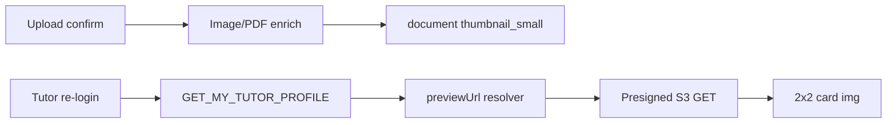

# Document Upload Thumbnails + 2x2 Grid

## Current state

- UI: vertical list in [`TutorDocsUpload.tsx`](apps/web/src/app/components/tutor-onboarding/tutor-docs-upload/TutorDocsUpload.tsx) — no previews.
- API: on confirm, [`document.service.ts`](apps/api/src/app/modules/document/services/document.service.ts) calls `tryEnrichRasterImageMedia()` which generates WebP thumbs for **JPEG/PNG only** via [`document-image-media.ts`](apps/api/src/app/modules/document/document-image-media.ts). PDFs get no thumbnails.
- DB fields already exist: `thumbnailSmall`, `thumbnailMedium`, `mimeType`, etc. on [`DocumentEntity`](apps/api/src/app/modules/document/entities/document.entity.ts).
- GraphQL: [`GET_MY_TUTOR_PROFILE`](libs/shared-graphql/src/queries/tutor.queries.ts) fetches `filename`, `storageKey`, `mimeType` but **not** thumbnail/preview fields — so re-login cannot show images.
- Thumbnail values are often **raw S3 keys** when `DOCUMENT_PUBLIC_BASE_URL` is unset — not loadable in `` without presigned GET.



## Backend

### 1. PDF first-page thumbnail generation

Extend [`document-image-media.ts`](apps/api/src/app/modules/document/document-image-media.ts):

- Add dependency (e.g. `pdf-to-img` or `pdfjs-dist` + `@napi-rs/canvas`) to root [`package.json`](package.json).
- New helper `buildPdfFirstPageBuffer(pdfBytes): Promise<Buffer>` — render page 1 to PNG/JPEG.
- Reuse existing Sharp pipeline (`THUMB_SIZES`, WebP upload to `{basePath}_thumb_{sm|md|lg}.webp`) after rasterizing PDF page 1.
- Update `tryEnrichRasterImageMedia` in [`document.service.ts`](apps/api/src/app/modules/document/services/document.service.ts) to also run when `mimeType === 'application/pdf'` (rename to `tryEnrichDocumentMedia`).

### 2. Preview URL for private S3 (re-login support)

Add to [`DocumentService`](apps/api/src/app/modules/document/services/document.service.ts):

```typescript
async resolvePreviewUrl(doc: DocumentEntity, user: User): Promise<string | null>
```

Logic:
- Verify caller owns the tutor document (same guards as upload).
- Preview key priority: `thumbnailSmall` (if set) → else `storageKey` for raster images.
- If value already starts with `https://`, return as-is (CDN path).
- Else presign `GetObjectCommand` (~15 min TTL) for the S3 key.

Add `@ResolveField('previewUrl')` on [`DocumentEntityResolver`](apps/api/src/app/modules/document/resolvers/document-entity.resolver.ts) — requires injecting `DocumentService` + auth context (`@CurrentUser()` via `@Context()` or pass user from parent tutor query).

**Note:** Field resolver needs authenticated user; wire JWT user from GraphQL context (same pattern as other guarded resolvers).

### 3. GraphQL schema exposure

Update [`libs/shared-graphql/src/queries/tutor.queries.ts`](libs/shared-graphql/src/queries/tutor.queries.ts) documents selection:

```graphql
documents {
  ...
  mimeType
  thumbnailSmall
  previewUrl
}
```

Update [`document.mutations.ts`](libs/shared-graphql/src/mutations/document.mutations.ts) confirm mutation to return `previewUrl` + `mimeType` for immediate post-upload preview.

## Frontend

### 4. Refactor card layout — 2x2 grid

In [`TutorDocsUpload.tsx`](apps/web/src/app/components/tutor-onboarding/tutor-docs-upload/TutorDocsUpload.tsx):

- Replace `<ul className="space-y-4">` with `grid grid-cols-1 gap-4 sm:grid-cols-2`.
- Slot order unchanged (already Aadhaar, PAN, Class XII, Degree → natural 2x2 rows).
- Extract `DocumentUploadCard` subcomponent (keeps file readable).

### 5. Thumbnail area per card

Each card layout (top to bottom):

```
┌─────────────────────────┐
│  [thumbnail  ~120px]    │  ← preview or placeholder
│  Title + description    │
│  Status line            │
│  [Choose / Replace btn] │
└─────────────────────────┘
```

**Preview sources (priority):**
1. **After upload / re-login:** `doc.previewUrl` from GraphQL (persisted server-side).
2. **During upload (optimistic):** `URL.createObjectURL(file)` for JPEG/PNG until refetch completes; revoke on unmount/replace.
3. **Empty slot:** static placeholder (document icon + “No file uploaded”).

**PDF:** once backend generates first-page thumb, `previewUrl` points at WebP thumb — same `` path as photos.

**Error fallback:** if `previewUrl` img fails to load, show placeholder.

### 6. Extend `SlotDoc` type

Add `mimeType`, `previewUrl`, optional local `optimisticPreviewUrl` state keyed by slot.

## Testing

- **API unit test:** PDF enrich produces `thumbnailSmall` key; `resolvePreviewUrl` returns presigned URL when key is non-HTTP.
- **Manual:** upload JPG + PDF, verify 2x2 grid shows thumbs; logout/login → thumbs still visible; replace file updates thumb.

## Files to change

| Area | Files |
|------|--------|
| PDF thumbs | [`document-image-media.ts`](apps/api/src/app/modules/document/document-image-media.ts), [`document.service.ts`](apps/api/src/app/modules/document/services/document.service.ts), `package.json` |
| Preview URL | [`document.service.ts`](apps/api/src/app/modules/document/services/document.service.ts), [`document-entity.resolver.ts`](apps/api/src/app/modules/document/resolvers/document-entity.resolver.ts) |
| GraphQL client | [`tutor.queries.ts`](libs/shared-graphql/src/queries/tutor.queries.ts), [`document.mutations.ts`](libs/shared-graphql/src/mutations/document.mutations.ts) |
| UI | [`TutorDocsUpload.tsx`](apps/web/src/app/components/tutor-onboarding/tutor-docs-upload/TutorDocsUpload.tsx) |

## Out of scope

- Mobile app parity (web only unless requested).
- Full-size document viewer modal (thumbnail only).
