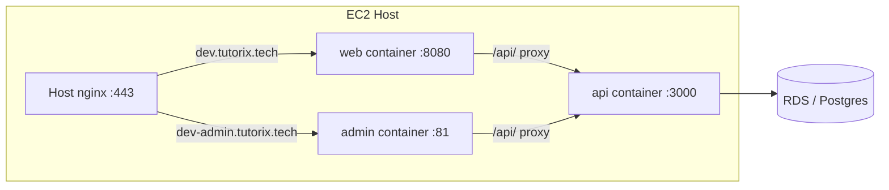

# EC2 Dev — Deploy Updated Code

Docker, nginx, TLS, RDS/IAM, and `.env` are already configured on dev. This plan covers **code-only rollout** to the running stack.

## Architecture (unchanged)



Existing files: [`docker-compose.yml`](docker-compose.yml), [`docker/Dockerfile.api`](docker/Dockerfile.api), [`docker/Dockerfile.web`](docker/Dockerfile.web), [`docker/Dockerfile.admin`](docker/Dockerfile.admin), server `.env` (from [`.env.docker.example`](.env.docker.example)).

---

## 1. Pre-deploy (local / before SSH)

**Confirm what changed** so you rebuild the right services:

| Changed paths | Rebuild |
|---------------|---------|
| `apps/api/**` | `api` |
| `apps/web/**` | `web` |
| `apps/web-admin/**` | `admin` |
| Shared libs used by frontends | `web` and/or `admin` |
| Only `.env` / `VITE_*` vars | Services whose build args use those vars (usually `web`; rarely `api`) |

**Schema / DB** — check before pulling on EC2:

- If this release adds or changes entities **and** dev uses `DB_SYNCHRONIZE=true` (typical per [`.env.docker.example`](.env.docker.example)): restarting `api` after rebuild applies schema sync automatically.
- If dev uses **`DB_SYNCHRONIZE=false`** and ships TypeORM migrations: run migrations **before** or **immediately after** API rollout (`npm run migration:run` from a machine that can reach RDS, or one-off on EC2 — migrations do **not** run inside the webpack Docker bundle when `AUTO_RUN_MIGRATIONS=false`).

**Do not edit `.env` on EC2** unless this release needs new secrets or CORS/origin changes. Code-only deploys reuse the existing `.env`.

---

## 2. Deploy on EC2

SSH (or SSM) into the dev instance, then from the **existing repo checkout** (same directory used for prior deploys):

```bash
cd /path/to/tutorix   # your clone on EC2

git fetch origin
git checkout <branch>   # e.g. main or your dev branch
git pull origin <branch>
```

Rebuild and restart (pick one):

**All services** (safest default when unsure):

```bash
docker compose up -d --build
```

**Targeted** (faster, when you know the blast radius):

```bash
# API only
docker compose up -d --build api

# Frontends only
docker compose up -d --build web admin

# API + both SPAs
docker compose up -d --build api web admin
```

Compose will:

- Rebuild images from current working tree
- Recreate containers only when images or env changed
- Wait for API healthcheck before starting `web` / `admin` ([`docker-compose.yml`](docker-compose.yml))

**Optional cleanup** (only if disk is tight):

```bash
docker image prune -f
```

---

## 3. Verify

On EC2:

```bash
docker compose ps
docker compose logs api --tail=50
curl -sI http://127.0.0.1:8080/ | head -1    # tutor SPA
curl -sI http://127.0.0.1:81/ | head -1      # admin SPA
```

From browser / curl:

- https://dev.tutorix.tech/
- https://dev-admin.tutorix.tech/
- GraphQL: `POST https://dev.tutorix.tech/api/graphql` (or Playground if enabled)

If something fails, use the troubleshooting table in [`docs/DEPLOYMENT_EC2.md`](docs/DEPLOYMENT_EC2.md) (502 → Compose not up; CORS → `FRONTEND_URL` / `CORS_ORIGINS`; S3 → IAM hop limit unchanged by code deploy).

---

## 4. Rollback (if needed)

```bash
git checkout <previous-commit-or-tag>
docker compose up -d --build
```

Same service targeting applies (`api` only vs full stack).

---

## 5. Optional repo improvement (not required for this deploy)

There is **no** `scripts/deploy-dev.sh` or CI workflow today. If you want this repeatable without remembering flags, a small follow-up could add:

- `scripts/deploy-ec2-dev.sh` — `git pull`, `docker compose up -d --build "$@"`, log tail
- A short **“Updating an existing deployment”** section at the top of [`docs/DEPLOYMENT_EC2.md`](docs/DEPLOYMENT_EC2.md)

That is documentation/automation only; **this rollout does not require code changes** — SSH + `git pull` + `docker compose up -d --build` is sufficient.

---

## Quick reference

```bash
# Typical full code deploy on existing dev EC2
cd /path/to/tutorix && git pull && docker compose up -d --build
```

Expected downtime: brief while containers recreate (API health gate may add ~1 min on cold start).
