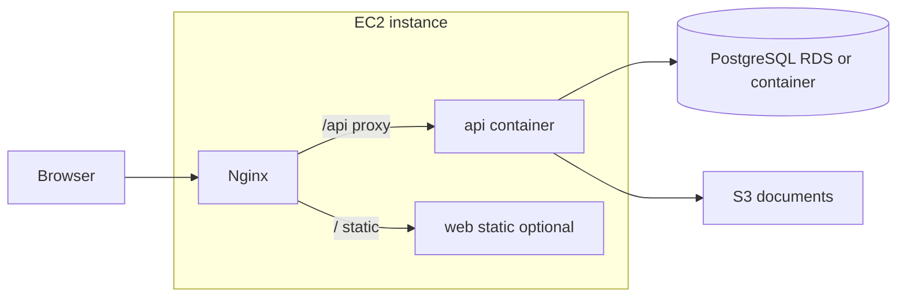

# Deploy Tutorix on EC2 with Docker

## Current state

- **No** [`Dockerfile`](Dockerfile) or [`docker-compose`](docker-compose.yml) exists in the repo today.
- **API** ([`apps/api`](apps/api)): NestJS, global prefix `api`, listens on `PORT` (default **3000**). GraphQL: **`/api/graphql`** ([`main.ts`](apps/api/src/main.ts)).
- **Build**: API uses Nx + webpack → **`dist/apps/api`** with a generated `package.json` ([`webpack.config.js`](apps/api/webpack.config.js)).
- **Web** ([`apps/web`](apps/web)): Vite/React; production is static assets after `nx build web` (or `vite build`).
- **Database**: PostgreSQL + TypeORM migrations ([`docs/MIGRATIONS_GUIDE.md`](docs/MIGRATIONS_GUIDE.md)); optional **AWS Secrets Manager** for DB in prod ([`database-credentials.loader.ts`](apps/api/src/app/database/database-credentials.loader.ts)).
- **CORS**: Hard-coded localhost origins + `FRONTEND_URL` ([`main.ts`](apps/api/src/main.ts)) — production **must** set `FRONTEND_URL` (and likely extend CORS for your real web origin or put web and API behind one host via nginx).

## Recommended topology (single EC2)

- **One EC2** runs **Docker Compose**: `nginx` + `api` + optional `web` (static files only).
- **PostgreSQL**: Prefer **RDS** in production; a `postgres` service in Compose is fine for staging/small setups.
- **TLS**: Terminate HTTPS at **ALB** or on-box **nginx** with ACM or Let’s Encrypt (not covered in code; ops choice).

## Implementation steps (what to add in the repo)

### 1. API Dockerfile (multi-stage)

- **Stage 1 (builder)**: Node 20 image, `COPY` repo, `npm ci`, `npx nx run api:build:production` (or `development` if prod webpack target differs — align with [`apps/api/project.json`](apps/api/project.json)).
- **Stage 2 (runtime)**: Node 20 slim, copy **`dist/apps/api`** + generated **`package.json`/`package-lock.json`** (or run `npm ci --omit=dev` in `dist/apps/api` if lockfile is generated there per Nx prune flow — verify output of your build; [`project.json`](apps/api/project.json) references `prune` targets).
- **CMD**: `node main.js` (confirm entry name under `dist/apps/api` after one local build).
- **Health**: optional `HEALTHCHECK` hitting `GET http://127.0.0.1:3000/api/graphql` with a tiny query or add a dedicated `/api/health` later.

### 2. Web Dockerfile (optional, static)

- Build stage: Node 20, `nx run web:build` with **`VITE_GRAPHQL_ENDPOINT`** (or your `vite.config` env names) pointing at the **public** GraphQL URL (e.g. `https://yourdomain.com/api/graphql`).
- Runtime: **nginx:alpine** serving `/usr/share/nginx/html` with SPA fallback (`try_files $uri /index.html`).

### 3. Root `docker-compose.yml` (EC2-oriented)

- **`api`**: build context repo, env file or environment from host; expose **3000** internally only (not public if nginx fronts it).
- **`nginx`**: mount config that:
  - Serves web static (if included), or proxies to external web host.
  - **`location /api/`** → `proxy_pass http://api:3000/api/;` (preserve path).
- **`postgres`** (optional): volume for data; **do not** expose `5432` publicly; use RDS in prod.
- **Networking**: single bridge network; only **80/443** published on EC2 SG.

### 4. Migrations

- **Option A**: One-off `docker compose run --rm api npx typeorm ... migration:run` using same image and env as API (ensure [`data-source.ts`](apps/api/src/data-source.ts) paths work in container — may need `WORKDIR` and copied `dist` + migrations).
- **Option B**: `AUTO_RUN_MIGRATIONS=true` on API ([`database.module.ts`](apps/api/src/app/database/database.module.ts)) — convenient but review risk for production rollouts.

TypeORM CLI in Docker often needs explicit `-d` path to compiled `data-source` or run migrations via a small npm script in `dist`; validate once locally in the image.

### 5. Environment and secrets on EC2

- Store secrets in **SSM Parameter Store** / **Secrets Manager** and inject at deploy time, or use a **restricted** `.env` on the instance (not in git).
- Minimum for API: `DB_*` or AWS secret name, `JWT_SECRET`, `S3_DOCUMENTS_BUCKET`, `AWS_REGION`, AWS credentials or instance **IAM role** (preferred for S3/Secrets).
- Set **`FRONTEND_URL`** to your real web origin (or nginx URL) so CORS matches.

### 6. EC2 host setup (operational checklist)

- Amazon Linux 2022 / Ubuntu: install Docker + Compose plugin.
- **Security group**: inbound **80/443** (and **22** restricted); no public DB port.
- **IAM instance profile** for S3 + Secrets Manager if used.
- Disk and log rotation for Docker.

## Out of scope / follow-ups

- **ECS/Fargate** or **EKS**: same images, different orchestration.
- **Mobile apps**: point to public API URL; no Docker on device.
- **Admin app** (`web-admin`): second static site or second `server` block in nginx if you deploy it on the same host.

## Key files to create or change

| Item | Purpose |
|------|---------|
| `Dockerfile.api` or `apps/api/Dockerfile` | Build and run Nest API |
| `apps/web/Dockerfile` or `Dockerfile.web` | Build Vite + nginx static |
| `docker-compose.yml` | Stack definition for EC2 |
| `nginx/nginx.conf` (or inline) | Reverse proxy `/api` → API |
| [`main.ts`](apps/api/src/main.ts) (optional follow-up) | Broader CORS via `FRONTEND_URL` list or env-driven origins for multiple domains |

No plan file edits; implementation can proceed after you confirm whether **RDS vs container Postgres** and **single-domain nginx vs split** are your targets.
