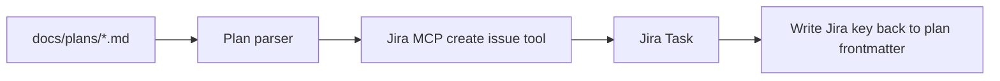

# Jira MCP Integration Plan

## Current State

- Plans are now copied into [`docs/plans/`](docs/plans/) and can be Git-tracked.
- The repo ignores `.cursor/`, so local Cursor rules and MCP config are not committed by default.
- Existing MCP servers do **not** include a general Jira issue creation server. The only Jira-related tool currently visible is a specialized RCA tool:
  - `/Users/atulmala/.cursor/projects/Users-atulmala-tutor-student-tutorix/mcps/user-devops-rca-assessment/tools/get_jira_issue.json`
  - It can read a Jira issue by key, but it cannot create Jira tasks from plan files.

## Assumptions

- Use Jira Cloud first: `https://<site>.atlassian.net`.
- Use Atlassian email + API token authentication.
- Do not commit secrets or personal MCP credential files.
- Start with a manual command/workflow, then automate after the MCP create-ticket path is verified.

## Target Workflow



## Phase 1: Configure Jira MCP Locally

1. Choose a Jira MCP server implementation that supports at least:
   - create issue
   - get issue
   - update issue or add comment
   - optional search by JQL
2. Add local Cursor MCP config outside committed source, for example user-level `~/.cursor/mcp.json` or Cursor settings UI.
3. Keep credentials in local MCP config/env only:
   - `JIRA_BASE_URL`
   - `JIRA_EMAIL`
   - `JIRA_API_TOKEN`
   - optional `JIRA_DEFAULT_PROJECT`
4. Restart/reload Cursor and verify the Jira MCP tools appear.
5. Test by creating one scratch Jira task manually via MCP.

## Phase 2: Define Plan-to-Jira Mapping

Use [`docs/plans/*.md`](docs/plans/) as the source of truth.

Map plan data to Jira fields:

- Jira summary: plan title or filename-derived title.
- Jira description: markdown plan body.
- Jira issue type: `Task` by default.
- Jira project: configured default project key.
- Labels: `cursor-plan`, `implementation-plan`.
- Optional components: infer from filename/body later.
- Plan frontmatter: add/update `jira: PROJECT-123` after ticket creation.

Recommended frontmatter:

```yaml
---
title: Compact Offering Cards
status: planned
jira: null
created: 2026-06-05
---
```

## Phase 3: Manual Create-from-Plan Command

Add a repo script or small Node utility, for example:

- [`scripts/jira/create-ticket-from-plan.ts`](scripts/jira/create-ticket-from-plan.ts)

Responsibilities:

- Read a selected `docs/plans/*.md` file.
- Parse frontmatter if present.
- Refuse to create a duplicate if `jira:` already has a key.
- Ask Jira MCP to create a ticket.
- Write the returned Jira issue key back into the plan file.

Example use:

```bash
npm run jira:create-from-plan docs/plans/compact_offering_cards_40fd0c3f.plan.md
```

## Phase 4: Optional Automation

Once Phase 3 is reliable, add one of these:

- Git hook: detect newly added `docs/plans/*.md` and create Jira tickets.
- CI job: create Jira ticket when a plan file lands on a branch.
- Cursor rule/command: when asked to "create Jira from plan," always use the MCP tool and update frontmatter.

Start with manual automation to avoid accidental Jira spam.

## Files To Add Or Update

- [`docs/plans/`](docs/plans/) — already populated with copied plans.
- [`docs/plans/README.md`](docs/plans/README.md) — document plan naming, frontmatter, and Jira sync expectations.
- [`scripts/jira/create-ticket-from-plan.ts`](scripts/jira/create-ticket-from-plan.ts) — optional manual bridge after MCP is configured.
- [`package.json`](package.json) — optional script entry like `jira:create-from-plan`.
- Local-only Cursor MCP config — configure through Cursor settings or user MCP config, not committed.

## Verification

- Confirm Jira MCP tools are visible in Cursor.
- Create one test Jira issue from a disposable/sample plan.
- Confirm Jira description preserves enough markdown content.
- Confirm plan frontmatter stores the created Jira key.
- Confirm rerunning the command does not create duplicates.
