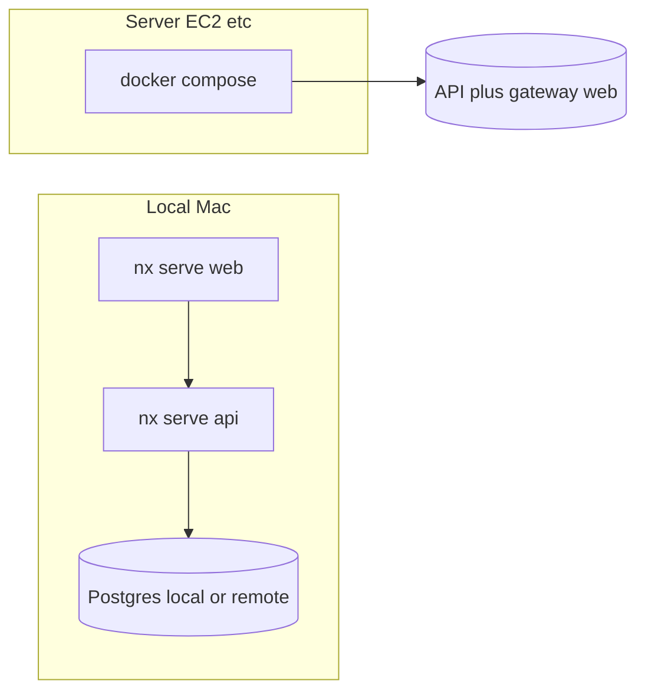

# Local Nx development without Colima

## Answer

**Yes.** The intended local workflow is **Nx + Node**, not Docker. The root [README.md](README.md) documents:

- API: `npm run serve:api` / `npx nx serve api` (GraphQL at `http://localhost:3000/api/graphql`)
- Web: `npm run serve:web` → typically `http://localhost:4200`
- Admin: `npm run serve:web-admin` → typically `http://localhost:4201`

**Docker in this repo is oriented at deployment**, not daily dev: [docker-compose.yml](docker-compose.yml) is commented as “Docker Compose for EC2 (Postgres + API + nginx gateway web UI)”, and the README points to [docs/DEPLOYMENT_EC2.md](docs/DEPLOYMENT_EC2.md) for production-style runs.

So your mental model matches the codebase: **local = Nx; server = Docker/Compose (or your host’s process manager).**

## What you still need locally (no Colima)

1. **PostgreSQL** reachable at the host/port in your API env (`DB_HOST`, `DB_PORT`, etc., as in README “Required Environment Variables for API”). Options that avoid Colima:
   - **Postgres.app** or **Homebrew `postgresql@…`** on macOS
   - A **shared dev/staging RDS** (same vars, point `DB_HOST` at the cloud instance)

2. **API env**: At minimum DB settings plus whatever the API already expects (e.g. `JWT_SECRET`, Firebase/S3 keys if those code paths run). Use a root or app-level `.env` following your existing convention (README mentions copying `.env.example` if present).

3. **Web GraphQL URL (`VITE_GRAPHQL_ENDPOINT`)**:
   - **Recommended for local Nx:** `http://localhost:3000/api/graphql` (absolute URL; web is on :4200, API on :3000, and Vite has no `/api` proxy by default).
   - **Optional:** omit the variable — the client defaults to the same URL ([libs/shared-graphql/src/client/web/endpoint.ts](libs/shared-graphql/src/client/web/endpoint.ts)).
   - **Avoid for local Vite:** `/api/graphql` alone — that resolves against the dev server origin (`localhost:4200`), not the API.
   - Use **`/api/graphql`** when the SPA is served **same-origin** behind the Docker/nginx gateway ([docker-compose.yml](docker-compose.yml)); that is for the server build, not typical local Nx.

4. **Migrations**: Use the npm scripts in README (`migration:run`, etc.) against your local (or remote) DB — same as before Docker.

## Colima disk usage (optional context)

Stopping Colima for day-to-day dev removes image/container layers from your workflow; if you still need Docker occasionally (e.g. testing the production image), you can prune images/volumes when not needed — that’s operational hygiene, not a code change.

## Summary diagram

No repository changes are required to adopt this — it is already the documented path.
