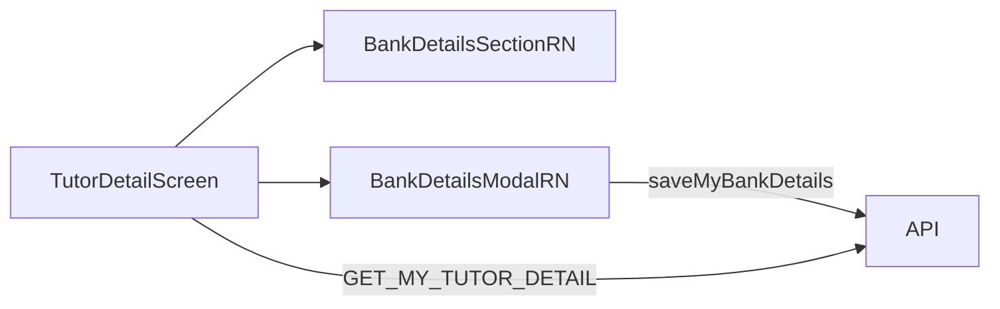

# Mobile bank details implementation

## Current state

| Layer | Status |
|-------|--------|
| API + GraphQL | Done — `saveMyBankDetails`, `panNumber`, `isComplete` |
| Shared query | Done — [`GET_MY_TUTOR_DETAIL`](libs/shared-graphql/src/queries/tutor.queries.ts) already requests `bankDetails { bankName, ifscCode, gstNumber, panNumber, accountNumberMasked, isComplete }` |
| Web | Done — [`TutorProfilePage`](apps/web/src/app/components/tutor-profile/TutorProfilePage.tsx) + [`TutorDetailView`](libs/tutor-detail-ui/src/TutorDetailView.tsx) |
| Mobile | **Missing** — [`TutorDetailScreen`](apps/mobile/src/app/components/tutor-profile/TutorDetailScreen.tsx) loads profile but has no bank section or mutation |

[`@tutorix/tutor-detail-ui`](libs/tutor-detail-ui) cannot be reused on mobile: `BankDetailsSection` / `BankDetailsModal` use HTML (`div`, `button`, Tailwind). Mobile already follows the same pattern as onboarding (native screens in `apps/mobile`, shared logic from `@tutorix/shared-utils` / `@tutorix/shared-graphql`).



## Implementation approach

### 1. Native display component — `BankDetailsSection.tsx`

New file: [`apps/mobile/src/app/components/tutor-profile/BankDetailsSection.tsx`](apps/mobile/src/app/components/tutor-profile/BankDetailsSection.tsx)

Mirror web tutor behavior (admin not needed on mobile):

- **Incomplete** (`!bankDetails?.isComplete`): show “To be entered” + **Enter bank details** button.
- **Complete**: 3-column-style layout using RN `View` rows (stack on narrow width):
  - Row 1: Bank name · Account no (masked) · IFSC
  - Row 2: PAN · GST (`formatGstDisplay` or **Not Applicable**)
- **Edit bank details** button when complete.
- Teal-tinted card styling consistent with existing mobile sections (e.g. address `borderColor: '#cffafe'`).

Reuse from `@tutorix/shared-utils`: `formatGstDisplay`.

Props: `bankDetails`, `onEnterOrEdit`.

### 2. Native form modal — `BankDetailsModal.tsx`

New file: [`apps/mobile/src/app/components/tutor-profile/BankDetailsModal.tsx`](apps/mobile/src/app/components/tutor-profile/BankDetailsModal.tsx)

Port logic from [`BankDetailsModal.tsx`](libs/tutor-detail-ui/src/BankDetailsModal.tsx) (web), using RN primitives:

| Field | Control |
|-------|---------|
| Bank | Modal list from `INDIAN_BANKS` + `OTHER_BANK_OPTION` (same pattern as country picker in [`LoginScreen.tsx`](apps/mobile/src/app/components/LoginScreen.tsx)) |
| Custom bank | `TextInput` when Other selected |
| Account | `TextInput` numeric; placeholder “Re-enter to update” on edit |
| IFSC | `TextInput`, uppercase, max 11 |
| PAN | Required `TextInput`, uppercase, max 10 |
| GST | Optional `TextInput`, uppercase, max 15 |

- `Modal` + `KeyboardAvoidingView` + `ScrollView` (see [`TutorAddressEntry.tsx`](apps/mobile/src/app/components/tutor-onboarding/tutor-address-entry/TutorAddressEntry.tsx)).
- Client validation: same rules as web (account 9–18 digits, IFSC, PAN, GST).
- Export or re-export `BankDetailsFormValues` — import type from `@tutorix/tutor-detail-ui` (`import type { BankDetailsFormValues }`) to keep a single type definition.

Props: `visible`, `initialValues`, `saving`, `error`, `onClose`, `onSubmit`.

### 3. Wire into `TutorDetailScreen.tsx`

Update [`TutorDetailScreen.tsx`](apps/mobile/src/app/components/tutor-profile/TutorDetailScreen.tsx):

```tsx
import { useMutation, useQuery } from '@apollo/client';
import { GET_MY_TUTOR_DETAIL } from '@tutorix/shared-graphql/queries';
import { SAVE_MY_BANK_DETAILS } from '@tutorix/shared-graphql/mutations';
```

- Add `refetch` to existing query.
- `useMutation(SAVE_MY_BANK_DETAILS)` — same variables as web [`TutorProfilePage`](apps/web/src/app/components/tutor-profile/TutorProfilePage.tsx): `bankName`, `accountNumber`, `ifscCode`, `panNumber`, `gstNumber: trim || null`.
- State: `bankModalVisible`, `bankDetailsSaveError`, handle save + refetch + close modal on success.
- Insert **Bank details** section after profile meta (`subtitle` / `meta` block), **before** Offerings — matching web [`TutorDetailView`](libs/tutor-detail-ui/src/TutorDetailView.tsx) order.

### 4. Optional shared validation helper (small DRY win)

Add `validateBankDetailsForm(values)` in [`libs/shared-utils/src/bank-details-formatters.ts`](libs/shared-utils/src/bank-details-formatters.ts) returning `{ ok: true } | { ok: false, message: string }`, used by web modal and mobile modal. **Not required** for MVP if you prefer to duplicate the short regex block once on mobile.

### 5. Testing

- **API/shared**: already covered by existing specs.
- **Mobile**: no component test suite today; manual test plan:
  - Profile with no bank details → Enter → save → complete grid visible.
  - Profile with legacy row (no PAN) → incomplete → edit adds PAN.
  - Invalid PAN/GST/IFSC → inline error, no save.
  - Save shows loading on button, refetch updates section.

## Out of scope

- Admin tutor detail on mobile (admin remains web-admin only).
- Moving `tutor-detail-ui` to React Native Web.
- New API fields or migrations.

## Files to add/change

| Action | File |
|--------|------|
| Add | `apps/mobile/.../BankDetailsSection.tsx` |
| Add | `apps/mobile/.../BankDetailsModal.tsx` |
| Edit | `apps/mobile/.../TutorDetailScreen.tsx` |
| Optional | `libs/shared-utils/src/bank-details-formatters.ts` + spec |

No GraphQL query/mutation changes required.
