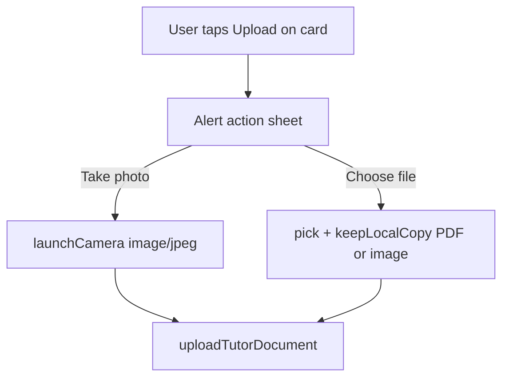

# Mobile camera document capture

## Context

The docs step in [`TutorDocsUpload.tsx`](apps/mobile/src/app/components/tutor-onboarding/tutor-docs-upload/TutorDocsUpload.tsx) already uploads via `pick` + `keepLocalCopy` + [`uploadTutorDocument.ts`](apps/mobile/src/app/components/tutor-onboarding/tutor-docs-upload/uploadTutorDocument.ts). There is **no camera library** in the repo today.

**Lesson from document-picker fix:** native deps must be listed in [`apps/mobile/package.json`](apps/mobile/package.json) (for autolinking) **and** root [`package.json`](package.json), then `pod install` + full native rebuild.

## Approach

- **Take photo:** camera only (JPEG/PNG) — ideal for Aadhaar/PAN photos.
- **Choose file:** existing flow (PDF, JPG, PNG from Files/Gallery).
- Reuse `uploadFileForSlot` / `PickedFile` — no API changes.

## Implementation

### 1. Add `react-native-image-picker`

- Add `react-native-image-picker@^8.2.1` to root and [`apps/mobile/package.json`](apps/mobile/package.json).
- Run `npm install`, then `pod install` in `apps/mobile/ios`.

### 2. Platform permissions

**iOS** — [`apps/mobile/ios/Mobile/Info.plist`](apps/mobile/ios/Mobile/Info.plist):

- `NSCameraUsageDescription` — e.g. "Take photos of your identity and qualification documents for verification."

**Android** — [`apps/mobile/android/app/src/main/AndroidManifest.xml`](apps/mobile/android/app/src/main/AndroidManifest.xml):

- `android.permission.CAMERA`
- Optional for older APIs if needed later: `READ_EXTERNAL_STORAGE` is **not** required for camera-only capture on modern Android.

### 3. New helper: `captureDocumentImage.ts`

In `tutor-docs-upload/`:

- `launchCamera` with `mediaType: 'photo'`, reasonable `quality` (e.g. 0.85), optional `maxWidth`/`maxHeight` (e.g. 2048) to cap upload size under 10 MB.
- Map `ImagePicker` asset → `PickedFile`: `uri`, `fileName` (fallback `document-{timestamp}.jpg`), `size` from `fileSize`, `type` from `type` or `image/jpeg`.
- Handle cancel (`didCancel`) as no-op; permission denied → user-friendly error string.

### 4. Refactor pick orchestration in `TutorDocsUpload.tsx`

- Extract current `handlePickFile` body into `pickDocumentFile(slot)` (unchanged logic).
- Add `handleTakePhoto(slot)` calling `captureDocumentImage` then `uploadFileForSlot`.
- Add `handleAddDocument(slot)` using `Alert.alert` (same pattern as [`LoginScreen.tsx`](apps/mobile/src/app/components/LoginScreen.tsx)):

  - **Take photo** → `handleTakePhoto`
  - **Choose file** → `pickDocumentFile`
  - **Cancel** → dismiss

- Wire cards with `onPickFile={() => handleAddDocument(slot)}` (or rename prop to `onAddDocument` for clarity).

### 5. Update `DocumentUploadCard.tsx`

- Button label: **Upload** when empty, **Replace** when file exists (or keep "Replace file").
- `TouchableOpacity` calls `onPickFile` (action sheet entry point).
- Update slot descriptions in [`document-upload.types.ts`](apps/mobile/src/app/components/tutor-onboarding/tutor-docs-upload/document-upload.types.ts) to mention camera: e.g. "Take a photo or upload PDF, JPG, or PNG (max 10 MB)."

### 6. Tests

- Unit test `captureDocumentImage` mapping logic (mock response → `PickedFile`) in a small spec file, or test a pure `imageAssetToPickedFile` helper if extraction keeps tests simple without mocking native modules.

## Files to touch

| File | Change |
|------|--------|
| `package.json`, `apps/mobile/package.json` | Add `react-native-image-picker` |
| `apps/mobile/ios/Mobile/Info.plist` | Camera usage string |
| `apps/mobile/android/.../AndroidManifest.xml` | `CAMERA` permission |
| `captureDocumentImage.ts` (new) | Camera → `PickedFile` |
| `TutorDocsUpload.tsx` | Action sheet + photo handler |
| `DocumentUploadCard.tsx` | Button copy |
| `document-upload.types.ts` | Description text |

## Verification (manual)

1. Rebuild iOS and Android after `pod install`.
2. On docs step, tap **Upload** → action sheet appears.
3. **Take photo** → camera opens → capture → image uploads and shows preview; profile refetch shows document.
4. **Choose file** → still works for PDF and gallery images.
5. Cancel on sheet / camera does not show an error.
6. Deny camera permission → clear error on the card.

**Note:** Android emulator may need a virtual camera scene; iOS Simulator uses a simulated camera feed.
