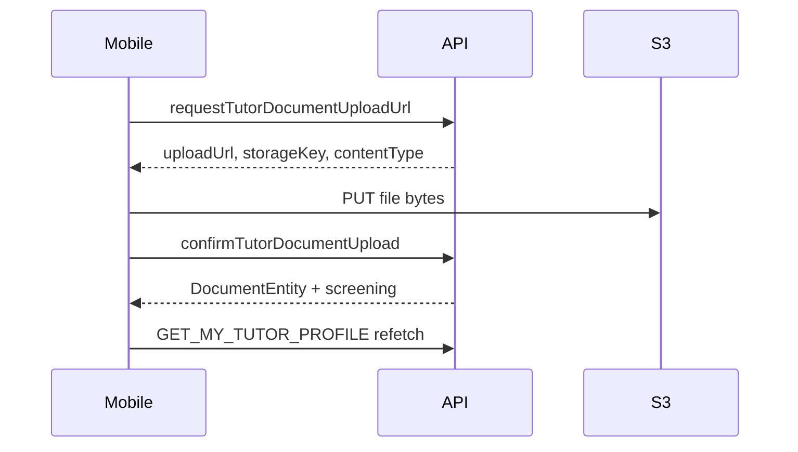

# Mobile tutor document upload (onboarding `docs` step)

## Current state

- Mobile [`TutorOnboarding.tsx`](apps/mobile/src/app/components/tutor-onboarding/TutorOnboarding.tsx) routes `docs` to a **placeholder** ("Coming soon") that locally skips to the next step with no API calls.
- **Backend and GraphQL are ready**: `requestTutorDocumentUploadUrl` → S3 PUT → `confirmTutorDocumentUpload`; documents listed on `GET_MY_TUTOR_PROFILE.documents`.
- **Web reference** (target behavior): [`TutorDocsUpload.tsx`](apps/web/src/app/components/tutor-onboarding/tutor-docs-upload/TutorDocsUpload.tsx) + [`DocumentUploadCard.tsx`](apps/web/src/app/components/tutor-onboarding/tutor-docs-upload/DocumentUploadCard.tsx).



## Scope (defaults)

- **File selection**: system document picker for PDF/JPG/PNG (parity with web `accept`); no camera unless you ask later.
- **Continue behavior**: mirror web — enabled only when all 4 slots have screening `PASSED_AUTOMATED` or `APPROVED_HUMAN`; `onComplete` bumps **local** step index only (no `completeDocsStep` mutation exists today).
- **Out of scope**: backend stage persistence, `complete` step UI, shared lib refactor of web+mobile (can follow up).

## Four document slots (same as web)

| `documentType` | Title |
|---|---|
| `AADHAAR_CARD` | Aadhaar card |
| `PAN_CARD` | PAN card |
| `CLASS_XII_MARKSHEET` | Higher secondary (Class XII) |
| `HIGHEST_DEGREE_CERTIFICATE` | Highest degree |

Constraints (enforced client + API): MIME `application/pdf`, `image/jpeg`, `image/png`; size 1 byte – 10 MB; tutor must be on `certificationStage === docs`.

## Implementation plan

### 1. Add native file picker dependency

Add **`react-native-document-picker`** to the workspace root [`package.json`](package.json) (monorepo hoists mobile deps here).

- Pick types: `pdf` + `images` (or explicit MIME allowlist).
- Run `pod install` under [`apps/mobile/ios`](apps/mobile/ios) after install.
- No S3 CORS changes needed for mobile (native PUT does not use browser preflight).

### 2. Create mobile docs upload module

New folder: `apps/mobile/src/app/components/tutor-onboarding/tutor-docs-upload/`

| File | Responsibility |
|------|----------------|
| `TutorDocsUpload.tsx` | Main step: profile query, progress, upload orchestration, review banner, Continue button |
| `DocumentUploadCard.tsx` | Per-slot card: thumbnail, status text, pick/replace button, errors |
| `uploadTutorDocument.ts` | Pure helper: validate MIME/size, presign mutation, S3 PUT from `file://` URI, confirm mutation |
| `index.ts` | Barrel export |

**Port logic from web** (keep behavior aligned):

- Reuse screening helpers: `screeningPassed`, `screeningRejected`, `screeningHumanPending`, `findSlotDoc`, progress `{ filled, allFilled, allPassed, anyRejected }`.
- GraphQL from `@tutorix/shared-graphql`: `REQUEST_TUTOR_DOCUMENT_UPLOAD_URL`, `CONFIRM_TUTOR_DOCUMENT_UPLOAD`, `GET_MY_TUTOR_PROFILE` (same import style as [`TutorRegistrationPayment.tsx`](apps/mobile/src/app/components/tutor-onboarding/TutorRegistrationPayment.tsx)).
- Props: `StepComponentProps` from `@tutorix/shared-utils` with `onComplete`.

**RN-specific upload helper** (`uploadTutorDocument.ts`):

```typescript
// After document picker returns { uri, name, size, type? }
const mimeType = resolveMimeType(name, type); // extension fallback like web
const blob = await (await fetch(uri)).blob();
await fetch(uploadUrl, { method: 'PUT', headers: { 'Content-Type': contentType }, body: blob });
```

- Map picker cancel to no-op; surface network/S3/GraphQL errors on the slot.
- For **image preview**: `Image` with local `uri` while uploading; after confirm use `doc.previewUrl` from API.
- For **PDF**: show document icon placeholder (web shows generic thumbnail when not image).

**UI styling**: match existing mobile onboarding — white card (`#fff`), border `#e2e8f0`, primary button `#5fa8ff`, amber review banner (same copy as web), `ActivityIndicator` on slot upload and Continue when refetching.

### 3. Wire into onboarding orchestrator

Update [`TutorOnboarding.tsx`](apps/mobile/src/app/components/tutor-onboarding/TutorOnboarding.tsx):

```typescript
if (stepConfig.id === 'docs') {
  return <TutorDocsUpload onComplete={handleStepComplete} />;
}
```

- Add `'Documents Upload'` (or `stepConfig.title`) to `screenTitle` mapping for the nav header.
- Remove `docs` from the generic `PlaceholderStep` path.

### 4. Manual test checklist

1. Tutor at `registrationPayment` → Continue → API sets stage `docs` → docs screen appears (not placeholder).
2. Upload each of 4 types (PDF + image cases); confirm profile refetch shows `storageKey` and `PENDING` workflow.
3. Invalid file (e.g. .doc) shows slot error; oversize file rejected before presign.
4. Replace rejected document; accepted documents disable replace (same as web).
5. Continue disabled until all 4 pass automated/human screening; then advances to Application Review locally.
6. Re-open app at `docs` stage — uploads still listed (server state intact).

## Key files touched

- **New**: `apps/mobile/.../tutor-docs-upload/*`
- **Edit**: [`TutorOnboarding.tsx`](apps/mobile/src/app/components/tutor-onboarding/TutorOnboarding.tsx), root [`package.json`](package.json)
- **No API changes** unless you later want `completeDocsStep` to persist `docs` → `interview`

## Optional follow-ups (not in initial PR)

- Extract `ONBOARDING_SLOTS` + screening helpers to `@tutorix/shared-utils` for web/mobile DRY.
- `completeDocsStep` GraphQL mutation + mobile/web calling it on Continue.
- Camera capture via `react-native-image-picker` for ID photos.
- Mount unused [`OnboardingStepper.tsx`](apps/mobile/src/app/components/tutor-onboarding/OnboardingStepper.tsx) for step progress UI.
