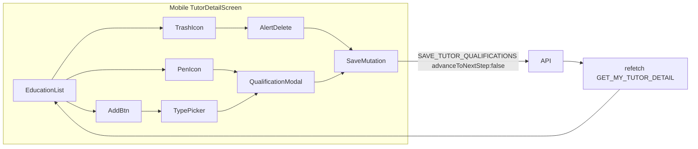

# Mobile Tutor Profile Education Edit/Add/Delete

## Current state

| Layer | Status |
|-------|--------|
| **Experience (mobile profile)** | Done — [`ExperienceModal`](apps/mobile/src/app/components/tutor-profile/ExperienceModal.tsx), pen/trash/add in [`TutorDetailScreen`](apps/mobile/src/app/components/tutor-profile/TutorDetailScreen.tsx), `SAVE_TUTOR_EXPERIENCES` + `GET_MY_TUTOR_DETAIL` refetch |
| **Education (mobile profile)** | Read-only list in `TutorDetailScreen` (~699–719) |
| **Education (web profile)** | Done — [`QualificationModal`](libs/tutor-detail-ui/src/QualificationModal.tsx) + [`TutorDetailView`](libs/tutor-detail-ui/src/TutorDetailView.tsx) wiring |
| **Shared helpers** | Done — [`tutor-qualification-form.ts`](libs/shared-utils/src/tutor-qualification-form.ts) |
| **API** | Ready — `SAVE_TUTOR_QUALIFICATIONS` replace-all by `qualificationType`; omit type = soft-delete; Higher Secondary required and not deletable |



## UX (match web + mobile experience)

| Action | Behavior |
|--------|----------|
| **Edit** (pen) | Open modal pre-filled; `qualificationType` read-only label |
| **Delete** (trash) | `Alert.alert` → save list without that type; hidden for Higher Secondary |
| **Add qualification** | Show only when unused types exist; 1 type → modal directly; multiple → inline type picker then modal |
| **Save** | `validateQualificationRow`, merge by `qualificationType`, save full list |
| **Cancel** | Close modal, no save |

**Row layout:** Title left; pen + trash on the right (reuse existing `PenIcon` / `TrashIcon` and `experienceTitleRow`-style layout from experience rows).

**Delete copy:** `"Delete this qualification? This cannot be undone."`

**Modal fields** (same as web [`QualificationModal`](libs/tutor-detail-ui/src/QualificationModal.tsx)):
- `qualificationType` — read-only label
- `degreeName` — required except HS (disabled)
- `fieldOfStudy`, `boardOrUniversity`, `gradeType`, `gradeValue`, `yearObtained`

**Count badge** in section header updates after refetch.

---

## Implementation

### 1. Create `QualificationModal` (React Native)

New file: [`apps/mobile/src/app/components/tutor-profile/QualificationModal.tsx`](apps/mobile/src/app/components/tutor-profile/QualificationModal.tsx)

Mirror [`ExperienceModal.tsx`](apps/mobile/src/app/components/tutor-profile/ExperienceModal.tsx) structure:

```typescript
type QualificationModalProps = {
  visible: boolean;
  mode: 'edit' | 'add';
  initialRow: QualificationFormRow;
  saving?: boolean;
  error?: string | null;
  onClose: () => void;
  onSubmit: (row: QualificationFormRow) => void;
};
```

- Import from `@tutorix/shared-utils`: `validateQualificationRow`, label/placeholder helpers, `EDUCATIONAL_QUALIFICATION_LABELS`, `GRADE_TYPE_LIST`, `GRADE_TYPE_LABELS`, `EducationalQualification`
- RN shell: `Modal` + `KeyboardAvoidingView` + `ScrollView` (same as experience)
- Nested picker modal for **grade type** (copy pattern from experience employment-type picker or mobile onboarding [`TutorQualification.tsx`](apps/mobile/src/app/components/tutor-onboarding/tutor-qualification/TutorQualification.tsx) lines 636–672)
- Reset local state on `visible` / `initialRow` change
- Export `QualificationFormRow` type re-export for screen imports

Field layout can follow web modal field order; styling should match `ExperienceModal` (`TextInput`, error text, Save/Cancel buttons).

### 2. Wire CRUD in `TutorDetailScreen`

Update [`apps/mobile/src/app/components/tutor-profile/TutorDetailScreen.tsx`](apps/mobile/src/app/components/tutor-profile/TutorDetailScreen.tsx):

**Imports / mutation:**
- Add `SAVE_TUTOR_QUALIFICATIONS`
- Add shared helpers: `mapQualificationToFormRow`, `emptyQualificationRow`, `buildQualificationMutationInput`, `getAvailableQualificationTypes`, `canDeleteQualificationType`, `EducationalQualification`, `QualificationFormRow`

**State** (parallel to experience):
- `qualificationModal: { mode: 'edit' | 'add'; qualificationType: EducationalQualification } | null`
- `qualificationTypePickerOpen: boolean`
- `deletingQualificationType: EducationalQualification | null`
- `qualificationSaveError: string | null`
- `useMutation(SAVE_TUTOR_QUALIFICATIONS)`

**Derived data:**
- `qualificationsAsFormRows` from `tutor.qualifications`
- `availableQualificationTypes` via `getAvailableQualificationTypes`
- `qualificationModalInitialRow` via `emptyQualificationRow` / find by type

**Handlers** (mirror web [`TutorDetailView`](libs/tutor-detail-ui/src/TutorDetailView.tsx)):
- `handleSaveQualifications(rows)` → `buildQualificationMutationInput(rows)` + `advanceToNextStep: false` + `refetch()`
- `handleQualificationModalSubmit(row)` → merge by `qualificationType` (edit replaces, add appends)
- `handleDeleteQualification(type)` → `Alert.alert` if `canDeleteQualificationType(type)` → filter → save
- `handleAddQualification()` → 1 available type opens modal; else set `qualificationTypePickerOpen`
- `handlePickQualificationType(type)` → open add modal

**Education section UI** (~699–719):
- Replace numbered title-only rows with title row + pen/trash (trash omitted for HS)
- Empty state: “Add qualification” when types available
- Non-empty: add button + optional inline type-picker panel (chip buttons, like web `EducationSection`)
- Reuse/adapt experience styles (`experienceTitleRow`, `experienceActions`, `addExperienceButton` — can alias as education-specific styles if colors differ)

**Render modal** at bottom with other modals (~864):

```tsx
<QualificationModal
  visible={qualificationModal != null}
  mode={qualificationModal?.mode ?? 'add'}
  initialRow={qualificationModalInitialRow}
  saving={savingQualifications}
  error={qualificationSaveError}
  onClose={() => { setQualificationModal(null); setQualificationTypePickerOpen(false); setQualificationSaveError(null); }}
  onSubmit={(row) => void handleQualificationModalSubmit(row)}
/>
```

### 3. No backend / GraphQL changes

Reuse existing `SAVE_TUTOR_QUALIFICATIONS` and `GET_MY_TUTOR_DETAIL` (qualifications already in query).

---

## Critical constraints

- **`advanceToNextStep: false`** on all profile saves (do not touch onboarding `certificationStage`)
- **Always send full qualification list** — API replace-all by type
- **Higher Secondary** cannot be deleted; no trash affordance
- **One row per qualification type** — add only unused types from `getAvailableQualificationTypes`
- **Out of scope:** mobile onboarding refactor (optional follow-up to swap local validation in [`apps/mobile/.../TutorQualification.tsx`](apps/mobile/src/app/components/tutor-onboarding/tutor-qualification/TutorQualification.tsx) to shared helpers)

---

## Files touched

| File | Change |
|------|--------|
| `apps/mobile/src/app/components/tutor-profile/QualificationModal.tsx` | **New** — RN modal form |
| `apps/mobile/src/app/components/tutor-profile/TutorDetailScreen.tsx` | Education CRUD UI + mutation/handlers + modal |

---

## Manual test plan

1. Profile with qualifications → each row shows pen; trash on all except Higher Secondary.
2. Edit a row → Save → list refreshes; count unchanged.
3. Add qualification → pick type (if multiple) → fill form → Save → new row; count increases.
4. Delete non-HS qualification → confirm → removed; count decreases.
5. Higher Secondary has no delete button.
6. Add button hidden when all types present.
7. Validation errors inline; invalid save blocked.
8. Certification stage unchanged after profile saves.
