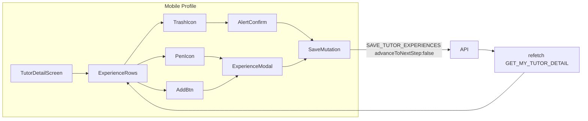

# Mobile Tutor Profile Experience Edit/Add/Delete

## Current state

| Layer | Status |
|-------|--------|
| **Web profile** | Done — [`ExperienceModal`](libs/tutor-detail-ui/src/ExperienceModal.tsx), edit/delete/add in [`TutorDetailView`](libs/tutor-detail-ui/src/TutorDetailView.tsx), save in [`TutorProfilePage`](apps/web/src/app/components/tutor-profile/TutorProfilePage.tsx) |
| **Shared helpers** | [`tutor-experience-form.ts`](libs/shared-utils/src/tutor-experience-form.ts) — validation, mapping, mutation input builder |
| **Mobile profile** | Read-only list in [`TutorDetailScreen.tsx`](apps/mobile/src/app/components/tutor-profile/TutorDetailScreen.tsx) (~473–510) |
| **Mobile onboarding** | Full editor in [`TutorExperience.tsx`](apps/mobile/src/app/components/tutor-onboarding/tutor-experience/TutorExperience.tsx) — duplicates helpers locally, uses `GET_MY_TUTOR_PROFILE` |

Web `ExperienceModal` is DOM-based and cannot be reused on RN. Mobile should follow the existing **slide-up modal** pattern from [`BankDetailsModal.tsx`](apps/mobile/src/app/components/tutor-profile/BankDetailsModal.tsx).



## UX (parity with web)

| Action | Mobile behavior |
|--------|-----------------|
| **Edit** (pen icon) | Opens slide-up `ExperienceModal` pre-filled for that row |
| **Delete** (red bin icon) | `Alert.alert` confirm → save remaining experiences |
| **Add new Experience** | Button below list (or in empty state) → modal with empty row |
| **Save** in modal | Validates via `validateExperienceRow`, merges into full list, saves |
| **Cancel** | Closes modal |

**Field parity with web profile modal** (same as onboarding per-row fields, **no** years-of-experience dropdown):
- Employment type (picker modal)
- Job title, employer name/address (hidden for self-employed)
- Start/end date (`YYYY-MM-DD` text inputs + `formatDateInput` from onboarding)
- Currently working (`Switch`)

**Totals:** Entry count + total duration badge already computed in `TutorDetailScreen` via `sumExperienceDurations` — update automatically after `refetch()`.

**Delete confirm copy:** `"Delete this experience? This cannot be undone."` with Cancel / Delete (destructive).

**Row layout:** Duration chip + pen + trash on the same row as job title (match web [`ExperienceSection`](libs/tutor-detail-ui/src/TutorDetailView.tsx)).

---

## Implementation

### 1. Create `ExperienceModal.tsx` (mobile)

New file: [`apps/mobile/src/app/components/tutor-profile/ExperienceModal.tsx`](apps/mobile/src/app/components/tutor-profile/ExperienceModal.tsx)

Mirror [`BankDetailsModal.tsx`](apps/mobile/src/app/components/tutor-profile/BankDetailsModal.tsx) structure:
- RN `Modal` (`animationType="slide"`, transparent overlay)
- `KeyboardAvoidingView` + `ScrollView`
- Props: `visible`, `mode: 'edit' | 'add'`, `initialRow: ExperienceFormRow`, `saving`, `error`, `onClose`, `onSubmit`

Form implementation:
- Import from `@tutorix/shared-utils`: `ExperienceFormRow`, `validateExperienceRow`, `emptyExperienceRow`, `EMPLOYMENT_TYPE_LIST`, `EMPLOYMENT_TYPE_LABELS`, `EmploymentType`
- Reuse onboarding UX patterns from [`TutorExperience.tsx`](apps/mobile/src/app/components/tutor-onboarding/tutor-experience/TutorExperience.tsx):
  - Employment type picker overlay (`Modal` + list of options)
  - `formatDateInput` for date fields (copy small helper or extract to shared-utils if trivial)
  - `Switch` for `isCurrent`
- Reset state in `useEffect` when `visible` changes
- Title: "Edit experience" / "Add new experience"

### 2. Add pen/trash icons (optional small component)

Use `react-native-svg` (already in mobile) with the same paths as web pen/trash icons in [`TutorDetailView.tsx`](libs/tutor-detail-ui/src/TutorDetailView.tsx). Either inline in `TutorDetailScreen` or a tiny `ExperienceActionIcons.tsx` in `tutor-profile/`.

### 3. Update experience section in `TutorDetailScreen`

In [`TutorDetailScreen.tsx`](apps/mobile/src/app/components/tutor-profile/TutorDetailScreen.tsx):

**State:**
```typescript
const [experienceModal, setExperienceModal] = useState<
  { mode: 'edit' | 'add'; experienceId?: number } | null
>(null);
const [deletingExperienceId, setDeletingExperienceId] = useState<number | null>(null);
const [experienceSaveError, setExperienceSaveError] = useState<string | null>(null);
```

**Mutation:**
- Import `SAVE_TUTOR_EXPERIENCES` from `@tutorix/shared-graphql/mutations`
- Import `buildExperienceMutationInput`, `mapExperienceToFormRow`, `normalizeYearsOfExperience`, `emptyExperienceRow`, `ExperienceFormRow`

**Handler** (same logic as web `TutorProfilePage`):
```typescript
await saveExperiences({
  variables: {
    input: {
      experiences: buildExperienceMutationInput(rows),
      yearsOfExperience: normalizeYearsOfExperience(tutor.yearsOfExperience),
      advanceToNextStep: false,
    },
  },
});
await refetch();
```

**Merge/save/delete:**
- Edit: replace row by `id` in mapped form rows, preserve `id`
- Add: append new row
- Delete: `Alert.alert` → filter out `experienceId` → save remaining list

**UI changes to experience list (~487–510):**
- Per row: job title left; right row with duration badge + pen + trash `TouchableOpacity`
- Bottom: "Add new Experience" button
- Empty state: muted text + Add button
- Disable actions while `savingExperiences` or row is deleting

**Render `<ExperienceModal />`** at bottom alongside `BankDetailsModal` / `RateCardModal`.

### 4. Refactor mobile onboarding `TutorExperience` (optional but recommended)

Update [`apps/mobile/.../TutorExperience.tsx`](apps/mobile/src/app/components/tutor-onboarding/tutor-experience/TutorExperience.tsx) to replace duplicated `mapEmploymentType`, `validateRow`, `buildExperiencesInput` with shared helpers — same refactor already done on web. Keeps onboarding and profile validation identical.

---

## Critical constraints

- **`advanceToNextStep: false`** on all profile saves
- **Always send full experience list** — API replace-all; omitted rows are soft-deleted
- **`yearsOfExperience`** not shown in profile modal; pass existing `tutor.yearsOfExperience` unchanged
- **No new API/GraphQL changes** — reuse `SAVE_TUTOR_EXPERIENCES` + `GET_MY_TUTOR_DETAIL`
- **Do not use web `ExperienceModal`** from `tutor-detail-ui` (DOM-only)

---

## Files to touch

| File | Change |
|------|--------|
| `apps/mobile/src/app/components/tutor-profile/ExperienceModal.tsx` | **New** — RN slide-up form |
| `apps/mobile/src/app/components/tutor-profile/TutorDetailScreen.tsx` | Row actions, modal/delete wiring, mutation |
| `apps/mobile/src/app/components/tutor-onboarding/tutor-experience/TutorExperience.tsx` | Use shared `tutor-experience-form` helpers |

---

## Manual test plan

1. Open tutor profile with experiences → each row shows duration + pen + trash.
2. Tap pen → edit fields → Save → list and totals refresh.
3. Tap "Add new Experience" → fill form → Save → new row appears; count/total update.
4. Tap trash → confirm → row removed; count/total decrease.
5. Cancel delete / cancel modal → no changes.
6. Self-employed → employer fields hidden; save works.
7. Validation errors shown inline; save blocked when invalid.
8. Certification stage unchanged after profile saves.
9. Delete last experience → empty state with Add button only.
