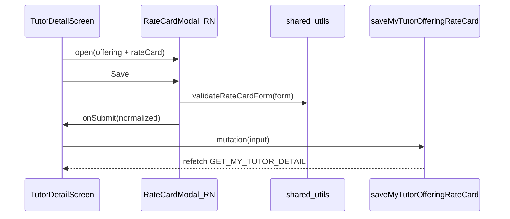

# Mobile tutor rate card

## Context

| Layer | Status |
|-------|--------|
| API | [`saveMyTutorOfferingRateCard`](apps/api/src/app/modules/tutor-rate-card/resolvers/tutor-rate-card-mutation.resolver.ts) + [`validateRateCardForm`](libs/shared-utils/src/rate-card.ts) — ready |
| GraphQL | [`GET_MY_TUTOR_DETAIL`](libs/shared-graphql/src/queries/tutor.queries.ts) already returns `offerings.rateCard`; [`SAVE_MY_TUTOR_OFFERING_RATE_CARD`](libs/shared-graphql/src/mutations/tutor-rate-card.mutations.ts) exists |
| Web reference | [`TutorProfilePage`](apps/web/src/app/components/tutor-profile/TutorProfilePage.tsx) + [`RateCardModal`](libs/tutor-detail-ui/src/RateCardModal.tsx) in `TutorDetailView` |
| Mobile | [`TutorDetailScreen`](apps/mobile/src/app/components/tutor-profile/TutorDetailScreen.tsx) shows offerings but **no rate card UI**; [`BankDetailsModal`](apps/mobile/src/app/components/tutor-profile/BankDetailsModal.tsx) is the modal pattern to follow |
| Access | [`App.tsx`](apps/mobile/src/app/App.tsx) only navigates to `tutorProfile` when `onBoardingComplete` and celebration seen; [`getMyTutorDetail`](apps/api/src/app/modules/tutor/services/tutor-detail.service.ts) enforces the same server-side |

**Cannot reuse** [`libs/tutor-detail-ui/src/RateCardModal.tsx`](libs/tutor-detail-ui/src/RateCardModal.tsx) on mobile (DOM/`className`). Port UI to React Native; keep **all business logic** from `@tutorix/shared-utils`.



## 1. New `RateCardModal` (React Native)

**File:** [`apps/mobile/src/app/components/tutor-profile/RateCardModal.tsx`](apps/mobile/src/app/components/tutor-profile/RateCardModal.tsx) (new)

Mirror web modal behavior from [`RateCardModal.tsx`](libs/tutor-detail-ui/src/RateCardModal.tsx):

- `Modal` + `KeyboardAvoidingView` + `ScrollView` (same shell as [`BankDetailsModal`](apps/mobile/src/app/components/tutor-profile/BankDetailsModal.tsx))
- Props: `visible`, `offeringName`, `initialValues` (`RateCardLike`), `saving`, `error`, `onClose`, `onSubmit`
- State: `rateCardToFormInput(initialValues)`, `activeTab` (`offline` | `online`), client validation via `validateRateCardForm`
- **Header:** title `Edit rate card` / `Rate card` via `isRateCardComplete`; subtitle “Set how you charge for this offering.”
- **Free demo** checkbox (`Switch` or `TouchableOpacity` + checked state)
- **Segmented tabs:** Offline classes / Online classes
- **Per tab:** “Offer offline/online classes” toggle; base rate (`TextInput`, numeric); three slab discount rows with `RATE_CARD_SLABS`, `calculateEffectiveRate`, `formatInr` previews
- **Fields always visible** when mode off but disabled (`inputsDisabled = saving || !enabled`) — matches current web UX
- **Footer:** Cancel + Save rate card; disable while saving; show validation/API error text

Use purple/teal styling consistent with existing mobile profile sections (offerings use teal `#0f766e` / `#f0fdfa`).

## 2. Wire into `TutorDetailScreen`

**File:** [`apps/mobile/src/app/components/tutor-profile/TutorDetailScreen.tsx`](apps/mobile/src/app/components/tutor-profile/TutorDetailScreen.tsx)

**Imports / mutation**

```ts
import { SAVE_MY_TUTOR_OFFERING_RATE_CARD } from '@tutorix/shared-graphql/mutations';
import type { RateCardFormValues } from '@tutorix/tutor-detail-ui';
import { RateCardModal } from './RateCardModal';
```

**State**

- `rateCardOffering`: selected offering from `tutor.offerings` (same pattern as web `rateCardOffering`)
- `rateCardSaveError`: string | null

**Save handler** — copy variable mapping from [`TutorProfilePage.tsx`](apps/web/src/app/components/tutor-profile/TutorProfilePage.tsx) lines 54–87 (`tutorOfferingId`, `freeDemoOffered`, offline/online fields null when disabled).

**Offerings UI** (inside each `offeringGridCard`):

- If `o.rateCard?.isComplete`: small “Configured” badge (green pill, like web)
- Button: `Edit rate card` when complete, else `Rate card` — opens modal with that offering
- Optional: serial index on cards for parity with recent web/mobile education pattern (`index + 1` in a circle) — low priority unless you want strict parity

**Modal render** at bottom of screen (with `BankDetailsModal`):

```tsx
<RateCardModal
  visible={rateCardOffering != null}
  offeringName={...}
  initialValues={rateCardOffering?.rateCard}
  saving={savingRateCard}
  error={rateCardSaveError}
  onClose={() => { setRateCardOffering(null); setRateCardSaveError(null); }}
  onSubmit={handleSaveRateCard}
/>
```

On successful save: `refetch()`, clear offering + error, close modal.

## 3. No backend / query changes

- `GET_MY_TUTOR_DETAIL` already includes `rateCard` fields — no query edit
- Mutation export already in [`libs/shared-graphql/src/mutations/index.ts`](libs/shared-graphql/src/mutations/index.ts)

## 4. Testing checklist

- Log in as tutor with **completed onboarding** → My profile → Offerings
- Open **Rate card** on offering with no card → fill offline (or online) → Save → badge “Configured”, reopen shows **Edit rate card**
- Tab switch offline/online; disabled fields when mode unchecked; validation errors (e.g. no mode enabled) shown in modal
- Confirm tutor still in onboarding cannot reach profile (existing `App.tsx` gate)
- Regression: bank details modal still works

## Scope notes

- **Out of scope:** admin read-only modal on mobile, extracting shared RN/web UI library (future refactor if a third client needs it)
- **Types only** from `@tutorix/tutor-detail-ui` (`RateCardFormValues`, `TutorDetailRecord` offering shape) — no web components in mobile bundle
