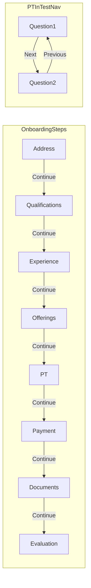

# Onboarding: remove Back, rename Interview to Evaluation

## 1. Rename interview stage to "Evaluation"

**Single source of truth** — update [`libs/shared-utils/src/onboarding-types.ts`](libs/shared-utils/src/onboarding-types.ts):

```ts
{
  id: 'interview',
  title: 'Evaluation',
  description: 'Your application is under evaluation',
}
```

This automatically updates:
- Web/mobile step headers (`stepConfig.title`)
- Admin tutor list tabs ([`apps/web-admin/src/app/pages/TutorsPage.tsx`](apps/web-admin/src/app/pages/TutorsPage.tsx) uses `step.title`)
- Admin onboarding timeline ([`apps/web-admin/src/app/utils/onboarding-timeline.ts`](apps/web-admin/src/app/utils/onboarding-timeline.ts) uses `ONBOARDING_STEPS`)

**Stepper short labels** (duplicated today — update both):
- [`apps/web/src/app/components/tutor-onboarding/OnboardingStepper.tsx`](apps/web/src/app/components/tutor-onboarding/OnboardingStepper.tsx): `interview: 'Evaluation'`
- [`apps/mobile/src/app/components/tutor-onboarding/OnboardingStepper.tsx`](apps/mobile/src/app/components/tutor-onboarding/OnboardingStepper.tsx): same

**Placeholder copy** — [`apps/web/src/app/components/tutor-onboarding/tutor-interview/TutorInterview.tsx`](apps/web/src/app/components/tutor-onboarding/tutor-interview/TutorInterview.tsx): update body text to reference evaluation (remove Back button block in same pass).

**Admin detail badge** — [`apps/web-admin/src/app/pages/TutorDetailPage.tsx`](apps/web-admin/src/app/pages/TutorDetailPage.tsx) currently renders raw `certificationStage` (e.g. `interview`). Replace with a lookup from `ONBOARDING_STEPS` so it shows `Evaluation`.

Optional small helper in shared-utils (keeps admin/tutor apps consistent):

```ts
export function getOnboardingStepTitle(stage: string | undefined): string
```

---

## 2. Remove step-level Back buttons (web)

**Orchestrator** — [`apps/web/src/app/components/tutor-onboarding/TutorOnboarding.tsx`](apps/web/src/app/components/tutor-onboarding/TutorOnboarding.tsx):
- Remove `handleStepBack` and `onBack` prop usage
- Pass only `onComplete` to step components (no `onBack`)

**Parent cleanup** — [`apps/web/src/app/app.tsx`](apps/web/src/app/app.tsx): remove `onBack` passed to `<TutorOnboarding />` (tutors can use header/logout to leave if needed).

**Step components** — remove `{onBack && (...Back...)}` footer blocks and any layout gaps left behind; keep Continue as the sole primary action in:
- `tutor-address-entry/TutorAddressEntry.tsx`
- `tutor-qualification/TutorQualification.tsx`
- `tutor-experience/TutorExperience.tsx`
- `tutor-offerings/TutorOfferings.tsx`
- `tutor-registration-payment/TutorRegistrationPayment.tsx`
- `tutor-docs-upload/TutorDocsUpload.tsx`
- `tutor-interview/TutorInterview.tsx`
- `tutor-onboarding-complete/TutorOnboardingComplete.tsx`
- `tutor-pt/PTIntroScreen.tsx`

**PT sub-flow exceptions** ([`apps/web/src/app/components/tutor-onboarding/tutor-pt/TutorPT.tsx`](apps/web/src/app/components/tutor-onboarding/tutor-pt/TutorPT.tsx)):
- Remove step-level Back on intro / empty states
- Replace **"Back to Offerings"** (all attempts failed) with a primary **Continue** button that still invokes the same handler (go back to offerings step via existing callback)
- **Keep** [`PTTestScreen.tsx`](apps/web/src/app/components/tutor-onboarding/tutor-pt/PTTestScreen.tsx) Previous/Next between questions (per your preference)

---

## 3. Remove step-level Back buttons (mobile)

**Orchestrator** — [`apps/mobile/src/app/components/tutor-onboarding/TutorOnboarding.tsx`](apps/mobile/src/app/components/tutor-onboarding/TutorOnboarding.tsx):
- Stop passing `onBack` to `NavHeader` (removes top back arrow during onboarding)
- Stop passing `onBack` to all step components and `PlaceholderStep`
- Remove `handleStepBack` / `showBack` logic
- Update `PlaceholderStep` to show only Continue

**Parent cleanup** — [`apps/mobile/src/app/App.tsx`](apps/mobile/src/app/App.tsx): remove unused `onBack={handleOnboardingBack}`.

**Step components** — same Back removal as web in:
- `tutor-address-entry/TutorAddressEntry.tsx`
- `tutor-qualification/TutorQualification.tsx`
- `tutor-experience/TutorExperience.tsx`
- `tutor-offerings/TutorOfferings.tsx`
- `TutorRegistrationPayment.tsx`
- `tutor-pt/TutorPT.tsx`, `tutor-pt/PTIntroScreen.tsx` (same PT failure → Continue rule)

**Keep** mobile `PTTestScreen` Previous/Next unchanged.

---

## 4. Type cleanup (optional, small)

[`libs/shared-utils/src/onboarding-types.ts`](libs/shared-utils/src/onboarding-types.ts) — remove `onBack?` from `StepComponentProps` if no longer referenced, or leave optional unused until a follow-up cleanup.

---

## Flow after change



No backward navigation between onboarding steps. Tutors progress forward only via Continue (and PT Retry where applicable).

---

## Verification

- Walk through web onboarding: each step shows Continue only (no Back)
- PT test: Previous/Next still works between questions
- PT all-attempts-failed: single Continue button returns to offerings
- Mobile: no NavHeader back arrow during onboarding; step footers match web
- Stepper + headers show **Evaluation** instead of Interview
- Admin tutors tabs, timeline, and tutor detail badge show **Evaluation** for `interview` stage
