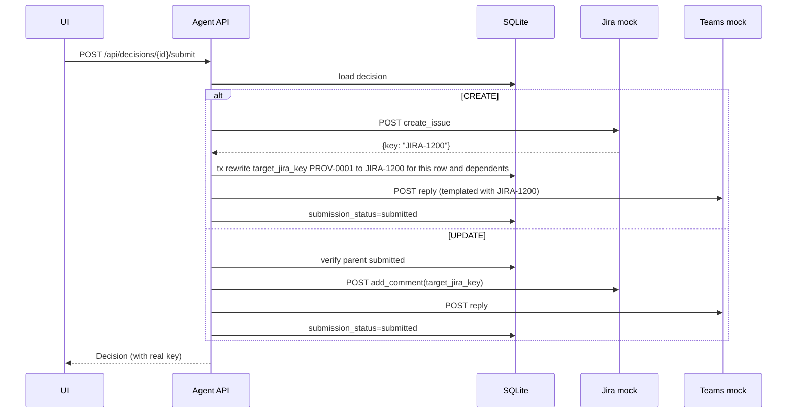

## Goal

Restore the write path without regressing the dedup invariant. On Submit of a CREATE, the decision's displayed key flips from `PROV-0001` (draft) to e.g. `JIRA-1200` (real); any later message that dedups to the same ticket shows and targets `JIRA-1200`. Submit for UPDATE posts a comment against the current target key (which may itself already be real).

## Data model

Extend [agent/app/db/migrations/](agent/app/db/migrations/) with `002_submission.sql`:

- `decisions` gains: `submission_status TEXT NOT NULL DEFAULT 'draft'` (`draft` | `submitted` | `submit_failed`), `submitted_at TEXT`, `submit_error TEXT`.
- Keep `provisional_key` as the immutable draft label (for audit / UI "was drafted as" hint).
- Add `target_jira_key` if not already present — set at draft time (equals provisional or matched backlog key) and **overwritten on CREATE submit** with the real Jira key.
- Index on `(target_jira_key)` for the rewrite cascade.

Update Pydantic models in [agent/app/schemas/decision.py](agent/app/schemas/decision.py): add `submission_status`, `submitted_at`, `submit_error`.

## Submitter service

Re-add `agent/app/services/submitter.py` (lean version of the deleted one):

- `async submit(decision_id) -> Decision`
- CREATE path:
  1. POST to Jira via `JiraClient.create_issue` → returns real key (e.g. `JIRA-1200`).
  2. Rewrite in one SQLite tx: `decisions.target_jira_key = real` for this row AND every row where `target_jira_key == old_prov_key` (chain of UPDATEs targeting the just-submitted CREATE).
  3. Template the Teams reply (`{{jira_key}}` → real key), POST via `TeamsClient.post_reply`.
  4. Set `submission_status='submitted'`, `submitted_at=now()`.
- UPDATE path:
  1. If `target_jira_key` is still a provisional key AND its owner CREATE isn't submitted → return 409 `ParentNotSubmitted` (UI shows tooltip).
  2. POST comment via `JiraClient.add_comment`, POST Teams reply, mark submitted.
- Errors → `submission_status='submit_failed'`, `submit_error=str(exc)`; retry is a fresh POST (no partial rollback because Jira-first keeps the order invariant).

## API

Add in [agent/app/api/routes.py](agent/app/api/routes.py):

- `POST /api/decisions/{id}/submit` → 200 updated `Decision`, 404 if missing, 409 if already submitted or parent-not-submitted, 502 if upstream fails.
- Extend `GET /api/decisions` response (already returns `Decision`) — new fields flow through automatically.

Extend [agent/app/clients/jira.py](agent/app/clients/jira.py) with `create_issue(...)` and `add_comment(key, body)` (they exist in git history pre-descope; restore + rebind to new Pydantic return types).

## Dedup preservation

Single targeted change in `_seed_backlog` in [agent/app/services/pipeline.py](agent/app/services/pipeline.py):

```python
for d in prior_creates:
    key = d.target_jira_key or d.provisional_key  # prefer real key after submit
    if key is None or d.draft_ticket is None:
        continue
    backlog.add_provisional(
        key=key,
        title=d.draft_ticket.title,
        summary=d.draft_ticket.description[:500],
    )
```

In-page runtime growth is unchanged — new CREATEs still get their `provisional_key` appended during the same run. Matcher semantics are untouched: it's a label swap, not a semantics swap.

## UI

[ui/src/lib/types.ts](ui/src/lib/types.ts) — add `submission_status`, `submitted_at`, `submit_error` to `Decision`.

[ui/src/lib/api.ts](ui/src/lib/api.ts) — add `submitDecision(id)`.

[ui/src/components/DecisionCard.tsx](ui/src/components/DecisionCard.tsx):

- Show `Submit` button when `kind ∈ {CREATE, UPDATE}` and `submission_status === 'draft'`.
- Disable with tooltip "Submit parent ticket first" when UPDATE's `target_jira_key` is provisional and its parent CREATE row (looked up from the current page list) is not yet submitted.
- On success, re-render card with the new key:
  - CREATE: big key flips from `PROV-0001` (draft pill) to `JIRA-1200` (submitted pill).
  - UPDATE: keeps its key but flips draft pill → submitted pill.
- Retry button when `submission_status === 'submit_failed'`, showing `submit_error` in the sub-line.

[ui/src/components/KindChips.tsx](ui/src/components/KindChips.tsx) — optionally append a "X submitted" counter (low-cost glance).

## Flow



## Tests

- Unit: [agent/tests/unit/test_store.py](agent/tests/unit/test_store.py) - restore `test_rewrite_provisional_key_cascades_to_dependent_updates` adapted to new schema.
- Unit: new [agent/tests/unit/test_submitter.py](agent/tests/unit/test_submitter.py) covering CREATE happy path, UPDATE happy path, parent-not-submitted guard, Jira failure → `submit_failed`.
- Integration: new test in [agent/tests/integration/test_pipeline_e2e.py](agent/tests/integration/test_pipeline_e2e.py) — run page 1, submit a CREATE (get `JIRA-1200`), run page 2 with a handcrafted dup, assert the UPDATE's `target_jira_key == "JIRA-1200"` (never `PROV-0001`). This is the regression guard for the dedup invariant.
- UI: extend [ui/src/__tests__/DecisionCard.test.tsx](ui/src/__tests__/DecisionCard.test.tsx) with submit-button present/absent states, success re-render, parent-not-submitted tooltip, retry on failure.

## Docs

- [README.md](README.md) + [docs/ARCHITECTURE.md](docs/ARCHITECTURE.md) + [docs/DECISIONS.md](docs/DECISIONS.md): replace the "drafts-only, no write-back" narrative with "drafts by default, human submits per-card; provisional keys rewrite to real Jira keys on submit and downstream UPDATEs cascade".
- [scripts/smoke.sh](scripts/smoke.sh): after drafting each page, optionally submit one decision and assert the key flipped.

## Guardrails preserved

- Runtime-growing backlog invariant: untouched. Dedup seeding still reads all CREATEs from the store — only the displayed key changes.
- Paged UI state machine: untouched. Submit is orthogonal to Next/Previous.
- Jira-first / Teams-second ordering: preserved.
- Idempotency: submit is idempotent on `decision_id`; re-hitting a submitted row returns 409 (or the same body if we want idempotent-200).
