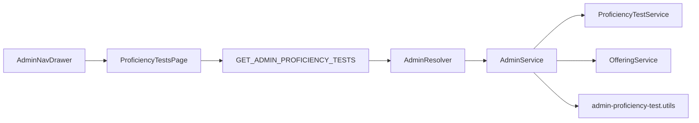

# Proficiency Test Management — Admin List

## Scope

**In scope:** Navigation link, route, admin GraphQL query, and a table listing all non-deleted proficiency tests with the requested columns.

**Out of scope (for now):** Create/edit/delete tests, question editing, pagination, detail page — the user request is a listing view only.

## Architecture



One **row per proficiency test**. Linked leaf offerings are aggregated into comma-separated values (e.g. one PT for CBSE Class 4 & 5 Maths → Board: `CBSE`, Class: `Class 4, Class 5`, Subjects: `Mathematics`).

## Column mapping (from offering tree)

Proficiency tests link to **leaf offerings** via `tutor_proficiency_test_offerings_offering`. Hierarchy is derived by walking `parentOffering` using a full offering map (same pattern as tutor offering selection in [`TutorOfferings.tsx`](apps/web/src/app/components/tutor-onboarding/tutor-offerings/TutorOfferings.tsx)).

| Column | Source |
|--------|--------|
| Test id | `ProficiencyTestEntity.id` |
| Study area | Root offering (level 0) `displayName` — e.g. School Education, Competitive Exam |
| Board | Level-1 ancestor `displayName` — board, category, test name, or language depending on study area |
| Class | Level-2 ancestor `displayName` — grade, exam title, proficiency level; `—` when study area has only 2 levels (e.g. Study Abroad) |
| Subjects | Leaf linked offering `displayName`(s), comma-separated |
| No. of questions | Count of non-deleted `pt_question` rows for that test (full question pool, not the 30 shown to takers) |

Helper logic will live in a new util file, e.g. [`apps/api/src/app/modules/admin/admin-proficiency-test.utils.ts`](apps/api/src/app/modules/admin/admin-proficiency-test.utils.ts), with unit tests for School Education, Competitive Exam, and 2-level study areas.

## Backend changes

### 1. DTO

Add [`apps/api/src/app/modules/admin/dto/admin-proficiency-test-list-item.dto.ts`](apps/api/src/app/modules/admin/dto/admin-proficiency-test-list-item.dto.ts):

```typescript
@ObjectType()
export class AdminProficiencyTestListItem {
  id: number;
  studyArea: string;   // "—" if no offerings linked
  board: string;
  classLabel: string; // GraphQL field name; UI column header "Class"
  subjects: string;
  questionCount: number;
}
```

Use `classLabel` (not `class`) to avoid reserved-word issues in GraphQL/TS.

### 2. Service method

Extend [`ProficiencyTestService`](apps/api/src/app/modules/proficiency/services/proficiency-test.service.ts) with a lean fetch:

- Query all PTs where `deleted = false`
- `leftJoinAndSelect` offerings
- `loadRelationCountAndMap` (or grouped query) for non-deleted question counts

Add `AdminService.listProficiencyTests()` in [`admin.service.ts`](apps/api/src/app/modules/admin/admin.service.ts):

- Call `OfferingService.findAll()` once → build `Map<id, OfferingEntity>`
- For each PT, call util to aggregate study area / board / class / subjects
- Return sorted by `id ASC`

### 3. GraphQL query

Add to [`admin.resolver.ts`](apps/api/src/app/modules/admin/admin.resolver.ts):

```typescript
@Query(() => [AdminProficiencyTestListItem])
@UseGuards(JwtAuthGuard, RolesGuard)
@Roles(UserRole.ADMIN)
async adminProficiencyTests(): Promise<AdminProficiencyTestListItem[]>
```

### 4. Module wiring

Update [`admin.module.ts`](apps/api/src/app/modules/admin/admin.module.ts) to import:

- `ProficiencyModule` (exports `ProficiencyTestService`)
- `OfferingsModule` (exports `OfferingService`)

## Shared GraphQL

Add to [`libs/shared-graphql/src/queries/admin.queries.ts`](libs/shared-graphql/src/queries/admin.queries.ts):

```graphql
query GetAdminProficiencyTests {
  adminProficiencyTests {
    id
    studyArea
    board
    classLabel
    subjects
    questionCount
  }
}
```

Already re-exported via [`libs/shared-graphql/src/queries/index.ts`](libs/shared-graphql/src/queries/index.ts).

## Frontend changes

### 1. Navigation + route

- [`AdminNavDrawer.tsx`](apps/web-admin/src/app/components/AdminNavDrawer.tsx): add `{ to: '/proficiency-tests', label: 'Proficiency test' }` after Students
- [`app.tsx`](apps/web-admin/src/app/app.tsx): add route `proficiency-tests` → new page

### 2. Page component

New [`apps/web-admin/src/app/pages/ProficiencyTestsPage.tsx`](apps/web-admin/src/app/pages/ProficiencyTestsPage.tsx):

- `useQuery` with typed generics (same pattern as [`TutorsPage.tsx`](apps/web-admin/src/app/pages/TutorsPage.tsx))
- Page title + short subtitle
- Responsive table with columns: Test ID, Study area, Board, Class, Subjects, No. of questions
- Loading / error / empty states
- Styling aligned with admin (gradient header row, white card, subtle row striping) — reuse TutorsPage table patterns without tabs/pagination

## Tests

- [`admin-proficiency-test.utils.spec.ts`](apps/api/src/app/modules/admin/admin-proficiency-test.utils.spec.ts): offering-chain → column aggregation (3-level and 2-level trees, multiple leaves, no offerings)
- Extend [`admin.service.spec.ts`](apps/api/src/app/modules/admin/admin.service.spec.ts): mock PT + offering data, assert `listProficiencyTests()` output

## Verification

After implementation:

1. Restart API (`npm run serve:api`) so GraphQL schema picks up the new query
2. Run admin app (`npm run serve:admin`, port 4201)
3. Log in as admin → open **Proficiency test** in drawer → confirm table loads with expected columns
4. Run `npx jest src/app/modules/admin/admin.service.spec.ts src/app/modules/admin/admin-proficiency-test.utils.spec.ts --watchman=false` from `apps/api`
