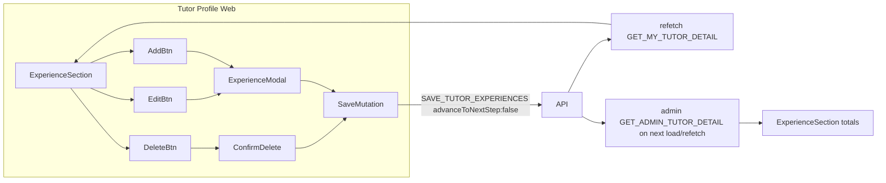

# Tutor Profile Experience Edit/Add (Web)

## Current state

- **Onboarding** already has a full experience form in [`TutorExperience.tsx`](apps/web/src/app/components/tutor-onboarding/tutor-experience/TutorExperience.tsx): years of experience + per-row fields (employment type, job title, employer, dates, isCurrent), inline validation, and save via `SAVE_TUTOR_EXPERIENCES`.
- **Profile** shows experiences read-only in `ExperienceSection` inside [`TutorDetailView.tsx`](libs/tutor-detail-ui/src/TutorDetailView.tsx). [`TutorProfilePage.tsx`](apps/web/src/app/components/tutor-profile/TutorProfilePage.tsx) has no experience save handler.
- **Backend** is ready: `saveTutorExperiences` replaces the full experience list and accepts `advanceToNextStep` (must be `false` on profile to avoid changing certification stage).



## UX (confirmed: modal)

| Action | Behavior |
|--------|----------|
| **Edit** on each experience row | Opens modal pre-filled with that row's fields |
| **Delete** on each experience row | Confirmation prompt → saves remaining experiences (omits deleted row) |
| **Add new Experience** at section bottom | Opens modal with empty row |
| **Save** in modal | Validates per-row fields (same rules as onboarding), merges into full list, saves all experiences |
| **Cancel** | Closes modal, no save |
| **Empty state** | Show "Add new Experience" when no rows exist |

After any add, edit, or delete, **experience count** (`N experiences`) and **total duration** badge in the section header recompute from the refreshed `experiences` list. Per-row duration badges update too. This applies to both **tutor profile** and **admin tutor detail** — both use the same `ExperienceSection`, which already derives totals via `sumExperienceDurations()` and `formatEntryCount()`.

Modal layout mirrors onboarding **per-row** fields only (no years-of-experience dropdown):
- Employment type, job title
- Employer name + address (hidden for self-employed)
- Start date, end date, "Currently working here"

**Years of experience** is set during onboarding and is **not shown or editable** in the profile modal. On save, the mutation still requires `yearsOfExperience` — pass the tutor's existing value from `tutor.yearsOfExperience` unchanged (no UI for it).

### Delete

- **Delete** button on each row (tutor mode only), styled as a destructive secondary action next to **Edit**.
- Click **Delete** → confirm dialog: *"Delete this experience? This cannot be undone."*
- On confirm: build list of all experiences **except** the deleted id, call `onSaveExperiences(remaining)` — same `SAVE_TUTOR_EXPERIENCES` mutation (API soft-deletes omitted rows; no new endpoint).
- Deleting the last experience is allowed (empty list saves fine).
- Show saving/disabled state on the row or section while delete is in flight; surface errors via `experienceSaveError`.

**Admin panel:** remains read-only (no Edit/Delete/Add). Admins see updated count and total duration when they load or refetch the tutor detail page ([`TutorDetailPage.tsx`](apps/web-admin/src/app/pages/TutorDetailPage.tsx) already uses `fetchPolicy: 'cache-and-network'`).

## Implementation

### 1. Extract shared experience form helpers

Add [`libs/shared-utils/src/tutor-experience-form.ts`](libs/shared-utils/src/tutor-experience-form.ts) (export from [`libs/shared-utils/src/index.ts`](libs/shared-utils/src/index.ts)):

- `ExperienceFormRow` type
- `mapEmploymentType()` (move from onboarding — handles numeric API values)
- `validateExperienceRow(row)` → `{ ok: true, normalized } | { ok: false, fieldErrors }`
- `buildExperienceMutationInput(rows)` → mutation payload shape (trim fields, omit employer for self-employed, handle `isCurrent` / `endDate`)

Add a small spec file [`tutor-experience-form.spec.ts`](libs/shared-utils/src/tutor-experience-form.spec.ts) mirroring [`bank-details-formatters.spec.ts`](libs/shared-utils/src/bank-details-formatters.spec.ts).

### 2. Create `ExperienceModal` in tutor-detail-ui

New file: [`libs/tutor-detail-ui/src/ExperienceModal.tsx`](libs/tutor-detail-ui/src/ExperienceModal.tsx)

Follow the same overlay/dialog pattern as [`BankDetailsModal.tsx`](libs/tutor-detail-ui/src/BankDetailsModal.tsx):

```typescript
type ExperienceModalProps = {
  open: boolean;
  mode: 'edit' | 'add';
  initialRow: ExperienceFormRow; // empty for add
  saving?: boolean;
  error?: string | null;
  onClose: () => void;
  onSubmit: (row: ExperienceFormRow) => void;
};
```

- Reset form state in `useEffect` when `open` changes
- Reuse onboarding field layout and CSS classes from `TutorExperience.tsx`
- Use shared `validateExperienceRow` for client validation
- Title: "Edit experience" / "Add new experience"

Export types from [`libs/tutor-detail-ui/src/index.ts`](libs/tutor-detail-ui/src/index.ts).

### 3. Update `ExperienceSection` + `TutorDetailView`

In [`TutorDetailView.tsx`](libs/tutor-detail-ui/src/TutorDetailView.tsx):

**Extend `TutorDetailViewProps`:**
```typescript
onSaveExperiences?: (experiences: ExperienceFormRow[]) => void | Promise<void>;
savingExperiences?: boolean;
experienceSaveError?: string | null;
```

**Update `ExperienceSection`** (tutor mode only, when `onSaveExperiences` is provided):
- Add **Edit** and **Delete** buttons on each row (violet-styled edit; red/destructive-styled delete — `text-xs font-semibold`, border button)
- Add **Add new Experience** button below the list (or in empty state)
- Pass `onEditExperience(id)`, `onDeleteExperience(id)`, and `onAddExperience()` callbacks from parent
- Header meta (entry count + total duration) stays as-is — recomputes automatically when `experiences` prop changes after refetch

**Wire modal + delete in `TutorDetailView`:**
- `experienceModal: { mode: 'edit' | 'add'; experienceId?: number } | null`
- On edit: find experience by id, map to `ExperienceFormRow`
- On save from modal: merge row into `tutor.experiences` (replace by id for edit, append for add), call `onSaveExperiences` with full merged list
- On delete confirm: filter out experience by id, map remaining to `ExperienceFormRow[]`, call `onSaveExperiences`
- Render `ExperienceModal` when open (tutor mode only)

Helper to map `TutorDetailRecord['experiences'][number]` → `ExperienceFormRow` (dates to `YYYY-MM-DD`, `mapEmploymentType`).

### 4. Wire save in `TutorProfilePage`

In [`TutorProfilePage.tsx`](apps/web/src/app/components/tutor-profile/TutorProfilePage.tsx):

- Import `SAVE_TUTOR_EXPERIENCES` from `@tutorix/shared-graphql`
- Import `buildExperienceMutationInput` from `@tutorix/shared-utils`
- Add `useMutation(SAVE_TUTOR_EXPERIENCES)` + `experienceSaveError` state
- Implement `handleSaveExperiences` — pass experiences from modal merge; **reuse existing `tutor.yearsOfExperience`** (normalize enum if numeric) for the mutation input:
  ```typescript
  await saveExperiences({
    variables: {
      input: {
        experiences: buildExperienceMutationInput(rows),
        yearsOfExperience: tutor.yearsOfExperience, // unchanged, not from modal
        advanceToNextStep: false, // critical for profile
      },
    },
  });
  await refetch(); // GET_MY_TUTOR_DETAIL
  ```
- Pass `onSaveExperiences`, `savingExperiences`, `experienceSaveError` to `TutorDetailView`

### 5. Refactor onboarding to use shared helpers (small, keeps parity)

Update [`TutorExperience.tsx`](apps/web/src/app/components/tutor-onboarding/tutor-experience/TutorExperience.tsx) to import `mapEmploymentType`, `validateExperienceRow`, and `buildExperienceMutationInput` from `@tutorix/shared-utils` instead of duplicating logic. Behavior stays identical.

## Critical constraints

- **Always send the full experience list** on save — API is replace-all; omitting rows soft-deletes them.
- **`advanceToNextStep: false`** on profile saves — do not touch certification stage or onboarding cache.
- **`yearsOfExperience`** is **not shown in the profile modal**; always pass the tutor's current value unchanged on save (mutation still requires it server-side). Onboarding keeps the years-of-experience dropdown as required.
- **Totals refresh:** tutor profile refetches immediately after save; admin sees updated count/duration on page load/refetch (same shared `ExperienceSection` — no separate admin logic needed).
- **Admin view** — read-only (no Edit/Delete/Add); totals display updates with fresh query data.

## Files touched

| File | Change |
|------|--------|
| `libs/shared-utils/src/tutor-experience-form.ts` | New — types, validation, input builder |
| `libs/shared-utils/src/tutor-experience-form.spec.ts` | New — unit tests |
| `libs/shared-utils/src/index.ts` | Export new module |
| `libs/tutor-detail-ui/src/ExperienceModal.tsx` | New — modal form |
| `libs/tutor-detail-ui/src/TutorDetailView.tsx` | Edit/Delete/Add buttons, modal + delete confirm, header totals from refreshed data |
| `libs/tutor-detail-ui/src/index.ts` | Export modal + types |
| `apps/web/src/app/components/tutor-profile/TutorProfilePage.tsx` | Mutation + handler |
| `apps/web/src/app/components/tutor-onboarding/tutor-experience/TutorExperience.tsx` | Use shared helpers |

No API or GraphQL schema changes required.

## Manual test plan

1. Open tutor profile with existing experiences → each row shows **Edit**.
2. Edit a row → change fields → **Save** → profile refreshes with updated data.
3. Click **Add new Experience** → fill form → **Save** → new row appears; header shows updated count and total duration.
4. Click **Delete** on a row → confirm → row removed; header count and total duration decrease.
5. Edit dates on a row → per-row duration badge and header total duration update after save.
6. Self-employed: employer fields hidden; save succeeds.
7. Validation: missing job title, invalid dates, end before start → inline errors, no save.
8. Cancel closes modal without changes.
9. Confirm certification stage unchanged after profile saves.
10. Admin tutor detail: no edit/delete buttons; after tutor changes experiences, reload admin page → count and total duration match tutor profile.
11. Profile modal does **not** show years-of-experience dropdown; existing value unchanged after save.
12. Delete last experience → empty state with **Add new Experience** only.
