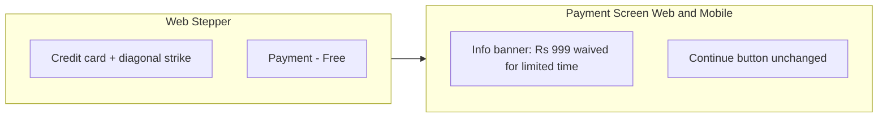

# Registration Fee Waiver — Onboarding UI

## Context

The onboarding payment step is already a **skip/continue placeholder** (no payment gateway). Tutors tap Continue, which calls `completeRegistrationPaymentStep` and advances to documents. Rs 999 exists only as a backend default (`regFeeAmountToBePaid: 999`); tutor-facing apps do not display it yet.

Your screenshot matches the **web** stepper in [`apps/web/src/app/components/tutor-onboarding/OnboardingStepper.tsx`](apps/web/src/app/components/tutor-onboarding/OnboardingStepper.tsx). Mobile has the same payment screen but does **not** render the stepper in [`TutorOnboarding.tsx`](apps/mobile/src/app/components/tutor-onboarding/TutorOnboarding.tsx) today.

## Approach

Centralize waiver copy and amount in shared utils so web/mobile stay in sync and reverting later is a one-line flag flip.

### 1. Shared constants ([`libs/shared-utils/src/onboarding-types.ts`](libs/shared-utils/src/onboarding-types.ts))

Add:

```ts
export const REGISTRATION_FEE_AMOUNT = 999;
export const REGISTRATION_FEE_WAIVED = true; // flip to false when fee is reinstated

export const REGISTRATION_FEE_WAIVED_MESSAGE =
  'The one-time registration fee of ₹999 is not being charged for a limited time. Tap Continue to proceed.';
```

Update the `registrationPayment` step metadata when waived:
- `title`: `Registration Fee (Free)`
- `description`: use the waiver message (keeps web/mobile header subtitle consistent)

Export from [`libs/shared-utils/src/index.ts`](libs/shared-utils/src/index.ts) if not already re-exported.

### 2. Web stepper — icon + label ([`apps/web/.../OnboardingStepper.tsx`](apps/web/src/app/components/tutor-onboarding/OnboardingStepper.tsx))

**Label:** Change `registrationPayment` in `STEP_SHORT_LABELS` from `'Payment'` to `'Payment - Free'`.

**Truncation fix:** The current label uses `max-w-[4.5rem] truncate`, which would clip "Payment - Free". Special-case `registrationPayment` (similar to `complete`) to allow a slightly wider label or two-line wrap without truncation.

**Icon:** Replace the plain credit-card SVG with a relative wrapper:

```tsx
registrationPayment: (
  <span className="relative inline-flex h-4 w-4">
    {/* existing credit card paths */}
    <svg className="absolute inset-0 h-4 w-4" ...>
      <path d="M4 4l16 16" /> {/* diagonal strike-through */}
    </svg>
  </span>
)
```

Only apply the crossed icon and "Payment - Free" label when `REGISTRATION_FEE_WAIVED` is true; otherwise keep current icon/label for easy rollback.

### 3. Web payment screen ([`apps/web/.../TutorRegistrationPayment.tsx`](apps/web/src/app/components/tutor-onboarding/tutor-registration-payment/TutorRegistrationPayment.tsx))

Replace placeholder copy with an info banner (reuse the amber info pattern from [`TutorDocsUpload.tsx`](apps/web/src/app/components/tutor-onboarding/tutor-docs-upload/TutorDocsUpload.tsx)):

- Banner text: `REGISTRATION_FEE_WAIVED_MESSAGE`
- Optional secondary line: "No payment is required right now."
- Keep existing Continue button + error handling unchanged

### 4. Mobile payment screen ([`apps/mobile/.../TutorRegistrationPayment.tsx`](apps/mobile/src/app/components/tutor-onboarding/TutorRegistrationPayment.tsx))

Mirror the web message using the same shared constant in a styled info `View` (light amber background, border, padding — matching mobile card styling). Replace the "implemented soon" placeholder text.

### 5. Mobile stepper (consistency only)

Update [`apps/mobile/.../OnboardingStepper.tsx`](apps/mobile/src/app/components/tutor-onboarding/OnboardingStepper.tsx) with the same label change and a credit-card + strike-through icon in `StepIcon` for `registrationPayment`. This component is exported but unused in the main mobile flow; update for future parity.

## Files to change

| File | Change |
|------|--------|
| [`libs/shared-utils/src/onboarding-types.ts`](libs/shared-utils/src/onboarding-types.ts) | Waiver flag, amount, message, step title/description |
| [`apps/web/.../OnboardingStepper.tsx`](apps/web/src/app/components/tutor-onboarding/OnboardingStepper.tsx) | Crossed icon, "Payment - Free" label, label width fix |
| [`apps/web/.../TutorRegistrationPayment.tsx`](apps/web/src/app/components/tutor-onboarding/tutor-registration-payment/TutorRegistrationPayment.tsx) | Waiver info banner |
| [`apps/mobile/.../TutorRegistrationPayment.tsx`](apps/mobile/src/app/components/tutor-onboarding/TutorRegistrationPayment.tsx) | Waiver info banner |
| [`apps/mobile/.../OnboardingStepper.tsx`](apps/mobile/src/app/components/tutor-onboarding/OnboardingStepper.tsx) | Label + icon (parity) |

**Out of scope:** API/backend changes, web-admin tutor detail page, payment gateway integration.

## Visual summary



## Reverting later

Set `REGISTRATION_FEE_WAIVED = false` in shared utils and restore original step title/description, icon, and label behind the same flag (or remove the conditional branches).
