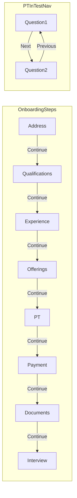

# Remove Back buttons from tutor onboarding

## Current state

Back navigation is wired through:
- [`apps/web/src/app/components/tutor-onboarding/TutorOnboarding.tsx`](apps/web/src/app/components/tutor-onboarding/TutorOnboarding.tsx) — passes `onBack` / `handleStepBack` to every step
- [`apps/mobile/src/app/components/tutor-onboarding/TutorOnboarding.tsx`](apps/mobile/src/app/components/tutor-onboarding/TutorOnboarding.tsx) — same, plus `NavHeader` back arrow
- Parent apps pass exit handlers: [`apps/web/src/app/app.tsx`](apps/web/src/app/app.tsx), [`apps/mobile/src/app/App.tsx`](apps/mobile/src/app/App.tsx)
- Each step component renders `{onBack && <Back ... />}` in the footer

PT in-test navigation in [`PTTestScreen.tsx`](apps/web/src/app/components/tutor-onboarding/tutor-pt/PTTestScreen.tsx) uses **Previous** (not Back) — **leave unchanged** per your preference.

## Web changes

### Orchestrator
- [`TutorOnboarding.tsx`](apps/web/src/app/components/tutor-onboarding/TutorOnboarding.tsx): remove `onBack` prop, `handleStepBack`, and stop passing `onBack` to steps
- Pass only `onComplete` to step components
- For PT step only, pass optional `onReturnToOfferings` (sets step index to offerings) — needed when all PT attempts fail or no pending test

### Parent
- [`apps/web/src/app/app.tsx`](apps/web/src/app/app.tsx): remove `onBack` from `<TutorOnboarding />`

### Step footers — remove Back blocks, keep Continue
- [`tutor-address-entry/TutorAddressEntry.tsx`](apps/web/src/app/components/tutor-onboarding/tutor-address-entry/TutorAddressEntry.tsx)
- [`tutor-qualification/TutorQualification.tsx`](apps/web/src/app/components/tutor-onboarding/tutor-qualification/TutorQualification.tsx)
- [`tutor-experience/TutorExperience.tsx`](apps/web/src/app/components/tutor-onboarding/tutor-experience/TutorExperience.tsx)
- [`tutor-offerings/TutorOfferings.tsx`](apps/web/src/app/components/tutor-onboarding/tutor-offerings/TutorOfferings.tsx)
- [`tutor-registration-payment/TutorRegistrationPayment.tsx`](apps/web/src/app/components/tutor-onboarding/tutor-registration-payment/TutorRegistrationPayment.tsx)
- [`tutor-docs-upload/TutorDocsUpload.tsx`](apps/web/src/app/components/tutor-onboarding/tutor-docs-upload/TutorDocsUpload.tsx)
- [`tutor-interview/TutorInterview.tsx`](apps/web/src/app/components/tutor-onboarding/tutor-interview/TutorInterview.tsx)
- [`tutor-onboarding-complete/TutorOnboardingComplete.tsx`](apps/web/src/app/components/tutor-onboarding/tutor-onboarding-complete/TutorOnboardingComplete.tsx)
- [`tutor-pt/PTIntroScreen.tsx`](apps/web/src/app/components/tutor-onboarding/tutor-pt/PTIntroScreen.tsx)

### PT sub-flow ([`tutor-pt/TutorPT.tsx`](apps/web/src/app/components/tutor-onboarding/tutor-pt/TutorPT.tsx))
- Remove Back on intro / empty states
- Replace **"Back to Offerings"** with primary **Continue** calling `onReturnToOfferings`
- No-questions state: replace Back with Continue (returns to intro)
- Do **not** change [`PTTestScreen.tsx`](apps/web/src/app/components/tutor-onboarding/tutor-pt/PTTestScreen.tsx) Previous/Next

## Mobile changes

Mirror web:
- [`TutorOnboarding.tsx`](apps/mobile/src/app/components/tutor-onboarding/TutorOnboarding.tsx): remove `NavHeader` `onBack`, `handleStepBack`, step `onBack` props; add `onReturnToOfferings` for PT
- [`App.tsx`](apps/mobile/src/app/App.tsx): remove `onBack={handleOnboardingBack}`
- Remove Back from step footers in address, qualification, experience, offerings, [`TutorRegistrationPayment.tsx`](apps/mobile/src/app/components/tutor-onboarding/TutorRegistrationPayment.tsx), [`tutor-pt/TutorPT.tsx`](apps/mobile/src/app/components/tutor-onboarding/tutor-pt/TutorPT.tsx), [`tutor-pt/PTIntroScreen.tsx`](apps/mobile/src/app/components/tutor-onboarding/tutor-pt/PTIntroScreen.tsx)
- Update `PlaceholderStep` to show only Continue
- Keep mobile [`PTTestScreen.tsx`](apps/mobile/src/app/components/tutor-onboarding/tutor-pt/PTTestScreen.tsx) Previous/Next

## Shared types

- [`libs/shared-utils/src/onboarding-types.ts`](libs/shared-utils/src/onboarding-types.ts):
  - Remove `onBack?` from `StepComponentProps`
  - Add optional `onReturnToOfferings?: () => void` for PT failure / no-pending-test cases

## Resulting flow

## Verification

- Web + mobile: every onboarding step footer shows Continue only (no Back)
- Mobile: no back arrow in onboarding header
- PT: Previous/Next still works between questions
- PT all attempts failed: single Continue returns to offerings step
- Tutors cannot navigate backward between onboarding steps
