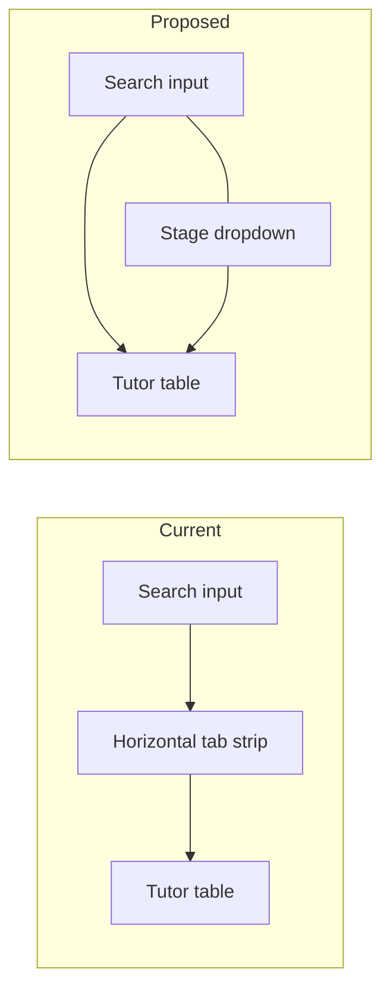

# Replace Tutor Stage Tabs with Dropdown

## Problem

The Tutors page ([`apps/web-admin/src/app/pages/TutorsPage.tsx`](apps/web-admin/src/app/pages/TutorsPage.tsx)) renders 9 onboarding stages as horizontal tabs (L245–286). With the new **Onboarding Complete** stage, this row overflows and requires horizontal scrolling.

## Solution

Replace the tab strip with a single **Onboarding stage** `<select>` placed next to the search box. No backend or GraphQL changes are needed — `activeStage` state and queries remain unchanged.



## Implementation

### 1. Combine search + stage filter into one toolbar row

In [`TutorsPage.tsx`](apps/web-admin/src/app/pages/TutorsPage.tsx), replace the separate search block (L224–243) and tab strip (L245–286) with a responsive flex row:

```tsx
<div className="mt-6 flex flex-col gap-3 sm:flex-row sm:items-end">
  {/* search — existing input, flex-1, max-w-md */}
  {/* stage select — fixed width on sm+, e.g. sm:w-72 */}
</div>
```

- Add a visible label: **Onboarding stage** (`htmlFor="tutor-stage"`)
- Use native `<select>` styled consistently with admin patterns from [`ProficiencyTestsPage.tsx`](apps/web-admin/src/app/pages/ProficiencyTestsPage.tsx):

```tsx
const selectClassName =
  'h-11 w-full rounded-xl border border-sky-200/80 bg-white px-3 text-sm text-primary shadow-sm focus:border-sky-400 focus:outline-none focus:ring-2 focus:ring-sky-200';
```

- Wire `value={activeStage}` and `onChange={(e) => setActiveStage(e.target.value as OnboardingStepId)}`

### 2. Show counts in dropdown options

Map `ONBOARDING_STEPS` to `<option>` elements with counts from existing `stageCounts` map:

- Default label: `Address (12)`
- For **Documents Upload** when `docsPendingReviewCount > 0`, append review hint: `Documents Upload (5) — 2 review`

This preserves the docs review signal currently shown as a tab badge.

### 3. Remove unused tab UI code

Delete the horizontal tab JSX and trim styling constants that only served tabs:

| Keep | Remove |
|------|--------|
| `STAGE_TAB_STYLES[stage].header` (table header color) | `active`, `badge`, `badgeInactive`, `indicator` fields |
| `ACTIVE_PANEL_STYLES` (panel border accent) | Tab-only wrapper classes (`overflow-x-auto`, `min-w-max`, `rounded-t-xl`, etc.) |

Rename `STAGE_TAB_STYLES` → `STAGE_HEADER_STYLES` (optional cleanup) to reflect table-only usage.

### 4. Fix table panel rounding

The table container currently uses tab-attached corners (`rounded-b-xl rounded-tr-xl`). After removing tabs, use a standalone card:

- Change to `rounded-xl border bg-white shadow-md` (full rounding on all sides)
- Keep stage-colored border via `ACTIVE_PANEL_STYLES[activeStage]`

### 5. Preserve existing behavior

No changes to:
- `activeStage` default (`'address'`)
- `GET_ADMIN_TUTORS` / `GET_ADMIN_TUTOR_STAGE_COUNTS` queries
- Pagination reset on stage/search change
- Docs row highlight (`pendingAdminDocumentReview`)
- Empty-state copy for `complete` stage
- Tutor detail links

## Files to change

| File | Change |
|------|--------|
| [`apps/web-admin/src/app/pages/TutorsPage.tsx`](apps/web-admin/src/app/pages/TutorsPage.tsx) | Replace tabs with dropdown beside search; simplify styles; adjust panel rounding |

## Verification

1. Open `/tutors` — no horizontal tab scroll bar
2. Search and stage dropdown appear on one row (stack on narrow screens)
3. Selecting each stage loads the correct tutor list and count in the option label
4. Documents Upload option shows review count when applicable
5. Table header/panel still reflect stage color; pagination and search still work
