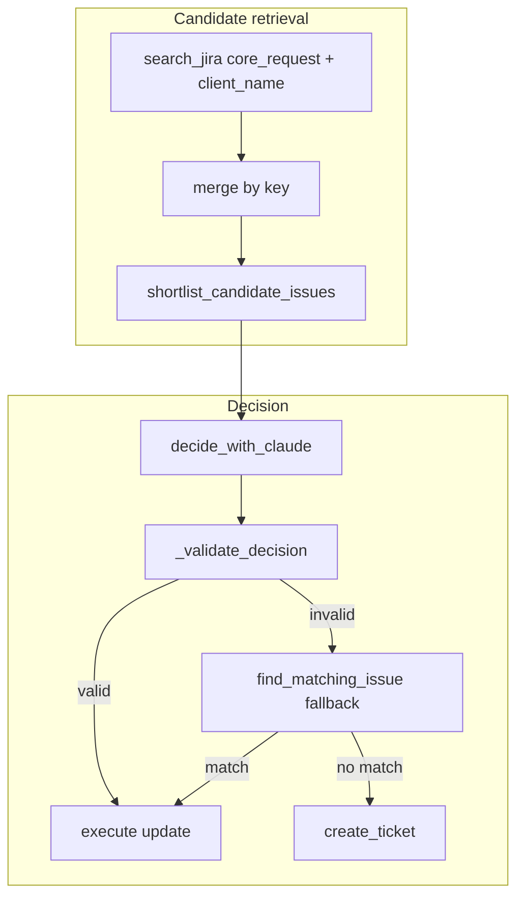

# Strengthen deduplication (reduce false merges)

## Problem framing

You prioritized **over-merge** (unrelated messages ending up on the same Jira issue). Today the pipeline is:

1. Jira search → merge → [`shortlist_candidate_issues`](app/services/deduplication.py)
2. [`decide_with_claude`](app/clients/anthropic_client.py) picks `update_ticket` + `matched_issue_key` from candidates
3. [`_validate_decision`](app/services/processor.py) applies a **low** floor (`confidence >= 0.45` for updates)
4. If invalid, [`find_matching_issue`](app/services/deduplication.py) can still pick a “best” match with **permissive** thresholds (`overlap_ratio >= 0.35` or `text_similarity >= 0.42`), plus a small client boost

That combination is intentionally “recall-friendly,” which is exactly what causes **false merges** when unrelated messages share generic words (e.g. “bug”, “fix”, “client”) or when Jira search returns a broad backlog ticket.

## Plan (targeted changes)

### 1) Tighten “accept update” guardrails in Python

**File:** [`app/services/processor.py`](app/services/processor.py)

- Raise **`update_ticket` minimum confidence** from `0.45` to a higher threshold (start **0.65–0.75**, tune with tests).
- Add an **ambiguity gate** for updates: if the top two scored candidates (from `shortlist_candidate_issues` scoring or a shared scoring helper) are within a small margin, treat as **ambiguous** and **reject** `update_ticket` decisions (force create path or force fallback behavior that prefers create).
- Optional: require **explicit non-semantic** evidence for updates in borderline cases (e.g. issue key mentioned in message, or very high text similarity), implemented as a small helper function in `processor.py` to avoid widening scope.

### 2) Make deterministic fallback conservative (reduce accidental merges)

**File:** [`app/services/deduplication.py`](app/services/deduplication.py)

- Increase **`request_relevant` thresholds** in `find_matching_issue` (overlap / similarity) so the fallback only matches when similarity is strong.
- Add a **margin rule**: only return a match if `best_score - second_best_score >= threshold` (or if second best is absent). Otherwise return `None` (prefer create).
- Revisit the **client boost** (`+0.05`) when the goal is anti-merge: consider requiring **client_exact** (word boundary) for the boost, or reduce/remove fuzzy client similarity for fallback matching.

### 3) Adjust Claude prompt for “precision over recall” on updates

**File:** [`app/clients/anthropic_client.py`](app/clients/anthropic_client.py)

- Strengthen instructions: **default to `create_ticket` unless the same product request is clearly the same**; explicitly forbid merging unrelated operational chatter.
- Clarify that **keyword overlap alone is insufficient**—must match the *intent/work item*.
- If the candidate list is noisy, instruct Claude to **prefer create** with lower confidence rather than guessing an update.

### 4) Fix the “API disabled” equivalent decision path (often overlooked)

**File:** [`app/clients/anthropic_client.py`](app/clients/anthropic_client.py) (`_equivalent_decision`)

- Today it can pick the **first candidate issue** as an update fallback, which is **high-merge-risk**.
- Change equivalent behavior to **prefer `create_ticket`** unless deterministic `find_matching_issue` passes the new stricter thresholds (or remove the “first candidate match” behavior entirely).

### 5) Tests + regression fixtures

**Files:** [`tests/`](tests/)

- Add unit tests for:
  - `_validate_decision` rejecting borderline `update_ticket` at new confidence
  - `find_matching_issue` returning `None` under ambiguity (two close scores)
  - a golden-case message pair: **should not** merge vs **should** merge (if you can provide 2–3 real examples from your mock data, encode them as fixtures)

### 6) Measurement loop (so tuning doesn’t regress)

- Keep a small table of scenarios (internal vs external, duplicate vs near-duplicate) and run `pytest` after threshold changes.

## Rollout notes

- Expect **more tickets created** as a tradeoff for fewer wrong merges; that matches your selected priority.
- If you later need to balance, we can add a “high confidence update only” mode with separate thresholds.

## Implementation todos

- **tighten-validate**: Raise update confidence threshold + add ambiguity rejection in `MessageProcessor._validate_decision`
- **conservative-fallback**: Increase `find_matching_issue` strictness + margin between top-2 scores
- **claude-precision-prompt**: Update `decide_with_claude` system/user rules for anti-merge behavior
- **fix-equivalent-decision**: Remove “first candidate” merge behavior in `_equivalent_decision`
- **tests-dedup**: Add regression tests for merge vs non-merge scenarios
