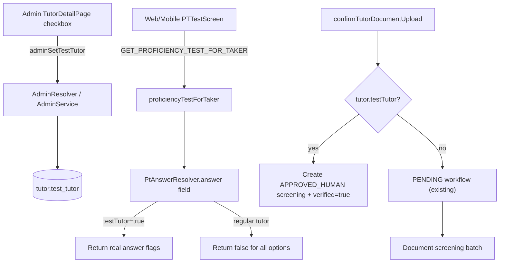

# Test Tutor Implementation Plan

## Goal

Enable admins to mark a tutor as a **test tutor** so onboarding can be exercised quickly:
- **Proficiency test:** correct answer options are visually highlighted (tutor still takes the test normally)
- **Documents:** uploads are auto-approved on confirm (skip batch AI screening and admin review queue)

## Architecture



## 1. Database and entity

**File:** [`apps/api/src/app/modules/tutor/entities/tutor.entity.ts`](apps/api/src/app/modules/tutor/entities/tutor.entity.ts)

Add GraphQL + TypeORM field (matching existing boolean patterns like `regFeePaid`):

```ts
@Field()
@Column({ name: 'test_tutor', default: false })
testTutor: boolean;
```

**Migration:** new file e.g. `apps/api/src/migrations/1774000000000-AddTestTutorToTutor.ts`

```sql
ALTER TABLE "tutor" ADD COLUMN "test_tutor" boolean NOT NULL DEFAULT false
```

## 2. Backend: admin toggle API

**TutorService** ([`apps/api/src/app/modules/tutor/services/tutor.service.ts`](apps/api/src/app/modules/tutor/services/tutor.service.ts))
- Add `updateTestTutor(tutorId, testTutor)` using existing `findOne` + `save` pattern.

**Admin DTO** ([`apps/api/src/app/modules/admin/dto/admin-tutor-detail.dto.ts`](apps/api/src/app/modules/admin/dto/admin-tutor-detail.dto.ts))
- Add `@Field() testTutor: boolean`.

**AdminService** ([`apps/api/src/app/modules/admin/admin.service.ts`](apps/api/src/app/modules/admin/admin.service.ts))
- Include `testTutor` in `getTutorDetail()` return object.
- Add `setTestTutor(tutorId, testTutor)` that calls `TutorService.updateTestTutor` and returns refreshed detail.

**AdminResolver** ([`apps/api/src/app/modules/admin/admin.resolver.ts`](apps/api/src/app/modules/admin/admin.resolver.ts))
- Add admin-only mutation:

```ts
adminSetTestTutor(tutorId: Int!, testTutor: Boolean!): AdminTutorDetail
```

Follow existing `@UseGuards(JwtAuthGuard, RolesGuard)` + `@Roles(UserRole.ADMIN)` pattern used by `adminReviewDocument`.

## 3. Backend: secure PT correct-answer exposure

Today, [`GET_PROFICIENCY_TEST_FOR_TAKER`](libs/shared-graphql/src/queries/proficiency.queries.ts) only fetches `answers { id text }`. The DB stores correctness on `pt_answer.answer` ([`PtAnswerEntity`](apps/api/src/app/modules/proficiency/entities/pt-answer.entity.ts)), but we must **not** leak it to regular tutors.

**New resolver:** `apps/api/src/app/modules/proficiency/resolvers/pt-answer.resolver.ts`

- `@ResolveField('answer')` on `PtAnswerEntity`
- Use `@Context()` pattern from [`document-entity.resolver.ts`](apps/api/src/app/modules/document/resolvers/document-entity.resolver.ts)
- Return the stored `parent.answer` only when:
  - `req.user.role === ADMIN`, or
  - `req.user` maps to a tutor with `testTutor === true`
- Otherwise return `false` for every option (non-nullable field; no information leak)

**Module wiring:** update [`proficiency.module.ts`](apps/api/src/app/modules/proficiency/proficiency.module.ts) to register `PtAnswerResolver` and import `TutorModule` (for `TutorService.findByUserId`).

**GraphQL query update:** add `answer` to `answers` in `GET_PROFICIENCY_TEST_FOR_TAKER`. Regular tutors will receive all `false`; test tutors receive real flags via the field resolver.

No change to PT submission/scoring in [`tutor-offering.service.ts`](apps/api/src/app/modules/tutor/services/tutor-offering.service.ts) — highlight-only behavior.

## 4. Backend: document auto-approve for test tutors

**DocumentScreeningService** ([`apps/api/src/app/modules/document/services/document-screening.service.ts`](apps/api/src/app/modules/document/services/document-screening.service.ts))

Add `autoApproveForTestTutor(documentId)` that:
- Sets `document.verified = true`, `verifiedDate = now()`
- Sets `verificationWorkflowStatus = COMPLETED` (so batch job in [`findPendingDocuments`](apps/api/src/app/modules/document/services/document-screening-batch.service.ts) skips it)
- Creates `document_screening` row with:
  - `status = APPROVED_HUMAN`
  - `summaryNotes = 'Auto-approved for test tutor'`
  - `automatedAt = now()`

This aligns with existing frontend pass checks in [`TutorDocsUpload.tsx`](apps/web/src/app/components/tutor-onboarding/tutor-docs-upload/TutorDocsUpload.tsx) (`PASSED_AUTOMATED` or `APPROVED_HUMAN`).

**DocumentService.confirmTutorDocumentUpload** ([`apps/api/src/app/modules/document/services/document.service.ts`](apps/api/src/app/modules/document/services/document.service.ts))

After `documentRepo.save(entity)`, if `tutor.testTutor`:
- Call `autoApproveForTestTutor(saved.id)`
- Return the updated document (with screening relation available via existing field resolver)

Note: existing re-upload logic already deletes prior screening rows before save; auto-approve runs on the fresh row.

## 5. Shared GraphQL client updates

**[`libs/shared-graphql/src/queries/admin.queries.ts`](libs/shared-graphql/src/queries/admin.queries.ts)**
- Add `testTutor` to `GET_ADMIN_TUTOR_DETAIL`.

**[`libs/shared-graphql/src/mutations/admin.mutations.ts`](libs/shared-graphql/src/mutations/admin.mutations.ts)**
- Add `ADMIN_SET_TEST_TUTOR` mutation returning `testTutor` (and `id` for cache update).

**[`libs/shared-graphql/src/queries/proficiency.queries.ts`](libs/shared-graphql/src/queries/proficiency.queries.ts)**
- Add `answer` under `answers` in `GET_PROFICIENCY_TEST_FOR_TAKER`.

Optional (recommended for UX): add `testTutor` to `GET_MY_TUTOR_PROFILE` so PT screens can show a small “Test mode” banner.

## 6. Admin UI: checkbox on tutor detail top panel

**File:** [`apps/web-admin/src/app/pages/TutorDetailPage.tsx`](apps/web-admin/src/app/pages/TutorDetailPage.tsx)

In the existing top header block (around lines 331–358):
- Add a **Test Tutor** checkbox beside the stage badge
- Wire `useMutation(ADMIN_SET_TEST_TUTOR)` with optimistic UI or `refetch()` on success
- Show a subtle badge (e.g. amber “Test Tutor”) when enabled
- Extend local `AdminTutorDetailData` type with `testTutor: boolean`

Reuse admin styling conventions from this page (rounded badges, gradient header).

## 7. Web + mobile PT UI: highlight correct options

**Files:**
- [`apps/web/src/app/components/tutor-onboarding/tutor-pt/PTTestScreen.tsx`](apps/web/src/app/components/tutor-onboarding/tutor-pt/PTTestScreen.tsx)
- [`apps/mobile/src/app/components/tutor-onboarding/tutor-pt/PTTestScreen.tsx`](apps/mobile/src/app/components/tutor-onboarding/tutor-pt/PTTestScreen.tsx)

Changes (both platforms):
- Extend answer type: `{ id, text, answer?: boolean }`
- When `answer === true`, apply emerald highlight styling (reuse visual language from [`ProficiencyTestDetailPage.tsx`](apps/web-admin/src/app/pages/ProficiencyTestDetailPage.tsx) lines 199–209: green border/background)
- Keep existing selected-state styling; correct highlight can stack with selection
- No auto-select or auto-submit

Optional in [`TutorPT.tsx`](apps/web/src/app/components/tutor-onboarding/tutor-pt/TutorPT.tsx) (web + mobile): if `myTutorProfile.testTutor`, show a one-line info banner above the test.

## 8. Tests

Add focused unit tests (no broad refactors):
- `TutorService.updateTestTutor`
- `AdminService.setTestTutor`
- `PtAnswerResolver` — admin sees truth; test tutor sees truth; regular tutor gets all `false`
- `DocumentScreeningService.autoApproveForTestTutor`
- `DocumentService.confirmTutorDocumentUpload` — when `testTutor=true`, document ends verified with `APPROVED_HUMAN` screening and `COMPLETED` workflow

## Out of scope (per your choices)

- Auto-passing PT without taking the test
- Unlimited PT attempts
- Skipping document upload entirely
- Test tutor indicator on tutors list page (can be a follow-up)

## Rollout

1. Run migration
2. Deploy API (field resolver + auto-approve must ship with admin toggle)
3. Deploy web-admin + web + mobile clients together so PT query includes `answer` and UI highlights correctly
