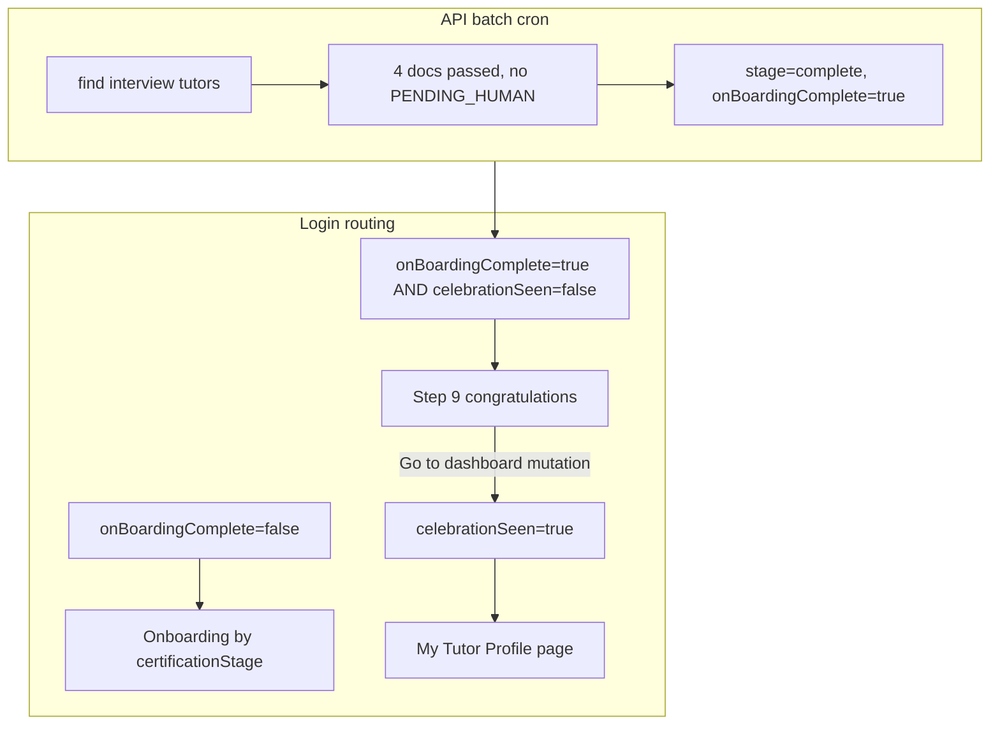

# Tutor onboarding approval and one-time celebration UX

## Current state

**Already implemented as files (not fully wired):**
- [`tutor-onboarding-document-eligibility.service.ts`](apps/api/src/app/modules/document/services/tutor-onboarding-document-eligibility.service.ts) — 4 doc types, `PASSED_AUTOMATED` / `APPROVED_HUMAN`, blocks `PENDING_HUMAN`
- [`tutor-onboarding.service.ts`](apps/api/src/app/modules/tutor/services/tutor-onboarding.service.ts) — `approveTutorOnboarding` sets `certificationStage=complete` + `onBoardingComplete=true`
- [`tutor-onboarding-approval-batch.service.ts`](apps/api/src/app/modules/tutor/services/tutor-onboarding-approval-batch.service.ts) + [`tutor-onboarding-approval-batch.cron.ts`](apps/api/src/app/batch-jobs/tutor-onboarding-approval/tutor-onboarding-approval-batch.cron.ts)

**Gaps blocking your screenshot scenario (tutor id 59, `interview`, `on_boarding_complete=false`):**
- [`tutor.module.ts`](apps/api/src/app/modules/tutor/tutor.module.ts) does not register onboarding services or import `ConfigModule` / `BatchJobAuditModule` / `DocumentModule`
- [`document.module.ts`](apps/api/src/app/modules/document/document.module.ts) does not register/export eligibility service
- [`batch-jobs.module.ts`](apps/api/src/app/batch-jobs/batch-jobs.module.ts) only runs document screening cron; approval cron + `TutorModule` import missing
- [`batch-job-name.enum.ts`](apps/api/src/app/batch-jobs/enums/batch-job-name.enum.ts) missing `TUTOR_ONBOARDING_APPROVAL`
- Web/mobile **login routing** ([`app.tsx`](apps/web/src/app/app.tsx), [`App.tsx`](apps/mobile/src/app/App.tsx)): `onBoardingComplete === true` → `home`, which **skips** step 9 congratulations entirely
- [`TutorInterview.tsx`](apps/web/src/app/components/tutor-onboarding/tutor-interview/TutorInterview.tsx) / [`TutorApplicationReview.tsx`](apps/mobile/src/app/components/tutor-onboarding/TutorApplicationReview.tsx): static review message, no polling
- No DB/API flag for **“celebration shown once”**
- No tutor-facing profile page (you chose **MVP read-only**)



---

## 1. Backend: wire existing approval pipeline

| Task | Files |
|------|--------|
| Register eligibility service | [`document.module.ts`](apps/api/src/app/modules/document/document.module.ts) — provider + export `TutorOnboardingDocumentEligibilityService` |
| Register onboarding + batch services | [`tutor.module.ts`](apps/api/src/app/modules/tutor/tutor.module.ts) — imports: `ConfigModule`, `BatchJobAuditModule`, `DocumentModule`; providers/exports: `TutorOnboardingService`, `TutorOnboardingApprovalBatchService` |
| Register approval cron | [`batch-jobs.module.ts`](apps/api/src/app/batch-jobs/batch-jobs.module.ts) — import `TutorModule`, add `TutorOnboardingApprovalBatchCron` provider |
| Batch job enum | [`batch-job-name.enum.ts`](apps/api/src/app/batch-jobs/enums/batch-job-name.enum.ts) — add `TUTOR_ONBOARDING_APPROVAL` |
| Env docs | [`.env.example`](.env.example) — `TUTOR_APPROVAL_BATCH_ENABLED`, `TUTOR_APPROVAL_BATCH_CRON`, `TUTOR_APPROVAL_BATCH_LIMIT` |

**Batch behavior (unchanged logic, ensure enabled in dev):**
- Candidates: `certificationStage=interview`, `onBoardingComplete=false`, `deleted=false`
- Approve only if `hasPassedAllOnboardingDocuments(tutorId)`
- On approve: `complete` + `onBoardingComplete=true` (celebration flag stays false)

Optional: add `completeDocsStep` GraphQL mutation in [`tutor.resolver.ts`](apps/api/src/app/modules/tutor/resolvers/tutor.resolver.ts) + [`tutor.mutations.ts`](libs/shared-graphql/src/mutations/tutor.mutations.ts) so docs Continue persists `interview` in DB (prerequisite for batch); wire web/mobile `TutorDocsUpload` Continue to call it.

---

## 2. Backend: one-time celebration flag

Add column on `tutor` (name suggestion: `onboarding_celebration_seen`, boolean, default `false`):

- New TypeORM migration under `apps/api`
- Field on [`tutor.entity.ts`](apps/api/src/app/modules/tutor/entities/tutor.entity.ts) + GraphQL `@Field`
- Expose on `myTutorProfile` via existing query ([`tutor.queries.ts`](libs/shared-graphql/src/queries/tutor.queries.ts))

**Mutation** `acknowledgeOnboardingCelebration` (tutor-only):
- Requires `onBoardingComplete === true`
- Sets `onboardingCelebrationSeen = true`
- Implemented in `TutorOnboardingService` + `TutorResolver`

Batch approval must **not** set this flag — only the user clicking “Go to your dashboard” does.

---

## 3. Shared copy and constants

In [`onboarding-types.ts`](libs/shared-utils/src/onboarding-types.ts):

```ts
export const ONBOARDING_APPROVED_MESSAGE =
  'Congratulations! You are now accepted as a Tutorix certified tutor! Go to your dashboard to build your tutor profile.';
```

Reuse in web `TutorOnboardingComplete`, mobile equivalent (new small component or extend placeholder `complete` step).

---

## 4. Web client

### 4a. Application review (step 8)
Update [`TutorInterview.tsx`](apps/web/src/app/components/tutor-onboarding/tutor-interview/TutorInterview.tsx):
- `useQuery(GET_MY_TUTOR_PROFILE, { pollInterval: 30_000 })`
- Amber banner while waiting; green banner with `ONBOARDING_APPROVED_MESSAGE` when `onBoardingComplete` or stage `complete`
- Parent [`TutorOnboarding.tsx`](apps/web/src/app/components/tutor-onboarding/TutorOnboarding.tsx) already syncs `currentStepIndex` from `certificationStage` — approved tutors auto-advance to step 9 on refetch

### 4b. Celebration (step 9) — once
Replace placeholder copy in [`TutorOnboardingComplete.tsx`](apps/web/src/app/components/tutor-onboarding/tutor-onboarding-complete/TutorOnboardingComplete.tsx):
- Show `ONBOARDING_APPROVED_MESSAGE`
- Primary link/button: “Go to your dashboard” → calls `acknowledgeOnboardingCelebration` then `onComplete` to parent

### 4c. Login routing ([`app.tsx`](apps/web/src/app/app.tsx))

Replace binary `onBoardingComplete` check with three branches:

```ts
if (!tutor.onBoardingComplete) → tutor-onboarding
else if (!tutor.onboardingCelebrationSeen) → tutor-onboarding (stage complete)
else → tutor-profile (new view)
```

Remove conflation of `onBoardingComplete` with “exit onboarding to home” in [`TutorOnboarding`](apps/web/src/app/components/tutor-onboarding/TutorOnboarding.tsx) `useEffect` (if re-added from prior work).

### 4d. My Tutor Profile (new)
- New view `tutor-profile` in `app.tsx`
- New [`TutorProfilePage.tsx`](apps/web/src/app/components/tutor-profile/TutorProfilePage.tsx) — read-only sections using `GET_MY_TUTOR_PROFILE`
- Reuse formatting patterns from [`TutorDetailPage.tsx`](apps/web-admin/src/app/pages/TutorDetailPage.tsx) / [`tutor-detail-formatters.ts`](apps/web-admin/src/app/utils/tutor-detail-formatters.ts) — move shared formatters to `libs/shared-utils` only if needed to avoid admin→web dependency; otherwise duplicate minimal formatters in web

---

## 5. Mobile client

Mirror web:
- [`TutorApplicationReview.tsx`](apps/mobile/src/app/components/tutor-onboarding/TutorApplicationReview.tsx) — polling + approved banner (do **not** auto-call `onComplete` on approve; let stage sync show complete step)
- New `TutorOnboardingComplete` screen (replace placeholder `complete` step in [`TutorOnboarding.tsx`](apps/mobile/src/app/components/tutor-onboarding/TutorOnboarding.tsx))
- [`App.tsx`](apps/mobile/src/app/App.tsx) — same 3-way routing + new `tutorProfile` view
- New `TutorProfileScreen.tsx` — read-only MVP from `GET_MY_TUTOR_PROFILE`

---

## 6. GraphQL

| Addition | Location |
|----------|----------|
| `onboardingCelebrationSeen` on tutor | entity + `GET_MY_TUTOR_PROFILE` |
| `acknowledgeOnboardingCelebration` | resolver + `tutor.mutations.ts` |
| `COMPLETE_DOCS_STEP` (if missing) | resolver + mutations |

---

## 7. Verification

1. Tutor at `interview` with 4 passed docs (e.g. id 59) — UI shows review message
2. Set `TUTOR_APPROVAL_BATCH_ENABLED=true`, restart API — batch moves row to `complete`, `on_boarding_complete=true`, `onboarding_celebration_seen=false`
3. Refresh web — step 9 congratulations + dashboard link (once)
4. Click link — mutation sets `onboarding_celebration_seen=true`, navigates to My Tutor Profile
5. Log out / log in — lands on profile page, not onboarding

Existing spec: [`tutor-onboarding-document-eligibility.service.spec.ts`](apps/api/src/app/modules/document/services/tutor-onboarding-document-eligibility.service.spec.ts) — keep; optionally add batch service unit test with mocked eligibility.

---

## Files to touch (summary)

**API:** tutor entity + migration, tutor module, document module, batch-jobs module, batch enum, tutor resolver/service, `.env.example`

**Shared:** `onboarding-types.ts`, `tutor.queries.ts`, `tutor.mutations.ts`

**Web:** `app.tsx`, `TutorInterview`, `TutorOnboardingComplete`, `TutorOnboarding`, new `TutorProfilePage`, optional `TutorDocsUpload` mutation

**Mobile:** `App.tsx`, `TutorApplicationReview`, `TutorOnboarding`, new complete + profile screens
