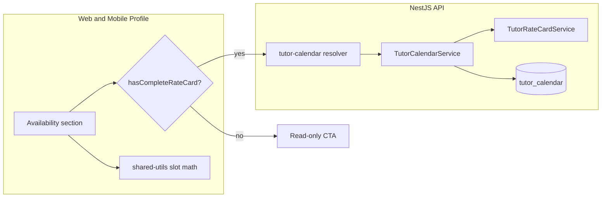

# Tutor availability calendar

## Context

- There is **no** existing availability/booking module ([`tutor.entity.ts`](apps/api/src/app/modules/tutor/entities/tutor.entity.ts) has onboarding/profile fields only).
- Approved tutors use [`TutorProfilePage`](apps/web/src/app/components/tutor-profile/TutorProfilePage.tsx) (web) and [`TutorDetailScreen`](apps/mobile/src/app/components/tutor-profile/TutorDetailScreen.tsx) (mobile), with rate cards on offerings via [`TutorDetailView`](libs/tutor-detail-ui/src/TutorDetailView.tsx) and [`isRateCardComplete`](libs/shared-utils/src/rate-card.ts) in [`tutor-rate-card.service.ts`](apps/api/src/app/modules/tutor-rate-card/services/tutor-rate-card.service.ts).
- **Onboarding is unchanged** — docs still advance directly to interview via [`completeDocsStep`](apps/api/src/app/modules/tutor/services/tutor-onboarding.service.ts). No new certification stage or stepper step.

## Product decisions

| Decision | Choice |
|----------|--------|
| When | **Profile only** — after onboarding approval, on tutor dashboard/profile |
| Prerequisite | **At least one complete rate card** on any `tutor_offering` (reuse `isRateCardComplete`: online or offline enabled with base rate ≥ 1) |
| Horizon | **8 weeks** from today (no editing past slots) |
| Slot timing | **1 hour class** per slot; **start times every 30 minutes** (`:00` and `:30`) in tutor timezone |
| Day window | **7:00 AM** first start; last start **21:30** (no starts at/after 10:00 PM — `DAY_END_HOUR = 22` exclusive) → **30 start times/day** |
| Checked | **Available**; unchecked = no row in DB (not available) |

Adjacent starts (e.g. 7:00 and 7:30) are independent — a tutor may mark both; future booking logic must treat overlapping hour-long windows as conflicts when scheduling.

## Architecture

### Data model

New table **`tutor_calendar`** — TypeORM entity **`TutorCalendar`** (`@Entity('tutor_calendar')`) in module `apps/api/src/app/modules/tutor-calendar/`:

- `tutor_id` (FK, cascade)
- `starts_at` (`timestamptz`, unique per tutor with soft-delete filter)
- `duration_minutes` default `60`
- Standard `QBaseEntity` fields (`id`, `version`, `deleted`, `active`, `createdDate`, `updatedDate`, `m_id`)

**Sparse storage**: only **available** slots are persisted (one row per checked start time).

Unique index: `(tutor_id, starts_at)` where `deleted = false`.

Optional on [`Tutor`](apps/api/src/app/modules/tutor/entities/tutor.entity.ts):

- `availabilityConfiguredAt` (`timestamp`, nullable) — set on first successful save with ≥1 slot; profile empty-state messaging only.

### Timezone and grid constants

- Store instants in **UTC**; display/generate in **`Asia/Kolkata`**.
- Shared constants (API + [`libs/shared-utils`](libs/shared-utils)):
  - `SLOT_DURATION_MINUTES = 60` (stored on each row; class length)
  - `SLOT_INTERVAL_MINUTES = 30` (grid step — valid starts at `:00` and `:30`)
  - `DAY_START_HOUR = 7` (first start **7:00 AM**)
  - `DAY_END_HOUR = 22` (exclusive — last allowed start **9:30 PM** / `21:30`)
  - `MAX_WEEKS_AHEAD = 8`
- `buildSlotGrid()` enumerates starts: `07:00, 07:30, 08:00, …, 21:30` per day.
- Server validates every `startsAt`: minute ∈ `{0, 30}`, on the allowed grid, within day window, not in the past, ≤ today + 8 weeks, owned by tutor.

### GraphQL API

| Operation | Purpose |
|-----------|---------|
| `myTutorCalendar(from, to)` | Returns `[TutorCalendar]` rows (or `startsAt` list); **blocked if no complete rate card** |
| `saveMyTutorCalendar(input)` | Replace calendar entries in `[rangeStart, rangeEnd]`; **same rate-card gate** |

GraphQL object type name: **`TutorCalendar`** (matches entity).

No `completeAvailabilityStep` or certification-stage mutations.

Expose eligibility for UI (pick one approach, implement consistently):

- **Option A (preferred)**: extend `myTutorDetail` / offerings payload with `canSetAvailability: boolean` computed server-side (`TutorRateCardService.tutorHasCompleteRateCard(tutorId)`).
- **Option B**: dedicated query `myTutorCalendarEligibility { canSet, reason }`.

Shared GraphQL in [`libs/shared-graphql`](libs/shared-graphql).

### Rate-card gate (API + UI)

**Server** (`TutorCalendarService`):

- Before read/write, load tutor’s offerings + rate cards (reuse [`TutorRateCardService`](apps/api/src/app/modules/tutor-rate-card/services/tutor-rate-card.service.ts) `findByTutorOfferingIds` pattern).
- If none satisfy `isRateCardComplete`, throw `BadRequestException` with a clear message (e.g. “Set up at least one rate card before adding availability.”).

**Client** ([`TutorDetailView`](libs/tutor-detail-ui/src/TutorDetailView.tsx), mobile profile):

- Add `tutorHasAtLeastOneCompleteRateCard(offerings)` in shared-utils (wraps `isRateCardComplete` over `offering.rateCard`).
- **Locked state** (no complete rate card): show Availability section collapsed or as a card with short copy + link/button to open rate card on first offering missing pricing (same pattern as bank details incomplete banner).
- **Unlocked state**: full calendar grid + Save.

No files under `tutor-onboarding/` for this feature.

## UI/UX design (profile only)

### Layout

- **Toolbar**: Week \| Month toggle; Previous / Next; date range label; legend (Available / Unavailable).
- **Grid**: sticky left column with **30-minute row labels** (`7:00 AM`, `7:30 AM`, …); day columns for visible range. Row height compact enough to scroll ~30 rows on mobile.
- **Interactions**: tap toggle; web click-drag; row action “toggle this time for all visible days”; day “clear day”.
- **Past** slots disabled.
- **Dirty state**: indicator + **Save** (explicit save, consistent with rate card / bank details).

### View modes

| Mode | Behavior |
|------|----------|
| **Week** | 7 columns from `viewStart` (initially today); navigate ±7 days within 8-week cap |
| **Month** | Month grid; only `[today, today+8w]` interactive |

### Shared implementation

- **`libs/shared-utils`**: `tutor-availability.ts` + `tutorHasAtLeastOneCompleteRateCard(offerings)`.
- **`libs/tutor-availability-ui`**: `TutorAvailabilityCalendar`, `useAvailabilityEditor`.
- **Mobile**: wrapper under `apps/mobile/.../tutor-profile/` or `tutor-availability/` with scroll-friendly grid.

## Files to touch (high level)

**API**

- Migration: `CreateTutorCalendar` only (no enum changes)
- `tutor-calendar` module: `TutorCalendar` entity, `TutorCalendarService`, resolver, DTOs, tests
- Rate-card check in service; optional `canSetAvailability` on tutor detail DTO/service
- **Do not modify** [`tutor-onboarding.service.ts`](apps/api/src/app/modules/tutor/services/tutor-onboarding.service.ts), [`tutor.enums.ts`](apps/api/src/app/modules/tutor/enums/tutor.enums.ts), or [`onboarding-types.ts`](libs/shared-utils/src/onboarding-types.ts)

**Shared**

- `libs/shared-graphql` queries/mutations
- `libs/tutor-availability-ui` + Nx project
- `libs/shared-utils` helpers

**Web / Mobile**

- [`TutorDetailView`](libs/tutor-detail-ui/src/TutorDetailView.tsx) + [`TutorProfilePage`](apps/web/src/app/components/tutor-profile/TutorProfilePage.tsx) wiring
- [`TutorDetailScreen`](apps/mobile/src/app/components/tutor-profile/TutorDetailScreen.tsx) section

## Out of scope

- Onboarding step or `certificationStage` for availability
- Student booking UI
- Recurring weekly templates
- Admin availability view

## Test plan

- API: save/query blocked without complete rate card; reject invalid starts (e.g. 7:15, 6:30, 22:00); accept 7:00 and 7:30 as distinct slots; range replace behavior.
- UI: locked section until rate card saved; calendar appears after; week/month navigation; save round-trip on web and mobile.
- Regression: onboarding flow and docs → interview unchanged.
