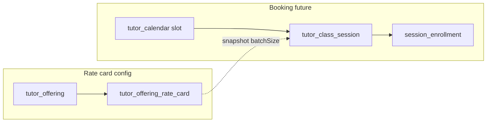

# Tutor batch size on rate card

## Context

Batch teaching means multiple students share one **60-minute** slot ([`SLOT_DURATION_MINUTES`](libs/shared-utils/src/tutor-calendar.ts)). Configuration belongs on the existing **one rate card per tutor offering** model ([`tutor_offering_rate_card`](apps/api/src/app/modules/tutor-rate-card/entities/tutor-offering-rate-card.entity.ts)), which already splits **offline** vs **online** per leaf offering (e.g. CBSE → English → Class 1–5).

Your examples map to one row per offering:

| Offering | Mode | Batch size |
|----------|------|------------|
| CBSE \| English \| Class 1–5 | offline | 4 |
| CBSE \| English \| Class 1–5 | online | 6 (second line in your message — assumed online vs offline) |

Default is **1** (1:1). Max is **6** (per your answer).

There is **no booking module** today; [`tutor_calendar`](apps/api/src/app/modules/tutor-calendar/entities/tutor-calendar.entity.ts) only stores tutor-level open slots (`tutorId`, `startsAt`, `durationMinutes`).



---

## 1. Database and API (rate card)

**Migration** (new file under `apps/api/src/migrations/`):

- `offline_batch_size smallint NOT NULL DEFAULT 1`
- `online_batch_size smallint NOT NULL DEFAULT 1`
- Backfill existing rows to `1`

**Entity** — [`tutor-offering-rate-card.entity.ts`](apps/api/src/app/modules/tutor-rate-card/entities/tutor-offering-rate-card.entity.ts): add both columns.

**GraphQL** — extend in parallel:

- [`TutorOfferingRateCard`](apps/api/src/app/modules/tutor-rate-card/dto/tutor-offering-rate-card.dto.ts) — `@Field(() => Int)` for `offlineBatchSize`, `onlineBatchSize`
- [`SaveTutorOfferingRateCardInput`](apps/api/src/app/modules/tutor-rate-card/dto/save-tutor-offering-rate-card.input.ts) — same fields on input

**Service** — [`tutor-rate-card.service.ts`](apps/api/src/app/modules/tutor-rate-card/services/tutor-rate-card.service.ts):

- Pass batch sizes into `validateRateCardForm`
- Persist on create/update (when a mode is **disabled**, still store `1` — mirrors how rates are cleared but keeps a safe default)
- Include in `mapEntityToGraphql`

**Queries/mutations** — add fields to:

- [`libs/shared-graphql/src/queries/tutor.queries.ts`](libs/shared-graphql/src/queries/tutor.queries.ts) (`myTutorDetail` → `offerings.rateCard`)
- [`libs/shared-graphql/src/mutations/tutor-rate-card.mutations.ts`](libs/shared-graphql/src/mutations/tutor-rate-card.mutations.ts)
- [`libs/shared-graphql/src/queries/admin.queries.ts`](libs/shared-graphql/src/queries/admin.queries.ts)

**Clients** — map new fields in:

- [`apps/web/src/app/components/tutor-profile/TutorProfilePage.tsx`](apps/web/src/app/components/tutor-profile/TutorProfilePage.tsx)
- [`apps/mobile/src/app/components/tutor-profile/TutorDetailScreen.tsx`](apps/mobile/src/app/components/tutor-profile/TutorDetailScreen.tsx)

---

## 2. Shared validation and helpers

**Constants** in [`libs/shared-utils/src/rate-card.ts`](libs/shared-utils/src/rate-card.ts):

- `DEFAULT_BATCH_SIZE = 1`
- `MAX_BATCH_SIZE = 6`

**Types** — extend `RateCardModeValues`, `RateCardFormValues`, `RateCardLike` with `batchSize` / `offlineBatchSize` / `onlineBatchSize`.

**Validation** — inside `validateMode` when `enabled`:

- Require integer **1–6**
- When disabled: normalized batch size **1**

**Helpers** (new, used by booking later):

- `getBatchSizeForMode(rateCard, 'online' | 'offline'): number` — returns configured size if mode enabled, else `1`
- Optional: extend `formatRateCardSummary` to append e.g. `· Batch: 4` when size &gt; 1

**Tests** — [`libs/shared-utils/src/rate-card.spec.ts`](libs/shared-utils/src/rate-card.spec.ts): defaults, max 6, rejection of 0/7, disabled mode → 1.

**Downstream type** — [`libs/tutor-detail-ui/src/types.ts`](libs/tutor-detail-ui/src/types.ts) `rateCard` shape.

---

## 3. Tutor UI (rate card modal)

Add a **Batch size** control in each mode section (offline / online tabs), only when that mode is enabled:

- Control: stepper or select **1–6**, copy: “Max students per 1-hour session”
- Default **1** for new rate cards

Update **both** modals (they duplicate today):

- [`libs/tutor-detail-ui/src/RateCardModal.tsx`](libs/tutor-detail-ui/src/RateCardModal.tsx) (web via `TutorDetailView`)
- [`apps/mobile/src/app/components/tutor-profile/RateCardModal.tsx`](apps/mobile/src/app/components/tutor-profile/RateCardModal.tsx)

Wire through `rateCardToFormInput` / submit payload so `validateRateCardForm` runs before save.

Admin read-only view in [`TutorDetailView`](libs/tutor-detail-ui/src/TutorDetailView.tsx) can show batch size in offering summary when &gt; 1 (optional, low effort).

---

## 4. Booking foundation (design + scaffold)

**Pricing assumption (document in code comment):** base rate stays **per student per class**; batch only caps how many students share one hourly slot. Change later if product says otherwise.

**Proposed tables** (new module e.g. `apps/api/src/app/modules/tutor-class-session/`):

**`tutor_class_session`**

| Column | Purpose |
|--------|---------|
| `tutor_calendar_id` | FK → open slot |
| `tutor_offering_id` | Which offering this batch is for |
| `delivery_mode` | `online` \| `offline` |
| `batch_size` | **Snapshot** from rate card at session creation |
| `status` | e.g. `open`, `full`, `cancelled` |

Unique constraint (v1): **one session per calendar slot** — avoids multiple offerings fighting for the same hour. If product later needs multi-offering per slot, relax this.

**`tutor_class_session_enrollment`**

| Column | Purpose |
|--------|---------|
| `session_id` | FK |
| `student_id` | FK (when student entity exists) |
| `status` | `confirmed`, `cancelled`, etc. |

**Capacity rule** (for future booking service):

```
activeEnrollments < session.batch_size
```

On create session: resolve `batch_size` via `getBatchSizeForMode(rateCard, deliveryMode)` for the booked `tutor_offering_id`; reject booking if mode not enabled on rate card.

**Not in this change:** student/parent booking UI, payment, resolvers, or calendar UI changes. Deliver **migration + TypeORM entities + enum** only so booking can attach without reshaping rate cards.

**Calendar link:** [`TutorCalendar`](apps/api/src/app/modules/tutor-calendar/entities/tutor-calendar.entity.ts) stays as-is; sessions hang off slots. Availability UI can later show “up to N students” by reading rate card batch size for the selected offering/mode.

---

## 5. Tests and regression

- `rate-card.spec.ts` — validation and helpers
- [`tutor-rate-card.service`](apps/api/src/app/modules/tutor-rate-card/services/tutor-rate-card.service.ts) — optional unit test for save mapping
- [`tutor-detail.service.spec.ts`](apps/api/src/app/modules/tutor/services/tutor-detail.service.spec.ts) / [`tutor-calendar.service.spec.ts`](apps/api/src/app/modules/tutor-calendar/services/tutor-calendar.service.spec.ts) — update fixtures if they embed rate card objects

`isRateCardComplete` **unchanged** — batch size does not gate “complete” rate card or calendar setup.

---

## Implementation order

1. Migration + entity + GraphQL DTOs + service + shared-utils validation
2. GraphQL query/mutation + web/mobile save wiring
3. Rate card UI (web lib + mobile modal)
4. Booking scaffold (entities + migration, no API)
5. Tests
