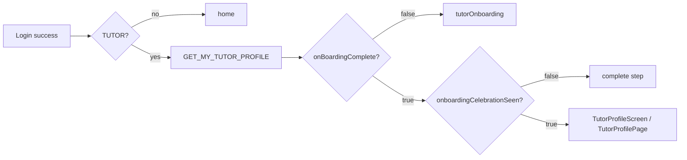
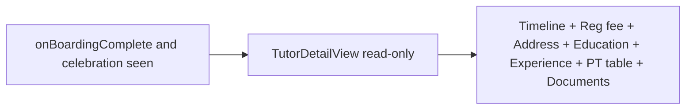

# Tutor detail page (admin parity) for certified tutors

## Current behavior



- **Admin detail** ([`TutorDetailPage.tsx`](apps/web-admin/src/app/pages/TutorDetailPage.tsx)): `GET_ADMIN_TUTOR_DETAIL` → `adminTutorDetail` (admin-only in [`admin.resolver.ts`](apps/api/src/app/modules/admin/admin.resolver.ts)).
- **Tutor post-login today**: [`TutorProfileScreen.tsx`](apps/mobile/src/app/components/tutor-profile/TutorProfileScreen.tsx) / [`TutorProfilePage.tsx`](apps/web/src/app/components/tutor-profile/TutorProfilePage.tsx) via `GET_MY_TUTOR_PROFILE` — plain text sections, no timeline, no reg fee, no PT table, no document previews.

**Eligibility** (unchanged routing gates in [`App.tsx`](apps/mobile/src/app/App.tsx) and [`app.tsx`](apps/web/src/app/app.tsx)):

- `onBoardingComplete === true`
- `onboardingCelebrationSeen === true` (set by `acknowledgeOnboardingCelebration` on “Go to your dashboard”)

Only replace what renders at `tutorProfile` / `tutor-profile`; celebration and onboarding flows stay as-is.

---

## Target behavior



**Same data and section order as admin**, with tutor-appropriate chrome:

| Admin-only | Tutor view |
|------------|------------|
| “← Back to tutors” | No back link (or optional “Home” / app header) |
| Test tutor checkbox + `ADMIN_SET_TEST_TUTOR` | Hidden |
| `AdminDocumentViewerModal` approve/reject | **View-only** modal (preview + status/notes, no `ADMIN_REVIEW_DOCUMENT`) |

---

## 1. API: tutor-scoped full detail query

**Problem:** `adminTutorDetail` is behind `RolesGuard` + `UserRole.ADMIN`. Tutors cannot call it.

**Approach:** Extract detail assembly from [`AdminService.getTutorDetail`](apps/api/src/app/modules/admin/admin.service.ts) into a dedicated service to avoid `TutorModule` ↔ `AdminModule` circular imports (`AdminModule` already imports `TutorModule`).

- Add e.g. [`apps/api/src/app/modules/tutor/services/tutor-detail.service.ts`](apps/api/src/app/modules/tutor/services/tutor-detail.service.ts) (or under `document` if preferred) with the existing `getTutorDetail` logic (profile + qualifications + experiences + offerings mapping + onboarding documents + screening URLs).
- [`AdminService`](apps/api/src/app/modules/admin/admin.service.ts) delegates to it (behavior unchanged; existing [`admin.service.spec.ts`](apps/api/src/app/modules/admin/admin.service.spec.ts) stays valid).
- New resolver on [`TutorResolver`](apps/api/src/app/modules/tutor/resolvers/tutor.resolver.ts):

```typescript
@Query(() => AdminTutorDetail, { name: 'myTutorDetail' })
@UseGuards(JwtAuthGuard)
async myTutorDetail(@CurrentUser() user: User): Promise<AdminTutorDetail>
```

**Guards inside service/resolver:**

- `user.role === TUTOR`
- Load tutor by `user.id`; throw if missing
- Require `onBoardingComplete && onboardingCelebrationSeen` (e.g. `ForbiddenException`) so incomplete tutors cannot scrape full detail via GraphQL

**GraphQL type:** Reuse existing `AdminTutorDetail` DTO for the response shape (no duplicate ObjectTypes). Client query name makes intent clear.

**Tests:** Unit tests on `TutorDetailService` + resolver spec for happy path, wrong role, and blocked when celebration not seen.

---

## 2. Shared GraphQL client

Add to [`libs/shared-graphql/src/queries/tutor.queries.ts`](libs/shared-graphql/src/queries/tutor.queries.ts):

```graphql
query GetMyTutorDetail {
  myTutorDetail { ...same fields as GET_ADMIN_TUTOR_DETAIL minus tutorId variable }
}
```

Mirror field selection from [`GET_ADMIN_TUTOR_DETAIL`](libs/shared-graphql/src/queries/admin.queries.ts) (lines 52–141): reg fee fields, user contact/createdDate, `offerings` with PT stats, `documents` with `previewUrl` / `viewUrl` and `screening`.

Export from [`libs/shared-graphql/src/queries/index.ts`](libs/shared-graphql/src/queries/index.ts).

Keep `GET_MY_TUTOR_PROFILE` for onboarding routing and lightweight polls.

---

## 3. Shared presentation logic (web)

Move pure TS helpers out of `web-admin` so both admin and tutor web UIs stay in sync:

| Move to `libs/shared-utils` | From |
|-----------------------------|------|
| `buildOnboardingTimeline` + types | [`onboarding-timeline.ts`](apps/web-admin/src/app/utils/onboarding-timeline.ts) |
| `formatDate`, PT/doc badges, qualification sort, experience duration helpers | [`tutor-detail-formatters.ts`](apps/web-admin/src/app/utils/tutor-detail-formatters.ts) |

Update [`apps/web-admin`](apps/web-admin) imports to `@tutorix/shared-utils`.

**New shared web UI** (new Nx lib recommended: `libs/tutor-detail-ui` with React + Tailwind, depended on by `web-admin` and `apps/web`):

- Extract presentational **`TutorDetailView`** from `TutorDetailPage` (props: `tutor` detail object, `mode: 'admin' | 'tutor'`, optional `onTestTutorChange`, optional document review callbacks).
- Move **`OnboardingTimeline`** component into the lib (imports formatters from `shared-utils`).
- Split document modal:
  - **`TutorDocumentViewerModal`** — view-only (used in tutor mode)
  - Admin keeps review actions wired only when `mode === 'admin'`

Refactor [`TutorDetailPage.tsx`](apps/web-admin/src/app/pages/TutorDetailPage.tsx) to thin wrapper: `useQuery(GET_ADMIN_TUTOR_DETAIL)` + `TutorDetailView mode="admin"`.

---

## 4. Tutor web app (`apps/web`)

- Replace body of [`TutorProfilePage.tsx`](apps/web/src/app/components/tutor-profile/TutorProfilePage.tsx) (or rename to `TutorDetailPage.tsx`) with `useQuery(GET_MY_TUTOR_DETAIL)` + `<TutorDetailView mode="tutor" />`.
- Header copy: e.g. “Your tutor profile” instead of admin “Back to tutors”; hide test-tutor controls.
- No routing changes in [`app.tsx`](apps/web/src/app/app.tsx) — still `setCurrentView('tutor-profile')` after login and after celebration `onGoToDashboard`.

---

## 5. Tutor mobile app (`apps/mobile`)

React Native cannot reuse Tailwind `TutorDetailView` directly. Implement **`TutorDetailScreen`** (replace [`TutorProfileScreen.tsx`](apps/mobile/src/app/components/tutor-profile/TutorProfileScreen.tsx)) that:

- Uses `GET_MY_TUTOR_DETAIL`
- Reuses **`@tutorix/shared-utils`** for timeline entries, date/PT/doc labels, qualification sort, experience duration math
- Mirrors admin **sections and content** with RN layout (ScrollView, section cards, offerings as horizontal scroll table or stacked rows, document grid with `Image` + `Linking`/`WebView` for PDFs)
- View-only document bottom sheet/modal (no approve/reject)

Optional follow-up (out of initial scope): extract tiny shared `OnboardingTimeline` data model only; RN renders its own step list from `buildOnboardingTimeline()`.

[`App.tsx`](apps/mobile/src/app/App.tsx): keep `tutorProfile` view key; swap component import to `TutorDetailScreen`.

---

## 6. Celebration handoff

[`TutorOnboardingComplete`](apps/mobile/src/app/components/tutor-onboarding/TutorOnboardingComplete.tsx) / web equivalent already calls `onGoToDashboard` → profile view. After this change, that navigation shows the rich detail page immediately (prefetch `GET_MY_TUTOR_DETAIL` on acknowledge optional for snappier UX).

---

## 7. Verification

| Check | How |
|-------|-----|
| API | `myTutorDetail` returns same shape as `adminTutorDetail` for a given tutor id when called as admin vs tutor self |
| Auth | Non-tutor and pre-celebration tutor get 403 |
| Web tutor | Login as approved tutor → full sections, document preview, no admin controls |
| Web admin | `/tutors/:id` unchanged functionally |
| Mobile | Same section coverage; scroll and document open work on iOS/Android |
| Regression | Existing onboarding + `GET_MY_TUTOR_PROFILE` flows unaffected |

Run: API unit tests (`admin.service.spec`, new tutor-detail specs), and manual smoke on mobile + web for the three login states (in onboarding, celebration pending, certified).

---

## File touch summary

| Area | Key files |
|------|-----------|
| API | New `tutor-detail.service.ts`, `tutor.resolver.ts`, `tutor.module.ts`, slim `admin.service.ts` |
| GraphQL | `tutor.queries.ts`, `index.ts` |
| Shared logic | `libs/shared-utils` (+ tests for timeline/formatters) |
| Shared web UI | New `libs/tutor-detail-ui`, refactor `TutorDetailPage.tsx` |
| Tutor clients | `TutorProfilePage.tsx` → detail view; `TutorProfileScreen.tsx` → `TutorDetailScreen` |
| Unchanged | Login routing conditions, `acknowledgeOnboardingCelebration`, admin list at `/tutors` |
