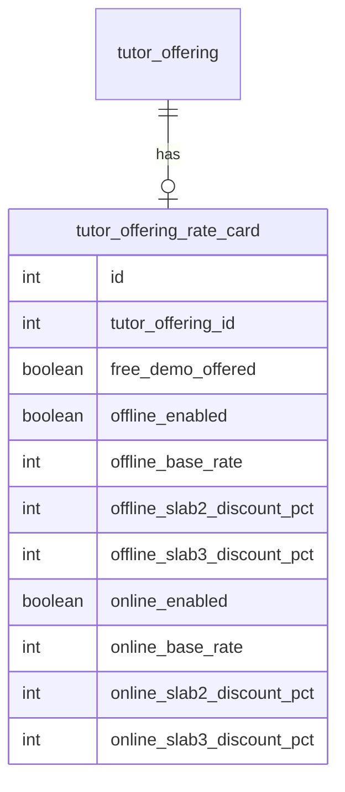
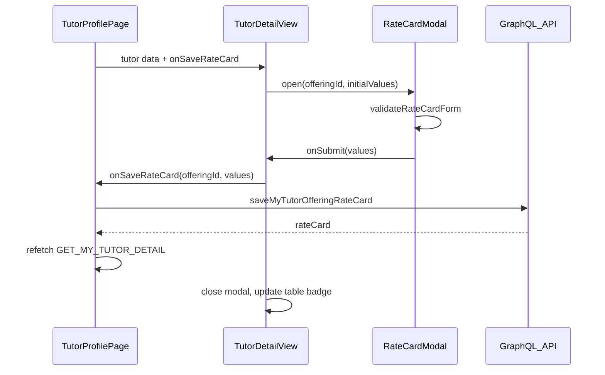

# Tutor Rate Card Feature (Web First)

## Context

Today, tutor offerings on web are **read-only** in [`libs/tutor-detail-ui/src/TutorDetailView.tsx`](libs/tutor-detail-ui/src/TutorDetailView.tsx) (`OfferingsSection` table: offering name, PT status, score, attempts). There is **no pricing model** beyond registration fee. The best reference for the new edit flow is the **bank details** pattern:

- Shared UI in `libs/tutor-detail-ui`
- Page-level mutation in [`apps/web/src/app/components/tutor-profile/TutorProfilePage.tsx`](apps/web/src/app/components/tutor-profile/TutorProfilePage.tsx)
- Backend module with entity + GraphQL mutation (see `user-bank-details` module)

## Pricing model (confirmed)

| Slab | Class count | Rate |
|------|-------------|------|
| 1 | 1–4 classes | Base rate (100%) |
| 2 | 5–10 classes | Base rate minus discount % (optional) |
| 3 | 11+ classes | Base rate minus discount % (optional) |

- **Offline** and **online** each have their own base rate and discount percentages.
- **Free demo**: boolean flag per offering (“1 free demo class for new students”).
- Discounts are **percent off base** (not fixed rupee amounts). Slab 2/3 discounts are optional; if blank, that slab uses base rate.

**Effective rate formula:**

```text
effectiveRate = baseRate × (1 - discountPercent / 100)
```

**Validation rules:**
- At least one mode (offline or online) must be enabled with a base rate when saving.
- Base rate: positive integer INR (store as paise or whole rupees — recommend **whole rupees** in DB for simplicity, min ₹1).
- Discount %: 0–99 integer (optional per slab); slab 3 discount must be ≥ slab 2 discount when both set.
- Tutor can disable a mode entirely (e.g. online-only tutor).

---

## Data model

New entity `tutor_offering_rate_card` — **1:1 with `tutor_offering`** (unique FK on `tutor_offering_id`).



**New files (API):**
- [`apps/api/src/app/modules/tutor-rate-card/entities/tutor-offering-rate-card.entity.ts`](apps/api/src/app/modules/tutor-rate-card/entities/tutor-offering-rate-card.entity.ts)
- DTOs: `TutorOfferingRateCard`, `SaveTutorOfferingRateCardInput`
- Service: upsert by `tutorOfferingId`, verify ownership (tutor owns the offering)
- Resolver: `saveMyTutorOfferingRateCard` mutation (JWT)
- Migration: create table + unique index on `tutor_offering_id`

**Extend read model:**
- Add optional `rateCard` field to `AdminTutorOfferingDetail` in [`apps/api/src/app/modules/admin/dto/admin-tutor-offering-detail.dto.ts`](apps/api/src/app/modules/admin/dto/admin-tutor-offering-detail.dto.ts)
- Map in [`apps/api/src/app/modules/tutor/services/tutor-detail.service.ts`](apps/api/src/app/modules/tutor/services/tutor-detail.service.ts)
- Extend `GET_MY_TUTOR_DETAIL` in [`libs/shared-graphql/src/queries/tutor.queries.ts`](libs/shared-graphql/src/queries/tutor.queries.ts)

**Shared types & validation** in [`libs/shared-utils/src/rate-card.ts`](libs/shared-utils/src/rate-card.ts):
- `RATE_CARD_SLABS` constants (labels: "1–4", "5–10", "11+")
- `calculateEffectiveRate(baseRate, discountPercent?)`
- `validateRateCardForm(values)` — mirrors bank-details pattern
- `formatRateCardSummary(rateCard)` — for read-only preview in table

---

## API surface

```graphql
type TutorOfferingRateCard {
  freeDemoOffered: Boolean!
  offlineEnabled: Boolean!
  offlineBaseRate: Int
  offlineSlab2DiscountPct: Int
  offlineSlab3DiscountPct: Int
  onlineEnabled: Boolean!
  onlineBaseRate: Int
  onlineSlab2DiscountPct: Int
  onlineSlab3DiscountPct: Int
  isComplete: Boolean!   # computed: at least one mode configured
}

input SaveTutorOfferingRateCardInput {
  tutorOfferingId: Int!
  freeDemoOffered: Boolean!
  offlineEnabled: Boolean!
  offlineBaseRate: Int
  offlineSlab2DiscountPct: Int
  offlineSlab3DiscountPct: Int
  onlineEnabled: Boolean!
  onlineBaseRate: Int
  onlineSlab2DiscountPct: Int
  onlineSlab3DiscountPct: Int
}

mutation saveMyTutorOfferingRateCard(input: SaveTutorOfferingRateCardInput!): TutorOfferingRateCard!
```

Authorization: resolve `tutorOfferingId` → verify `tutorId` matches authenticated user’s tutor record.

---

## Web UI design

### 1. Offerings table — new “Rate card” column

Update `OfferingsSection` in [`libs/tutor-detail-ui/src/TutorDetailView.tsx`](libs/tutor-detail-ui/src/TutorDetailView.tsx):

| Offering | PT status | … | **Rate card** |
|----------|-----------|---|---------------|
| Class 10 Maths | Passed | … | **Rate Card** button (tutor mode) or badge |

**Tutor mode (`mode="tutor"`):**
- New column with **“Rate Card”** button per row (purple outline, matches offerings section theme).
- If rate card exists: small “Configured” badge + button label becomes **“Edit rate card”**.
- Button only shown when `onSaveRateCard` prop is provided (same gating as bank details).

**Admin mode:** read-only summary (e.g. “₹500/class offline · Demo: Yes”) — no edit button in v1.

```
┌─────────────────────────────────────────────────────────────────────┐
│ Offerings & proficiency tests                                       │
├──────────────┬──────────┬─────────┬───────┬──────────┬────────────┤
│ Offering     │ PT status│ Date    │ Score │ Attempts │ Rate card  │
├──────────────┼──────────┼─────────┼───────┼──────────┼────────────┤
│ Class 10 …   │ Passed   │ …       │ 8/10  │ 1 · 1    │ [Rate Card]│
└──────────────┴──────────┴─────────┴───────┴──────────┴────────────┘
```

### 2. Rate Card modal (`RateCardModal.tsx`)

New component in `libs/tutor-detail-ui`, following [`BankDetailsModal.tsx`](libs/tutor-detail-ui/src/BankDetailsModal.tsx) structure:
- `fixed inset-0 z-50` overlay, centered `rounded-2xl` panel
- Props: `open`, `offeringName`, `initialValues`, `saving`, `error`, `onClose`, `onSubmit`

**Modal layout:**

```
┌──────────────────────────────────────────────────────────────┐
│  Rate card — Class 10 Mathematics                       [×]  │
│  Set how you charge for this offering.                       │
├──────────────────────────────────────────────────────────────┤
│  ☑ Free demo class for new students                          │
├──────────────────────────────────────────────────────────────┤
│  ┌─ Offline classes ─────────────────────────────────────┐   │
│  │ ☑ Offer offline classes                                │   │
│  │ Base rate (per class)     [ ₹ 500        ]             │   │
│  │                                                        │   │
│  │ Bulk booking discounts (% off base rate)               │   │
│  │   1–4 classes           Base rate (no discount)       │   │
│  │   5–10 classes          [ 10 ] %  →  ₹450/class        │   │
│  │   11+ classes           [ 20 ] %  →  ₹400/class        │   │
│  └────────────────────────────────────────────────────────┘   │
│                                                                │
│  ┌─ Online classes ──────────────────────────────────────┐   │
│  │ ☑ Offer online classes                                 │   │
│  │ Base rate (per class)     [ ₹ 400        ]             │   │
│  │   5–10 classes          [ 5  ] %  →  ₹380/class        │   │
│  │   11+ classes           [ 15 ] %  →  ₹340/class        │   │
│  └────────────────────────────────────────────────────────┘   │
├──────────────────────────────────────────────────────────────┤
│                              [ Cancel ]  [ Save rate card ]  │
└──────────────────────────────────────────────────────────────┘
```

**UX details:**
- Live **preview** of effective ₹/class per slab updates as user types (uses `calculateEffectiveRate`).
- Mode toggle disables that section’s inputs when unchecked.
- Slab 1 row is read-only informational (always base rate).
- Empty discount fields = 0% discount for that slab.
- Client validation before submit; server validation as source of truth.
- Form resets via `useEffect` when modal opens (same as bank details).

### 3. Wiring in TutorProfilePage

Mirror bank details in [`TutorProfilePage.tsx`](apps/web/src/app/components/tutor-profile/TutorProfilePage.tsx):

```typescript
// State: rateCardModalOfferingId, rateCardSaveError
// Mutation: SAVE_MY_TUTOR_OFFERING_RATE_CARD
// Pass to TutorDetailView:
//   onSaveRateCard, savingRateCard, rateCardSaveError
```

`TutorDetailView` manages modal open state keyed by `tutorOfferingId` (which offering row was clicked).

---

## Architecture flow



---

## Implementation phases

### Phase 1 — Backend (foundation)
1. Entity + migration for `tutor_offering_rate_card`
2. `TutorRateCardModule` registered in app module
3. Service (upsert + ownership check) + mutation resolver
4. Extend tutor detail query to include `rateCard` on each offering
5. Unit tests: validation, effective rate calculation, upsert

### Phase 2 — Shared layer
1. `libs/shared-utils/src/rate-card.ts` + spec
2. GraphQL mutation in `libs/shared-graphql`
3. Extend `TutorDetailRecord.offerings[]` in [`libs/tutor-detail-ui/src/types.ts`](libs/tutor-detail-ui/src/types.ts)

### Phase 3 — Web UI
1. `RateCardModal.tsx` component
2. Update `OfferingsSection` + `TutorDetailView` props/state
3. Wire `TutorProfilePage` mutation + refetch
4. Export from `libs/tutor-detail-ui` index

### Phase 4 — Admin read-only (optional, small)
- Show rate card summary in admin `TutorDetailPage` via same `TutorDetailView` (no edit props)

---

## Out of scope (v1)

- Mobile app UI (follow same shared lib later)
- Student-facing rate card display / booking price calculation
- Currency other than INR
- Per-student negotiated rates
- Rate card required before tutor goes live (can add as follow-up business rule)

---

## Key files to create/modify

| Layer | Files |
|-------|-------|
| API | New `tutor-rate-card` module; migration; extend `tutor-detail.service.ts` |
| Shared | `rate-card.ts`, `rate-card.spec.ts`; GraphQL mutation; query fields |
| UI lib | `RateCardModal.tsx`; `TutorDetailView.tsx`; `types.ts` |
| Web app | `TutorProfilePage.tsx` |
